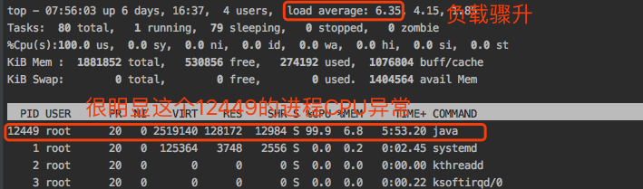
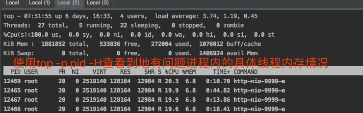
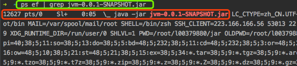

# 第2章 基于JDK命令行工具的监控

> 本章的主要内容如下
+ [JVM的参数类型`2.1`](#21-jvm的参数类型)
+ [运行时JVM参数查看`2.2`](#22-查看jvm运行时参数)
+ [jstat查看虚拟机统计信息`2.3`](#23-jstat查看jvm统计信息)
+ [jmap + MAT实战内存溢出`2.4~2.6`](#24-堆溢出和metaspace溢出)
+ [jstack实战死循环和死锁`2.7~2.8`](#27-jstack与多线程死循环和死锁)

## 2.1 JVM的参数类型

### 标准参数
> 特点：比较稳定，在个jvm版本里基本不变
+ `-help`:
+ `-server`
+ `-client`
+ `-version`
+ `-showversion`
+ `-cp`
+ `-classpath`

### X参数: 非标准化参数
> 在各个JVM版本中可能会变，但是变化很小
+ `-Xint`:解释执行
+ `-Xcomp`:第一次使用就编译成本地代码
+ `-Xmixed`:混合模式,JVM自己来决定是否编译成本地代码

命令使用如下：

```powershell
C:\Users\pc>java -version
java version "1.8.0_212"
Java(TM) SE Runtime Environment (build 1.8.0_212-b10)
Java HotSpot(TM) 64-Bit Server VM (build 25.212-b10, mixed mode) # mixed mode：混合模式，默认就是这个

C:\Users\pc>java -Xcomp -version # -Xcomp 
java version "1.8.0_212"
Java(TM) SE Runtime Environment (build 1.8.0_212-b10)
Java HotSpot(TM) 64-Bit Server VM (build 25.212-b10, compiled mode) # compiled mode：编译模式

C:\Users\pc>java -Xint -version # -Xint
java version "1.8.0_212"
Java(TM) SE Runtime Environment (build 1.8.0_212-b10)
Java HotSpot(TM) 64-Bit Server VM (build 25.212-b10, interpreted mode) # interpreted mode：交互模式

C:\Users\pc>java -Xmixed -version # -Xmixed
java version "1.8.0_212"
Java(TM) SE Runtime Environment (build 1.8.0_212-b10)
Java HotSpot(TM) 64-Bit Server VM (build 25.212-b10, mixed mode) # mixed mode：混合模式
```

### XX参数: 非标准化参数
> 相对不稳定, 主要用于jvm调优和Debug
+ Boolean类型
  + `[-XX:[+-]<name>]`:表示启用(+)或者禁用(-)name属性
  + 比如：`-XX:+UseConcMarkSweepGC`表示启用CMS垃圾收集器;`-XX:+UseG1GC`表示使用G1垃圾收集器
+ 非Boolean类型(`键值对类型`)
  + `[-XX:<name>=<value>]`:表示name的属性值是value
  + 比如:`-XX:MaxGCPauseMillis=500`表示GC的最大停顿时间是500ms;`-XX:GCTimeRatio=19`表示GC的时间周期是19，后面会讲
+ 下面三个比较特殊。虽然开头不是XX但仍然是XX参数
  + `-Xmx`: 等价于`-XX:MaxHeapSize`,设置JVM最大内存
  + `-Xms`: 等价于`-XX:InitialHeapSize`设置JVM最小内存
  + `-Xss`: 启动一个线程所占的内存大小，默认1024K，可以调整为512K。调整性能。


举例如下：
```shell
[root@VM_0_15_centos bin]# ps ef | grep tomcat
# 下面一开始的22843就是tomcat进行的PID
22843 pts/0    Sl     0:02 /usr/bin/java -Djava.util.logging.config.file=/usr/local/tomcat8/conf/logging.properties -Djava.util.logging.manager=org.apache.juli.ClassLoaderLogManager -Djdk.tls.ephemeralDHKeySize=2048 -Djava.protocol.handler.pkgs=org.apache.catalina.webresources -Dorg.apache.catalina.security.SecurityListener.UMASK=0027 -Dignore.endorsed.dirs= -classpath /usr/local/tomcat8/bin/bootstrap.jar:/usr/local/tomcat8/bin/tomcat-juli.jar -Dcatalina.base=/usr/local/tomcat8 -Dcatalina.home=/usr/local/tomcat8 -Djava.io.tmpdir=/usr/local/tomcat8/temp org.apache.catalina.startup.Bootstrap start XDG_SESSION_ID=236475 HOSTNAME=VM_0_15_centos TERM=xterm SHELL=/bin/bash HISTSIZE=3000 SSH_CLIENT=223.104.5.228 16071 22 SSH_TTY=/dev/pts/0 JDK_JAVA_OPTIONS= --add-opens=java.base/java.lang=ALL-UNNAMED --add-opens=java.base/java.io=ALL-UNNAMED --add-opens=java.rmi/sun.rmi.transport=ALL-UNNAMED USER=root  PATH=/usr/local/sbin:/usr/local/bin:/usr/sbin:/usr/bin:/root/bin PWD=/usr/local/tomcat8/bin LANG=en_US.utf8 SHLVL=2 HOME=/root LOGNAME=root SSH_CONNECTION=223.104.5.228 16071 172.17.0.15 22 LESSOPEN=||/usr/bin/lesspipe.sh %s PROMPT_COMMAND=history -a; printf "\033]0;%s@%s:%s\007" "${USER}" "${HOSTNAME%%.*}" "${PWD/#$HOME/~}" XDG_RUNTIME_DIR=/run/user/0 HISTTIMEFORMAT=%F %T  _=/usr/bin/java
# MaxHeapSize：查看最大的堆大小
[root@VM_0_15_centos bin]# jinfo -flag MaxHeapSize 22843
-XX:MaxHeapSize=994050048
# ThreadStackSize：线程栈的大小，1024k算比较大了，一般我们会把它调小
[root@VM_0_15_centos bin]# jinfo -flag ThreadStackSize 22843
-XX:ThreadStackSize=1024
```

## 2.2 查看JVM运行时参数
> `java`+ `如下的命令`可以完成对应的功能

+ **-XX:+PrintFlagsInitial**:JVM初始化的参数，比如`java -XX:+PrintFlagsInitial -version`
+ **-XX:+PrintFlagFinal**:JVM最终的参数值，可能应用启动会修改JVM参数,比如：`java -XX:+PrintFlagsFinal -version`,可以得到所有的参数，其中
  + `=`表示默认值
  + `:=`表示赋值过
+ **-XX:+UnlockExperimentalVMOptions**:解锁试验参数，部分参数需要设置这个才能赋值
+ **-XX:+UnlockDiagnosticVMOptions**:解锁诊断参数
+ **-XX:+PrintCommandLineFlags**:打印命令行参数，如`java -XX:+PrintCommandLineFlags -version`


### jps

> jps就是java 的ps

+ `-q`：只输出进程 ID
+ `-m`：输出传入 main 方法的参数
+ `-l`：输出完全的包名，应用主类名，jar的完全路径名
+ `-v`：输出jvm参数
+ `-V`：输出通过flag文件传递到JVM中的参数

```shell
$ jps
24416 Jps
7892 Bootstrap

$ jps -q
19952
7892

$ jps -m
7892 Bootstrap start
20760 Jps -m

$ jps -l
7892 org.apache.catalina.startup.Bootstrap
26328 sun.tools.jps.Jps

$ jps -v
7892 Bootstrap -Djava.util.logging.config.file=D:\Program Files\ApacheSoftware\apache-tomcat-8.5.45\conf\logging.properties -Djava.util.logging.manager=org.apache.juli.ClassLoaderLogManager -Djdk.tls.ephemeralDHKeySize=2048 -Djava.protocol.handler.pkgs=org.apache.catalina.webresources -Dignore.endorsed.dirs= -Dcatalina.base=D:\Program Files\ApacheSoftware\apache-tomcat-8.5.45 -Dcatalina.home=D:\Program Files\ApacheSoftware\apache-tomcat-8.5.45 -Djava.io.tmpdir=D:\Program Files\ApacheSoftware\apache-tomcat-8.5.45\temp
12940 Jps -Dapplication.home=D:\Program Files\Java\jdk1.8.0_212 -Xms8m

$ jps -V
7892 Bootstrap
23580 Jps
```

### jinfo

+ `jinfo flags 进程号`：查看进程设置过地参数值
+ `jinfo -flag MaxHeapSize 进程号`:查看最大内存
+ 查看垃圾回收器
  + `jinfo -flag UseConcMarkSweepGC 进程号`：查看CMS垃圾回收器
  + `jinfo -flag UseG1GC 进程号`:查看G1垃圾回收器
  + `jinfo -flag UseParallelGC 进程号`:查看并行的垃圾回收器

```shell
$ jps -l
7892 org.apache.catalina.startup.Bootstrap
26328 sun.tools.jps.Jps

$ jinfo -flags 7892 # 查看所有的Non-default VM flags即我们手动赋过值的flag
Attaching to process ID 7892, please wait...
Debugger attached successfully.
Server compiler detected.
JVM version is 25.212-b10
Non-default VM flags: -XX:CICompilerCount=4 -XX:InitialHeapSize=534773760 -XX:MaxHeapSize=8556380160 -XX:MaxNewSize=2852126720 -XX:MinHeapDeltaBytes=524288 -XX:NewSize=178257920 -XX:OldSize=356515840 -XX:+UseCompressedClassPointers -XX:+UseCompressedOops -XX:+UseFastUnorderedTimeStamps -XX:-UseLargePagesIndividualAllocation -XX:+UseParallelGC
Command line:  -Djava.util.logging.config.file=D:\Program Files\ApacheSoftware\apache-tomcat-8.5.45\conf\logging.properties -Djava.util.logging.manager=org.apache.juli.ClassLoaderLogManager -Djdk.tls.ephemeralDHKeySize=2048 -Djava.protocol.handler.pkgs=org.apache.catalina.webresources -Dignore.endorsed.dirs= -Dcatalina.base=D:\Program Files\ApacheSoftware\apache-tomcat-8.5.45 -Dcatalina.home=D:\Program Files\ApacheSoftware\apache-tomcat-8.5.45 -Djava.io.tmpdir=D:\Program Files\ApacheSoftware\apache-tomcat-8.5.45\temp

# 根据PID查询进程7892的MaxHeapSize(最大内存)
$ jinfo -flag MaxHeapSize 7892 
-XX:MaxHeapSize=8556380160

# 下面3个是查询垃圾回收器
$ jinfo -flag UseConcMarkSweepGC 7892
-XX:-UseConcMarkSweepGC

$ jinfo -flag UseG1GC 7892
-XX:-UseG1GC

$ jinfo -flag UseParallelGC 7892
-XX:+UseParallelGC
```
## 2.3 jstat查看JVM统计信息

> Jstat是JDK自带的一个轻量级小工具。全称“Java Virtual Machine statistics monitoring tool”，它位于java的bin目录下，主要利用JVM内建的指令对Java应用程序的资源和性能进行实时的命令行的监控，包括了对Heap size和垃圾回收状况的监控

+ [自己的总结：jstat命令详解](jstat命令详解.md)
+ [jstat官方文档](https://docs.oracle.com/javase/8/docs/technotes/tools/unix/jstat.html)
+ [jvm性能调优工具之 jstat](https://www.jianshu.com/p/213710fb9e40)
+ [java虚拟机博客集合](https://www.jianshu.com/c/25c9e47f8d93)
+ [JVM内存模型](https://www.jianshu.com/p/5946c0a414b5)
+ [JVM中堆和栈的区别](https://www.cnblogs.com/Jashinck/p/10480776.html)

### jstat可以查看哪些信息?

+ 类加载
+ 垃圾收集
+ JIT编译

### `jstat -help`返回详解

> `jstat -hep`可以看到命令使用格式如下：

```shell
jstat -help|-options # 查看帮助或option的选择项
jstat -<option> [-t] [-h<lines>] <vmid> [<interval> [<count>]] # 指定option和显示的字段及指令
```

详解如下：

+ `option`： 参数选项
+ `-t`： 可以在打印的列加上Timestamp列，用于显示系统运行的时间
+ `-h`： 可以在周期性数据数据的时候，可以在指定输出多少行以后输出一次表头
+ `vmid`： Virtual Machine ID（ 进程的 pid）
+ `interval`： 执行每次的间隔时间，单位为毫秒
+ `count`： 用于指定输出多少次记录，缺省则会一直打印

### `jstat -options`返回详解

> `jstat -options`命令回显如下

```shell
[root@localhost ~]# jstat -options
-class
-compiler
-gc
-gccapacity
-gccause
-gcmetacapacity
-gcnew
-gcnewcapacity
-gcold
-gcoldcapacity
-gcutil
-printcompilation
```

每个option的具体含义如下：

```shell
# 1.类加载 信息
-class  # 显示ClassLoad的相关信息

# 2.垃圾收集 信息
-gc # 显示和gc相关的堆信息
-gccapacity # 显示各个代的容量以及使用情况
-gccause # 显示垃圾回收的相关信息（通-gcutil）,同时显示最后一次或当前正在发生的垃圾回收的诱因
-gcmetacapacity # 显示metaspace的大小
-gcnew # 显示新生代信息
-gcnewcapacity # 显示新生代大小和使用情况
-gcold # 显示老年代和永久代的信息
-gcoldcapacity # 显示老年代的大小
-gcutil # 显示垃圾收集信息

# 3.JIT编译信息
-compiler # 显示JIT编译的相关信息
-printcompilation # 输出JIT编译的方法信息
```

> 具体每个option的使用和详解见[jstat命令详解](jstat命令详解.md)

每个命令回显的字段含义参考下图进行理解：


## 2.4 堆溢出和Metaspace溢出

> [代码：堆溢出和非堆溢出以Metaspace溢出为例](../code/jvm/src/main/java/imooc/jvm/Chapter2BasicCmdTool/MemoryController.java)，2.4~2.6 jmap+MAT分析内存溢出，是一个整体，2.5讲解怎么在溢出后导出内存映射文件方便分析，2.6讲解怎么分析内存映射文件

```java
package imooc.jvm.Chapter2BasicCmdTool;

import org.springframework.web.bind.annotation.GetMapping;
import org.springframework.web.bind.annotation.RestController;

import java.util.ArrayList;
import java.util.List;
import java.util.UUID;

/***********************************************************
 * @note      : jmap+MAT分析内存溢出
 * 情况1：堆溢出
 * 情况2：Metaspace溢出
 * 堆和MetaSpace的示意图见 [JVM内存结构](https://img1.sycdn.imooc.com/szimg/5d525b2b0001f94719201080.jpg)
 * @author    : l00379880 梁山广
 * @version   : V1.0 at 2019/8/13 14:25
 ***********************************************************/
@RestController
public class MemoryController {
    private List<User> userList = new ArrayList<>();

    /**
     * 堆溢出示例
     * 需要先设置最大内存和最小内存，在Run Configurations-->Configurations-->VM Options 添加"-Xmx32M -Xms32M"即可
     * 访问：http://localhost:9999/heap
     * 很快就会出现如下错误： Exception in thread "http-nio-9999-exec-1" java.lang.OutOfMemoryError: GC overhead limit exceeded
     */
    @GetMapping("/heap")
    public void heap() {
        // 堆溢出
        int i = 0;
        while (true) {
            userList.add(new User(i++, UUID.randomUUID().toString()));
        }
    }

    private List<Class<?>> classList = new ArrayList<>();

    /**
     * 非堆区溢出，这里以MetaSpace区为例，MetaSpace里面存储地是类、Field等元数据信息
     * 在Run Configurations-->Configurations-->VM Options 添加"-XX:MetaspaceSize=32M -XX:MaxMetaspaceSize=32M" 即可(JDK8)
     * 很快就会报错：java.lang.OutOfMemoryError: GC overhead limit exceeded
     */
    @GetMapping("/nonheap")
    public void nonheap() {
        // 非堆溢出，插入1000w个随机的类(Metaspace生成)
        classList.addAll(Metaspace.createClasses());
    }
}
```

## 2.5 导出内存映射文件

> 在发生内存溢出时导出map文件，方便定位问题，导出方法有二

### 一、自动导出

加JVM参数，让JVM在发生内存溢出时，自动导出内存快照。 Run Configurations-->Configurations-->VM Options 添加`-XX:+HeapDumpOnOutOfMemoryError -XX:HeapDumpPath=导出路径`,执行后会在"导出路径"生成.hprof文件.

命令示例`-Xmx32M -Xms32M -XX:+HeapDumpOnOutOfMemoryError -XX:HeapDumpPath=./`,运行后访问 http://localhost:9999/heap ,回显如下：

```shell
Dumping heap to ./java_pid43813.hprof ...
Heap dump file created [44950449 bytes in 0.577 secs]
Exception in thread "http-nio-9999-exec-1" java.lang.OutOfMemoryError: GC overhead limit exceeded
```

在项目根目录下生成如下文件

```shell
➜  /Users/liangshanguang/Program/Java/jvm-learn/01_Java生产环境下性能监控与调优详解/code/jvm git:(master) ✗   tree -L 2
.
├── java_pid43813.hprof # 这个就是jmap命令dump出的文件
├── jvm.iml
├── pom.xml
├── src
│   └── main
└── target
    ├── classes
    └── generated-sources
```

### 二、手动导出

使用jps命令查看pid

```shell
➜  /Users/liangshanguang/Program/Java/jvm-learn/01_Java生产环境下性能监控与调优详解/code/jvm git:(master) ✗   jps
43812 Launcher
43813 JvmApplication
33693
44575 Jps
43519 RemoteMavenServer
```

利用jmap命令 来导出命令执行时的内存快照。`jmap -dump:format=b,file=导出的文件路径 .hprof  pid`

```shell
➜  /Users/liangshanguang/Program/Java/jvm-learn/01_Java生产环境下性能监控与调优详解/code/jvm git:(master) ✗   jmap -dump:format=b,file=heap_by_jmap.hprof 43813 # 手动jmap命令导出内存映射文件
Dumping heap to /Users/liangshanguang/Program/Java/jvm-learn/01_Java生产环境下性能监控与调优详解/code/jvm/heap_by_jmap.hprof ...
Heap dump file created

➜  /Users/liangshanguang/Program/Java/jvm-learn/01_Java生产环境下性能监控与调优详解/code/jvm git:(master) ✗   tree -Lh 2 
.
├── [ 43M]  heap_by_jmap.hprof # 使用jmap命令手动导出地，可以看到和下面的自动导出地大小一致
├── [ 43M]  java_pid43813.hprof # 配置VM_Options后自动导出地
├── [7.2K]  jvm.iml
├── [1.5K]  pom.xml
├── [  96]  src
│   └── [ 128]  main
└── [ 128]  target
    ├── [ 128]  classes
    └── [  96]  generated-sources

5 directories, 4 files

```

通过`jmap -heap pid`也可以查看具体的堆栈信息

**注意**：推荐用jmap命令手动导出，因为到文件较大时，方法一的自动导出可能会出问题导不出来

## 2.6 MAT工具分析内存溢出

> 参考教程

+ [利用jmap和MAT等工具查看JVM运行时堆内存](https://www.cnblogs.com/cjsblog/p/9561375.html)
+ [官方教程](https://www.eclipse.org/mat/)
+ [下载地址](https://www.eclipse.org/mat/downloads.php)

## 2.7 jstack与多线程死循环和死锁

> jstack是jdk自带的线程堆栈分析工具，使用该命令可以查看或导出 Java 应用程序中线程堆栈信息,多用于定位多线程死锁问题

参考博客

+ [jvm 性能调优工具之 jstack](https://www.jianshu.com/p/025cb069cb69)
+ [如何使用jstack分析线程状态](https://www.cnblogs.com/wuchanming/p/7766994.html)
+ [死循环导致CPU负载高](https://blog.csdn.net/goldenfish1919/article/details/8755378)
+ [正则表达式导致死循环](https://blog.csdn.net/goldenfish1919/article/details/49123787)

线程状态及转换如下图：


## 2.8 JVM实战死循环和死锁

### 2.8.1 实现死循环导致CPU飚高

+ 实现存在死循环的代码，见[json解析导致死循环](../code/jvm/src/main/java/imooc/jvm/Chapter2BasicCmdTool/JStackController.java#L25)
+ 在服务器上运行打包好的jar包`java -jar jvm-0.0.1-SNAPSHOT.jar`
+ 以服务器119.3.80.210为例，多次访问 http://119.3.80.210:9999/jstack/endless_loop ，top命令查看服务器负载，发现负载和CPU都在飙升
  > 
+ 根据上图获取到的出问题的PID=12449,使用jstack导出栈信息`jstack 12449 > endless_loop_pid12449.txt`,信息内容见[endless_loop_pid12449.txt](../code/jvm/src/main/java/imooc/jvm/Chapter2BasicCmdTool/endless_loop_pid12449.txt)
+ 查看进程PID=12449内每个线程的内存情况`top =p 12449 -H`,可以得到如下信息
  > 
+ 选择排名较高地几个线程,比如上图的12465、12466、12467、12469，把PID号(其实是线程号)[转换为十六进制](https://tool.lu/hexconvert)分别为0x30b1、0x30b2、0x30b3、0x30b5，去endless_loop_pid12449.txt寻找相关日志块，排查块里面的代码即可，以0x30b1为例，出错日志块如下，可以很容易看出是getPartneridsFromJson()函数出了问题
  ```hava
  "http-nio-9999-exec-1" #15 daemon prio=5 os_prio=0 tid=0x00007f66687b3000 nid=0x30b1 runnable [0x00007f6637efb000]
   java.lang.Thread.State: RUNNABLE
    at java.lang.String.indexOf(String.java:1769)
    at java.lang.String.indexOf(String.java:1718)
    at imooc.jvm.Chapter2BasicCmdTool.JStackEndlessLoop.getPartneridsFromJson(JStackEndlessLoop.java:41) // 自己的代码
    at imooc.jvm.Chapter2BasicCmdTool.JStackController.endlessLoop(JStackController.java:24) // 自己的代码
    at sun.reflect.NativeMethodAccessorImpl.invoke0(Native Method)
    at sun.reflect.NativeMethodAccessorImpl.invoke(NativeMethodAccessorImpl.java:62)
    at sun.reflect.DelegatingMethodAccessorImpl.invoke(DelegatingMethodAccessorImpl.java:43)
    at java.lang.reflect.Method.invoke(Method.java:498)
  ```

### 2.8.2 jstack实战多线程死锁

+ 实现存在死循环的代码，见[json解析导致死循环](../code/jvm/src/main/java/imooc/jvm/Chapter2BasicCmdTool/JStackController.java#L37)
+ 在服务器上运行打包好的jar包`java -jar jvm-0.0.1-SNAPSHOT.jar`
+ 以服务器119.3.80.210为例，访问 http://119.3.80.210:9999/jstack/deadlock ,返回"deadlock"
+ 使用`ps ef | grep jvm-0.0.1-SNAPSHOT.jar`查看jar包起的进程，如下图
  > 
+ 根据上图获取到的出问题的PID=12627,使用jstack导出栈信息`jstack 12627 > deadlock_pid12627.txt`,信息内容见[deadlock_pid12627.txt](../code/jvm/src/main/java/imooc/jvm/Chapter2BasicCmdTool/deadlock_pid12627.txt)
+ 查看deadlock_pid12627.txt的内容，可以在最后面发现已经给出了死锁的日志，很容易看出问题出在`JStackController.java:57`，即我们的lambda表达式内

  ```hava
  Found one Java-level deadlock:
  =============================
  "Thread-5":
    waiting to lock monitor 0x00007ff0800062c8 (object 0x00000000ed7743a8, a java.lang.Object),
    which is held by "Thread-4"
  "Thread-4":
    waiting to lock monitor 0x00007ff0800060b8 (object 0x00000000ed7743b8, a java.lang.Object),
    which is held by "Thread-5"

  Java stack information for the threads listed above:
  ===================================================
  "Thread-5":
    at imooc.jvm.Chapter2BasicCmdTool.JStackController.lambda$deadlock$1(JStackController.java:57) // 出现问题的地方
    - waiting to lock <0x00000000ed7743a8> (a java.lang.Object)
    - locked <0x00000000ed7743b8> (a java.lang.Object)
    at imooc.jvm.Chapter2BasicCmdTool.JStackController$$Lambda$393/1811483932.run(Unknown Source)
    at java.lang.Thread.run(Thread.java:748)
  "Thread-4":
    at imooc.jvm.Chapter2BasicCmdTool.JStackController.lambda$deadlock$0(JStackController.java:46)
    - waiting to lock <0x00000000ed7743b8> (a java.lang.Object)
    - locked <0x00000000ed7743a8> (a java.lang.Object)
    at imooc.jvm.Chapter2BasicCmdTool.JStackController$$Lambda$392/470932492.run(Unknown Source)
    at java.lang.Thread.run(Thread.java:748)

  Found 1 deadlock. // 明显地提示发现了死锁
  ```
