# 第3章 基于JVisualVM的可视化监控

> 是JDK自带的工具，命令行输入`jvisualvm`即可打开可视化界面

官方文档

+ [开源仓库地址](https://github.com/oracle/visualvm)
+ [官方文档,本地监控和远程监控的教程都有](https://docs.oracle.com/javase/8/docs/technotes/guides/visualvm/index.html)
+ [网站首页](https://visualvm.github.io)
+ [插件市场](https://visualvm.github.io/plugins.html)

高参考价值的博客

+ [基于JVisualVM的可视化监控](https://cloud.tencent.com/info/62f4797e0dd22f5e7c78aa8f05b0fa8b.html)
+ [使用jvisualvm监控Java程序:本地和远程](https://juejin.im/post/5a3b92def265da4319567218)
+ [Java jvisualvm简要说明](https://blog.csdn.net/a19881029/article/details/8432368)

## 一、介绍

VisualVM，能够监控线程，内存情况，查看方法的CPU时间和内存中的对 象，已被GC的对象，反向查看分配的堆栈(如100个String对象分别由哪几个对象分配出来的).

从界面上看还是比较简洁的，左边是树形结构，自动显示当前本机所运行的Java程序，还可以添加远程的Java VM，其中括号里面的PID指的是进程ID。OverView界面显示VM启动参数以及该VM对应的一些属性。Monitor界面则是监控Java堆大小，Permgen大小，Classes和线程数量。jdk不同版本中界面会不太一致，如有的含cpu监控，有的则不含（jdk1.6.0_10未包含）。

## 二、JVisualVM能做什么

VisualVM 是Netbeans的profile子项目，已在JDK6.0 update 7 中自带，能够监控线程，内存情况，查看方法的CPU时间和内存中的对 象，已被GC的对象，反向查看分配的堆栈(如100个String对象分别由哪几个对象分配出来的)

## 三、jvisualvm在哪

jvisualvm位于JAVA_HOME/bin目录下，如下图：

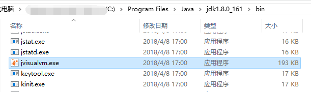

## 四、jvisualvm页面介绍

直接双击就可以打开该程序，打开后界面如下：

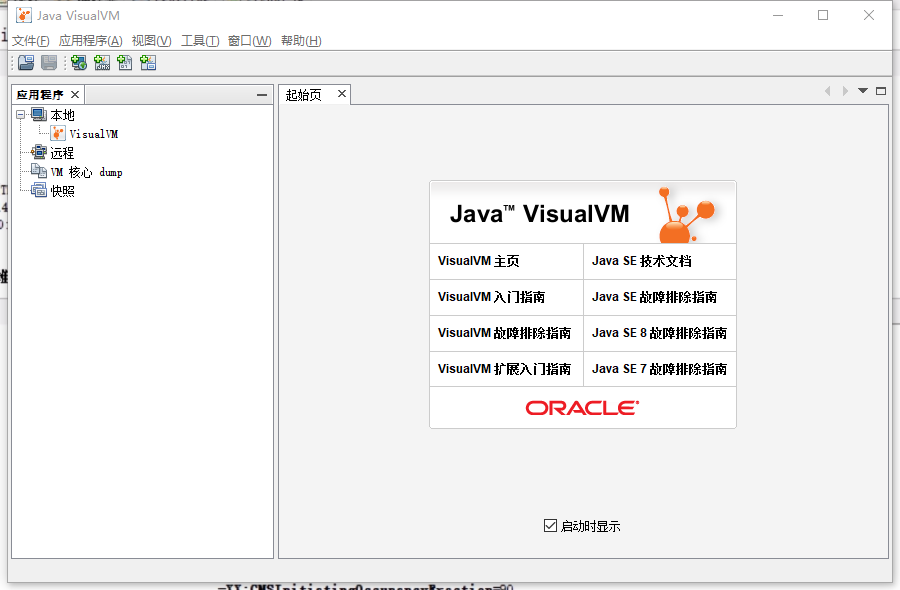

如果只是监控本地的java进程，是不需要配置参数的，直接打开就能够进行监控。首先我们需要在本地打开一个Java程序，例如我打开IDEA，这时在jvisualvm界面就可以看到与IDEA相关的Java进程了：

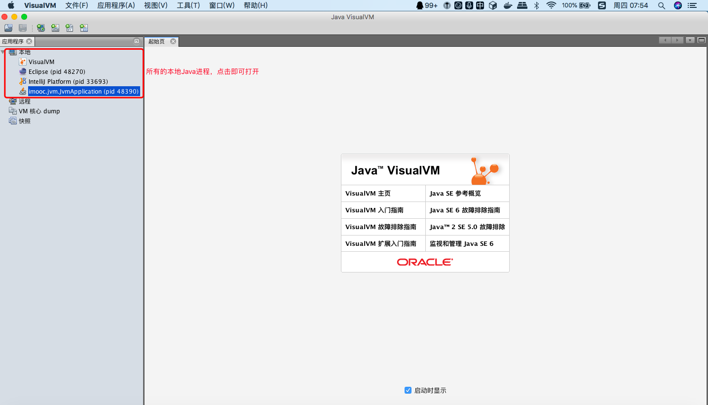

点击一个进程，就可以查看该进程的概述信息，该进程的JVM参数以及系统属性信息等都能查看到

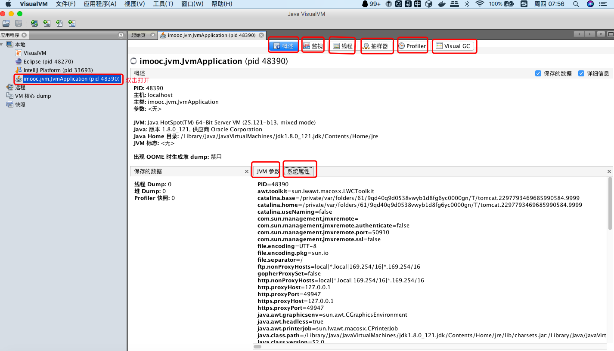

点击 “监视” 就能够看到CPU、内存、类以及线程的活动状况，点击右上角的 “堆Dump” 就能够导出内存映像文件：

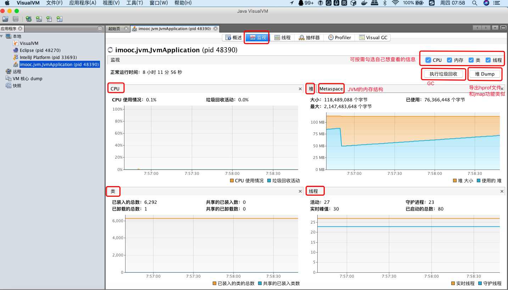

除了导出，也还可以导入内存映像文件，只不过分析功能上没有MAT强大：

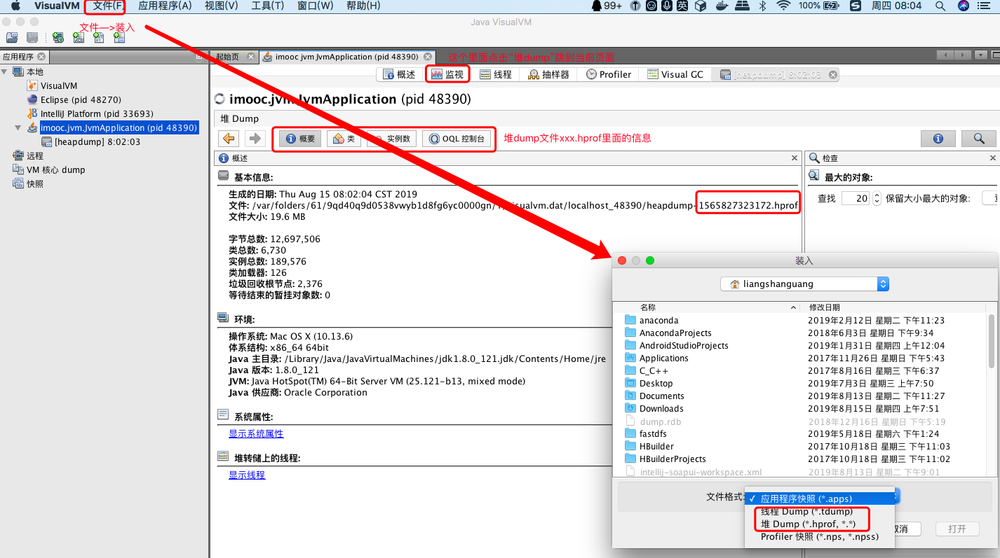

点击 “线程” 就能够看到该进程内部的所有线程，以及线程的运行状况等信息。如果点击右上角的 “线程Dump” 就会导出一个内容与jstack打印内容一致的文件： 

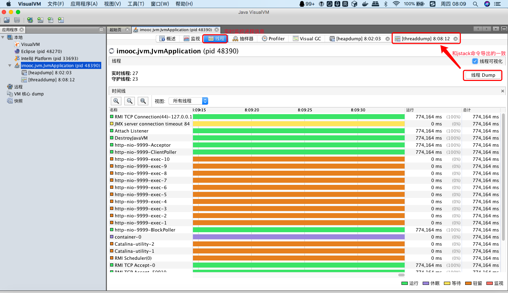

点击 “抽样器” 界面中的 “CPU ” 就可以动态的看到每个方法的执行时间，当我们的代码执行的比较慢了，就可以通过抽样器来查看是哪一个方法执行的比较慢：


而点击 “内存” 的话，就可以实时的、动态的查看到每个类实例对象的数量以及这些实例所占用的内存大小：

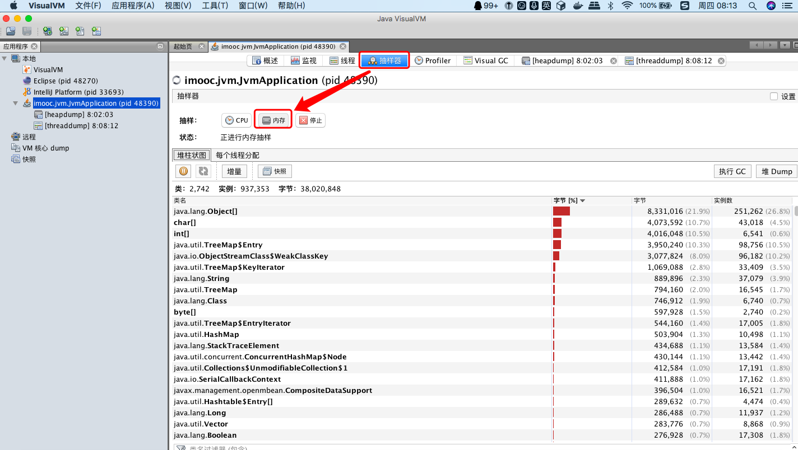

在Profiler界面上，可以对CPU、内存进行性能分析，分析后会给出分析结果：

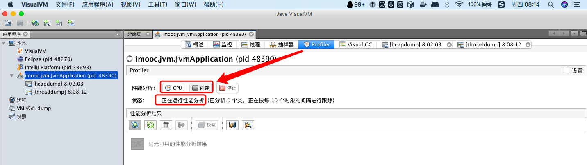

## 五、jvisualvm的两个常用插件：Visual GC和Btrace WorkBench

首先到VisualVM插件中心，地址如下：

https://visualvm.github.io/pluginscenters.html

因为有时候自带的插件地址可能无法使用，所以我们需要自行配置可用的地址：

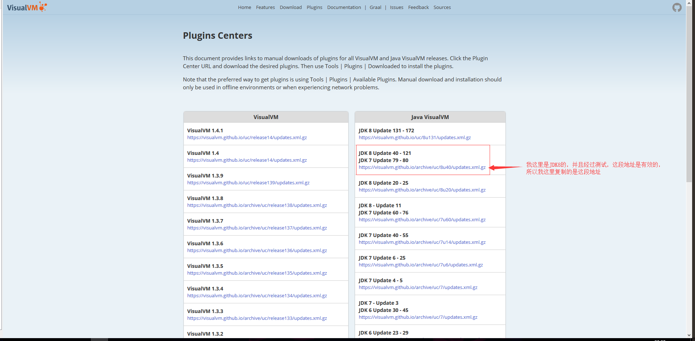

回到jvisualvm中，点击菜单栏中的 “工具“ 选项，再点击子菜单的 ”插件“ 选项：

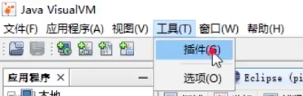

然后按照下图配置插件地址：

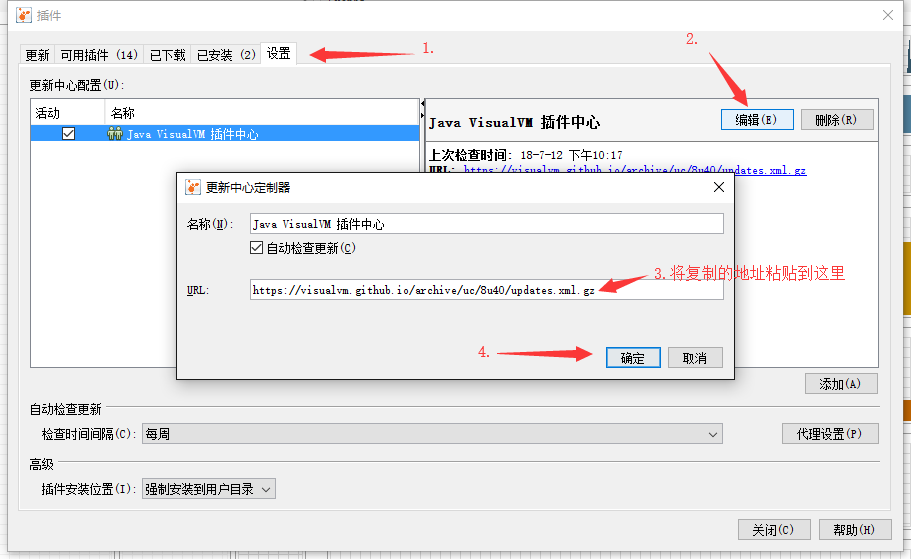

配置好插件地址后，按照下图勾选以下两个插件,并按照提示安装即可：


插件安装完成后需要重启jvisualvm才会生效，这时会看到选项卡中多了一个 “Visual GC” 选项，点击该选项后，可以动态的查看到JVM内存结构各个区域的运行状况，极大方便我们进行各个区内存的监控及调优，这个图和jvm的内存模型是对应地：

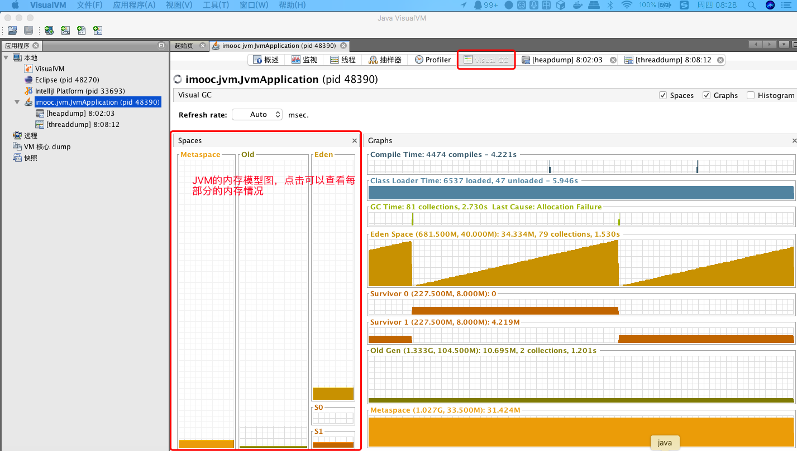

## 六、监控远程的java进程

在上一小节中，我们简单介绍了如何使用JDK自带的jvisualvm工具来监控本地的Java进程。而本小节我们将介绍一下如何使用jvisualvm来监控远程的java进程，我们这里以线上服务器的Tomcat为例。

打开jvisualvm，双击 “远程” 选项，添加一个远程主机，即远程的服务器：

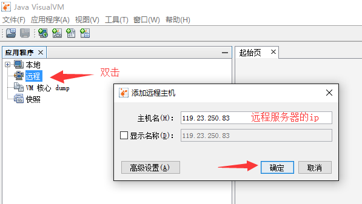

然后编辑Tomcat的catalina.sh文件，在该文件中加入如下配置内容：

```shell
[root@server ~]# vim /home/tomcat/apache-tomcat-8.5.8/bin/catalina.sh
JAVA_OPTS="$JAVA_OPTS -Dcom.sun.management.jmxremote -Dcom.sun.management.jmxremote.port=9004 -Dcom.sun.management.jmxremote.authenticate=false -Dcom.sun.management.jmxremote.ssl=false -Djava.net.preferIPv4Stack=true -Djava.rmi.server.hostname=119.23.250.83"
```

配置简单说明：

```shell
-Dcom.sun.management.jmxremote添加一个jmx远程连接属性
-Dcom.sun.management.jmxremote.port=9004 指定连接的端口号
-Dcom.sun.management.jmxremote.authenticate=false 是否启用验证
-Dcom.sun.management.jmxremote.ssl=false 是否启用ssl
Djava.net.preferIPv4Stack=true 是否优先使用ipv4
-Djava.rmi.server.hostname=119.23.250.83 指定远程主机的ip地址
```

如下图：

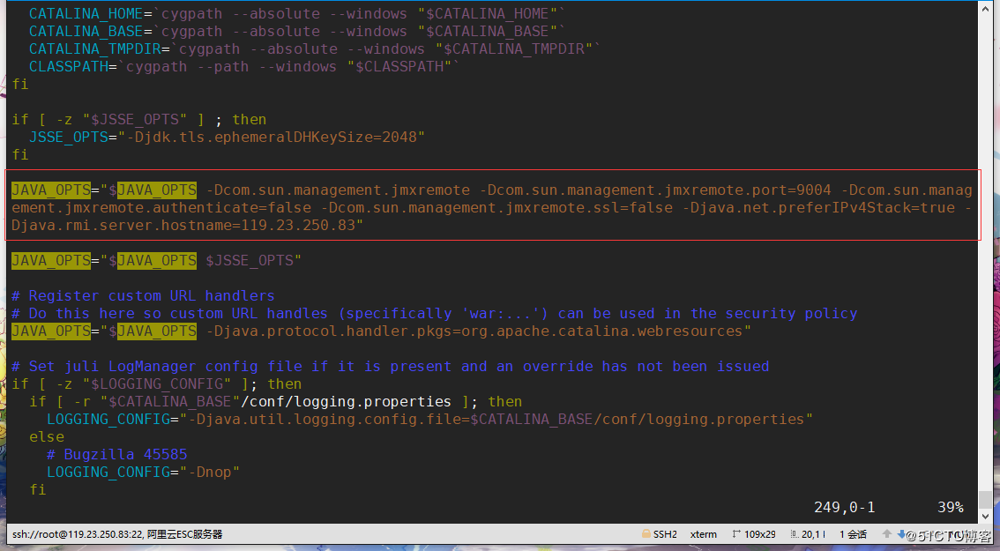

增加完配置后，重启Tomcat，查看是否有9004端口，有的话就代表配置成功了，如下：

```shell
[root@server ~]# netstat -lntp |grep java
tcp        0      0 0.0.0.0:9004            0.0.0.0:*               LISTEN      13399/java          
tcp        0      0 0.0.0.0:8080            0.0.0.0:*               LISTEN      13399/java          
tcp        0      0 0.0.0.0:46199           0.0.0.0:*               LISTEN      13399/java          
tcp        0      0 0.0.0.0:32859           0.0.0.0:*               LISTEN      13399/java          
tcp        0      0 127.0.0.1:8005          0.0.0.0:*               LISTEN      13399/java          
tcp        0      0 0.0.0.0:8009            0.0.0.0:*               LISTEN      13399/java          
[root@server ~]#
```

回到jvisualvm中，添加JMX连接，配置连接地址和端口，如下：

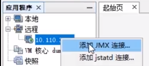

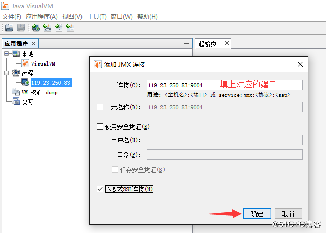

注意，如果你使用的是阿里云等云服务器的话，不仅需要配置防火墙规则来开放端口，还需要到云服务器的安全组规则中，增加相应的端口规则，如下:

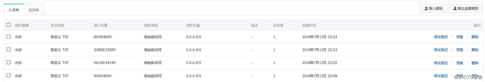

连接成功后，如下：

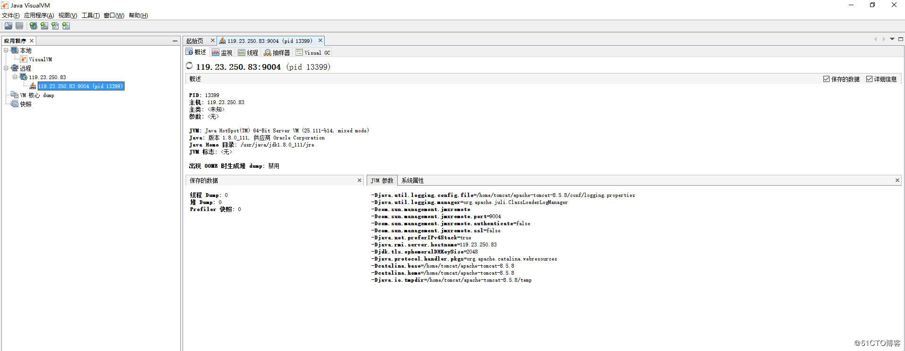

同样的，可以像监控本地进程一样，监控远程的进程，在界面的操作上是一模一样的。唯一不同的也就是需要添加一个远程主机，然后到远程的Java进程上配置一些jmx参数而已：

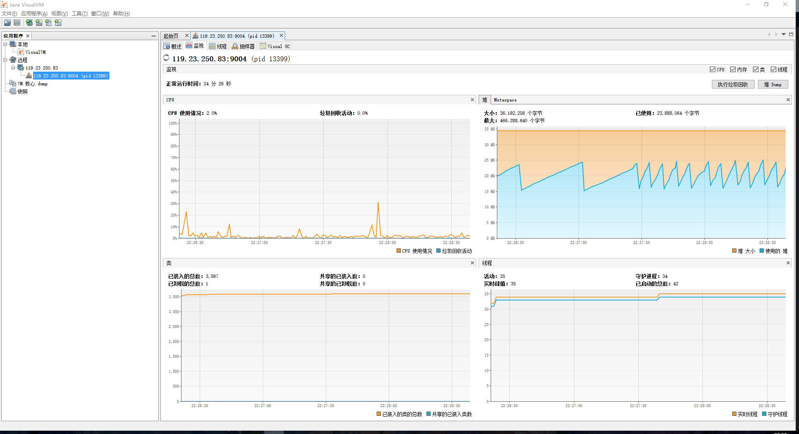

以上我们是以Tomcat这种服务型的进程作为一个示例，只需要去配置Tomcat的脚本文件就可以了。那么如果我们需要监控的是自己线上跑的一个Java进程需要怎么进行配置呢？其实也是一样的，同样的是使用这些参数，只不过是作为启动参数而已，在启动项目的时候加上即可，如下：

```shell
[root@server ~]# nohup java -Dcom.sun.management.jmxremote -Dcom.sun.management.jmxremote.port=9005 -Dcom.sun.management.jmxremote.authenticate=false -Dcom.sun.management.jmxremote.ssl=false -Djava.net.preferIPv4Stack=true -Djava.rmi.server.hostname=119.23.250.83 -jar monitor_tuning-0.0.1-SNAPSHOT.jar &
```

成功启动后，也是使用同样的方式进行连接，注意端口不要弄错了：

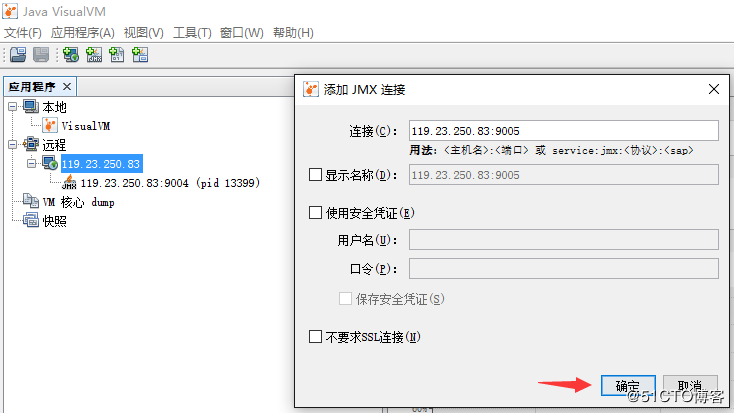

然后我们就可以愉快的在本地监控远程的Java进程了，而且还是图形化的，免去了敲命令的烦恼。

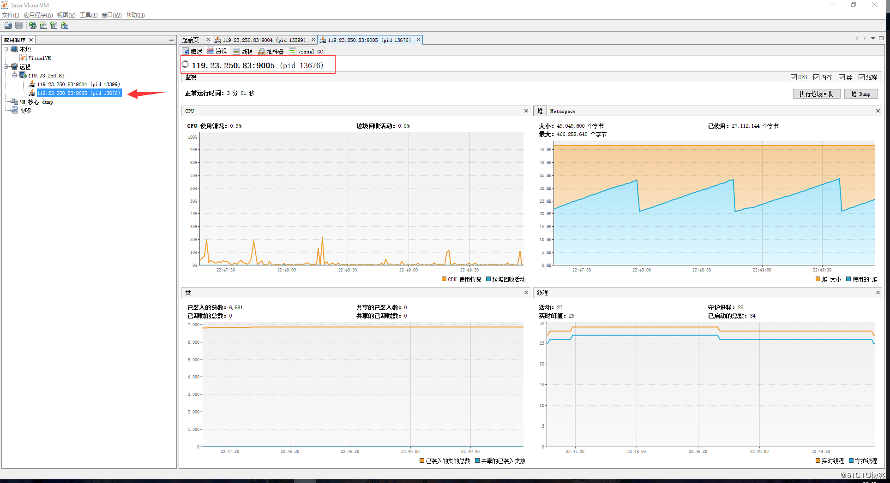

我们来做一个堆内存溢出的实验，看看jvisualvm能否监控到内存的变化，在浏览器上访问我们之前在基于JDK命令行工具的监控一文中所编写的/head接口。访问后如下，可以看到堆内存的变化很激烈，利用jvisualvm工具进行监控，就很明显的就能够观察到该进程的异常：

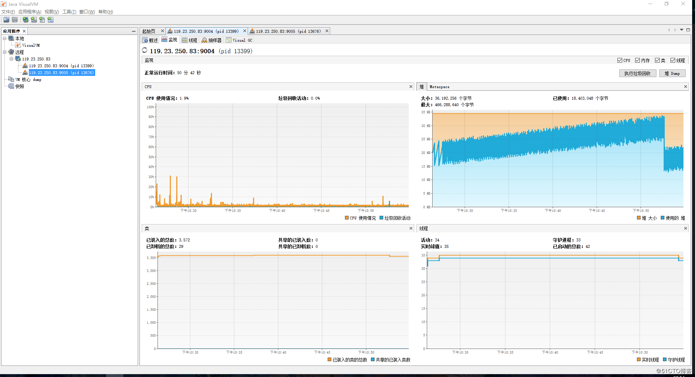

所以线上监控不能少，是我们必须要掌握的一种技能。监控相当于我们的眼睛，如果没有监控工具，那我们就相当于瞎子一样两眼一抹黑。无法看到内存、线程的使用情况，当出现异常的时候，也难以定位问题发生的原因。
