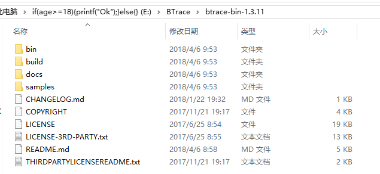
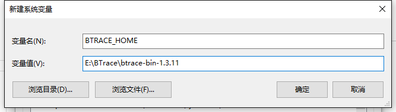
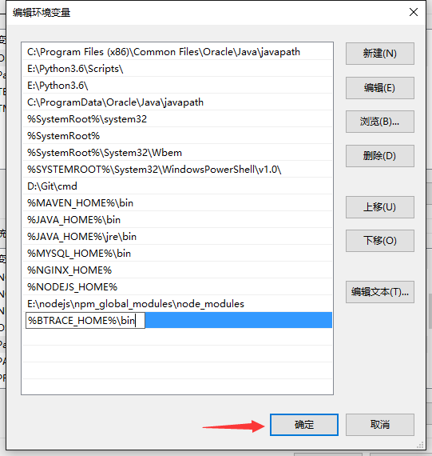
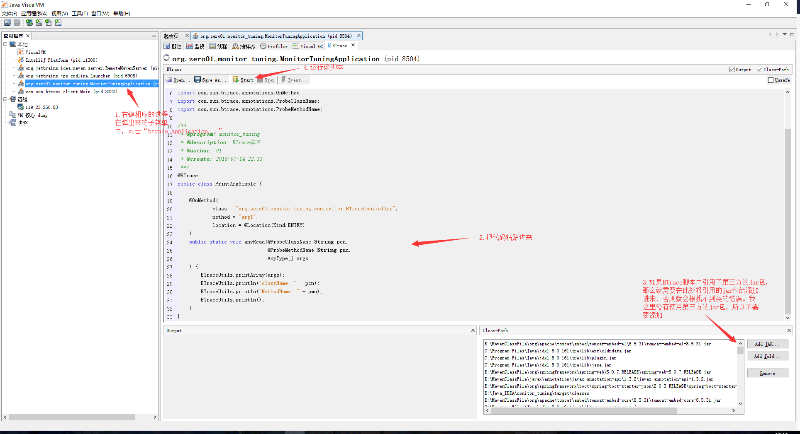
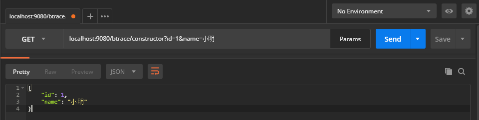
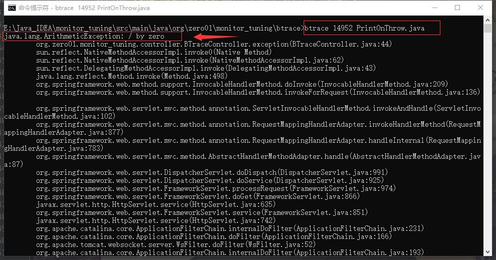
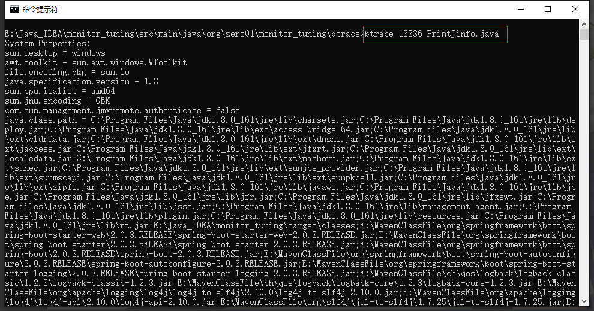

# 第4章 基于Btrace的监控调试

> 可以动态地向目标应用程序的字节码注入追踪代码，用到的技术：JavaComplierApi、JVMTI、Agent、Instrumentation+ASM

+ [官方仓库](https://github.com/btraceio/btrace)
+ [下载地址](https://github.com/btraceio/btrace/releases/tag/v1.3.11)

参考博客

+ [本章完整笔记](https://blog.51cto.com/zero01/2143096)
+ [btrace使用教程](https://blog.csdn.net/ZYC88888/article/details/81662671)
+ [Java Agent简介](https://www.jianshu.com/p/63c328ca208d)
+ [Btrace简介](https://www.jianshu.com/p/63152d9116fe)

## 一、Btrace简介

BTrace是Java的安全可靠的动态跟踪工具。 它的工作原理是通过 instrument + asm 来对正在运行的java程序中的class类进行动态增强。`也就是说btrace可以在Java程序运行时，动态地向目标应用程序的字节码注入追踪代码`

说他是安全可靠的，是因为它对正在运行的程序是只读的。也就是说，他可以插入跟踪语句来检测和分析运行中的程序，不允许对其进行修改。因此他存在一些限制：

+ 不能创建对象
+ 不能创建数组
+ 不能抛出和捕获异常
+ 不能调用任何对象方法和静态方法
+ 不能给目标程序中的类静态属性和对象的属性进行赋值
+ 不能有外部、内部和嵌套类
+ 不能有同步块和同步方法
+ 不能有循环(for, while, do..while)
+ 不能继承任何的类
+ 不能实现接口
+ 不能包含assert断言语句

这些限制其实是可以使用unsafe模式绕过。通过在BTrace脚本中声明 `@BTrace(unsafe = true)` 注解 ，并且使用 -u 选项，指定以 unsafe 模式运行btrace即可

注：实际使用非安全模式跟踪时，发现一个问题，一个进程如果被安全模式btrace探测过一次， 后面再使用非安全模式进行探测时非安全模式不生效

## 二、安装btrace

到github上下载btrace的压缩包，我这里下载的是1.3.11版本，下载地址如下：

https://github.com/btraceio/btrace/releases/tag/v1.3.11

解压下载的压缩包，解压后可以看到目录如下：'



然后就是配置环境变量，首先创建一个BTRACE_HOME，该环境变量的值就是btrace的安装目录：



接着在path变量里，配置BTRACE_HOME环境变量下的bin目录：



## 三、使用btrace

配置好btrace后，我们有两种方式可以运行BTrace脚本：

+ 直接使用命令行运行：`btrace pid xxx.java`
+ 在JVisualVM中添加BTrace插件，添加classpath

### 命令行

我们先来演示第二种使用命令行的运行方式，在工程里新建一个简单的controller，用于演示如何利用BTrace脚本来实时获取方法的参数值：

```java
package org.zero01.monitor_tuning.controller;

import org.springframework.web.bind.annotation.RequestMapping;
import org.springframework.web.bind.annotation.RequestParam;
import org.springframework.web.bind.annotation.RestController;

/**
 * @program: monitor_tuning
 * @description: BTrace演示
 * @author: 01
 * @create: 2018-07-14 22:33
 **/

@RestController
@RequestMapping("/btrace")
public class BTraceController {

    @RequestMapping("/arg1")
    public String arg1(@RequestParam("name") String name) {
        return "hello: " + name;
    }
}
```

编写完这个Controller后就可以启动项目了，为了方便演示，我们直接将BTrace脚本写在这个工程里，实际上BTrace脚本与我们的项目代码是分离的，没有依赖关系的。但我们得引入编写BTrace脚本所需的jar包，pom.xml配置的依赖如下:

```xml
<dependency>
    <groupId>com.sun.btrace</groupId>
    <artifactId>btrace-agent</artifactId>
    <version>1.3.11</version>
    <type>jar</type>
    <scope>system</scope>
    <systemPath>E:\BTrace\btrace-bin-1.3.11\build\btrace-agent.jar</systemPath>
</dependency>
<dependency>
    <groupId>com.sun.btrace</groupId>
    <artifactId>btrace-boot</artifactId>
    <version>1.3.11</version>
    <type>jar</type>
    <scope>system</scope>
    <systemPath>E:\BTrace\btrace-bin-1.3.11\build\btrace-boot.jar</systemPath>
</dependency>
<dependency>
    <groupId>com.sun.btrace</groupId>
    <artifactId>btrace-client</artifactId>
    <version>1.3.11</version>
    <type>jar</type>
    <scope>system</scope>
    <systemPath>E:\BTrace\btrace-bin-1.3.11\build\btrace-client.jar</systemPath>
</dependency>
```

注：systemPath配置的是BTrace安装目录里的jar包路径，如果不想指向路径的话，可以使用maven命令，把这些jar包安装到本地的maven仓库中，命令示例如下：

> `mvn install:install-file -Dfile=E:\BTrace\btrace-bin-1.3.11\build\btrace-boot.jar -DgroupId=com.sun.btrace -DartifactId=btrace-boot -Dversion=1.3.11 -Dpackaging=jar`

然后新建一个btrace包，在该包内新建一个 PrintArgSimple 类，代码如下：

```java
package org.zero01.monitor_tuning.btrace;

import com.sun.btrace.AnyType;
import com.sun.btrace.BTraceUtils;
import com.sun.btrace.annotations.BTrace;
import com.sun.btrace.annotations.Kind;
import com.sun.btrace.annotations.Location;
import com.sun.btrace.annotations.OnMethod;
import com.sun.btrace.annotations.ProbeClassName;
import com.sun.btrace.annotations.ProbeMethodName;

/**
 * @program: monitor_tuning
 * @description: BTrace脚本
 * @author: 01
 * @create: 2018-07-14 22:33
 **/

@BTrace  // 注明这是一个BTrace脚本
public class PrintArgSimple {

    // 指定需要拦截的方法
    @OnMethod(
            // 类的路径
            clazz = "org.zero01.monitor_tuning.controller.BTraceController",
            // 方法名
            method = "arg1",
            // 在什么时候进行拦截
            location = @Location(Kind.ENTRY)
    )
    public static void anyRead(@ProbeClassName String pcn, // 被拦截的类名
                               @ProbeMethodName String pmn, // 被拦截的方法名
                               AnyType[] args // 被拦截的方法的参数值
    ) {
        // 打印数组
        BTraceUtils.printArray(args);
        // 打印行
        BTraceUtils.println("className: " + pcn);
        BTraceUtils.println("MethodName: " + pmn);
        BTraceUtils.println();
    }
}
```

打开命令行，进入到PrintArgSimple.java文件所在的路径，然后使用命令运行该BTrace脚本：

```shell
C:\Users\admin>e:

E:\>cd E:\Java_IDEA\monitor_tuning\src\main\java\org\zero01\monitor_tuning\btrace\

E:\Java_IDEA\monitor_tuning\src\main\java\org\zero01\monitor_tuning\btrace>jps
11300
7396 Jps
8504 MonitorTuningApplication
5656 RemoteMavenServer
12188 Main
13916 Launcher

E:\Java_IDEA\monitor_tuning\src\main\java\org\zero01\monitor_tuning\btrace>btrace 8504 PrintArgSimple.java
```

注：因为代码中有中文注释，可能会报：编码GBK的不可映射字符 错误，但是并不影响运行，可以不用管它

在命令行中运行了BTrace脚本后，到浏览器上，访问我们之前所编写的接口，如下：


访问成功后，命令行输出如下，可以看到BTrace脚本成功拦截了我们输入的参数值，以及访问的controller和方法：

```shell
[小明, ]
className: org.zero01.monitor_tuning.controller.BTraceController
MethodName: arg1
```

### 使用jvisualvm的BTrace插件

以上就是如何在命令行里运行BTrace脚本。接着我们再来演示如何在JVisualVM里运行BTrace脚本，在此之前我们还需要安装一个BTrace的插件。关于BTrace插件的安装，我已经在 基于[JVisualVM的可视化监控](../第3章_基于JVisualVM的可视化监控/README.md) 一文中介绍过了，这里就不赘述了。复制好之前编写的BTrace脚本，然后按照下图粘贴到JVisualVM里运行即可：



注：在JVisualVM里运行BTrace脚本其实会有很多迷之问题，所以一般推荐使用命令行的运行方式

## 拦截构造函数、同名函数

在上一小节中，我们简单介绍了BTrace的安装以及两种运行方式。并且也写了一个小demo用于动态地拦截方法参数，而本节将介绍一下如何拦截构造函数和同名方法。
首先我们新建一个实体类，代码如下：

```java
package org.zero01.monitor_tuning.vo;

public class User {

    private int id;
    private String name;

    public User(int id, String name) {
        super();  // 必须加上super不然无法拦截到参数
        this.id = id;
        this.name = name;
    }

    ... gtter setter 略 ...
}
```

在BTraceController类中，新增如下方法，并启动项目：

```java
@RequestMapping("/constructor")
public User constructor(User user) {
    return user;
}
```

然后和之前一样，在btrace包下新建一个BTrace脚本，代码如下：

```java
package org.zero01.monitor_tuning.btrace;

import com.sun.btrace.AnyType;
import com.sun.btrace.BTraceUtils;
import com.sun.btrace.annotations.BTrace;
import com.sun.btrace.annotations.OnMethod;
import com.sun.btrace.annotations.ProbeClassName;
import com.sun.btrace.annotations.ProbeMethodName;

/**
 * @program: monitor_tuning
 * @description: 演示拦截构造函数
 * @author: 01
 * @create: 2018-07-14 22:33
 **/

@BTrace
public class PrintConstructor {

    @OnMethod(
            clazz = "org.zero01.monitor_tuning.vo.User",
            method = "<init>"  // 指定拦截构造函数
    )
    public static void anyRead(@ProbeClassName String pcn, @ProbeMethodName String pmn, AnyType[] args) {
        BTraceUtils.println("ClassName: " + pcn);
        BTraceUtils.println("MethodName: " + pmn);
        BTraceUtils.printArray(args);
        BTraceUtils.println();
    }
}
```

同样的，在命令行中运行该脚本：

```shell
E:\Java_IDEA\monitor_tuning\src\main\java\org\zero01\monitor_tuning\btrace>jps
1184 MonitorTuningApplication
11300
15208 Launcher
5656 RemoteMavenServer
1052 Jps

E:\Java_IDEA\monitor_tuning\src\main\java\org\zero01\monitor_tuning\btrace>btrace 1184 PrintConstructor.java
```

使用postman或浏览器访问接口：



访问成功后，命令行输出如下，则是成功拦截到了：

```shell
ClassName: org.zero01.monitor_tuning.vo.User
MethodName: <init>
[1, 小明, ]
```

演示完构造函数的拦截后，然后我们来看看如何拦截同名的方法，在 BTraceController 类里，增加如下两个同名方法：

```java
@RequestMapping("/same1")
public String same(@RequestParam("name") String name) {
    return "hello: " + name;
}

@RequestMapping("/same2")
public User same(@RequestParam("id") int id,
                 @RequestParam("name") String name) {
    return new User(id, name);
}
```

然后在btrace包下新建一个BTrace脚本，代码如下：

```java
package org.zero01.monitor_tuning.btrace;

import com.sun.btrace.BTraceUtils;
import com.sun.btrace.annotations.BTrace;
import com.sun.btrace.annotations.OnMethod;
import com.sun.btrace.annotations.ProbeClassName;
import com.sun.btrace.annotations.ProbeMethodName;

@BTrace
public class PrintSame {

    @OnMethod(
            clazz = "org.zero01.monitor_tuning.controller.BTraceController",
            method = "same"
    )
    public static void anyRead(@ProbeClassName String pcn, @ProbeMethodName String pmn, String name) {
        BTraceUtils.println("ClassName: " + pcn);
        BTraceUtils.println("MethodName: " + pmn);
        BTraceUtils.println("name: " + name);
        BTraceUtils.println();
    }

    @OnMethod(
            clazz = "org.zero01.monitor_tuning.controller.BTraceController",
            method = "same"
    )
    public static void anyRead(@ProbeClassName String pcn, @ProbeMethodName String pmn, int id, String name) {
        BTraceUtils.println("ClassName: " + pcn);
        BTraceUtils.println("MethodName: " + pmn);
        BTraceUtils.println("id: " + id);
        BTraceUtils.println("name: " + name);
        BTraceUtils.println();
    }
}
```

从以上的BTrace脚本中可以看到，其实拦截重载方法的话，只需要在BTrace脚本的方法中声明与之对应的参数即可。

接着就是在命令行里运行该脚本，访问相应的接口后，输出如下：

```shell
E:\Java_IDEA\monitor_tuning\src\main\java\org\zero01\monitor_tuning\btrace>jps
9024 MonitorTuningApplication
11300
3956 Launcher
5656 RemoteMavenServer
9272 Jps

E:\Java_IDEA\monitor_tuning\src\main\java\org\zero01\monitor_tuning\btrace>btrace 9024 PrintSame.java
ClassName: org.zero01.monitor_tuning.controller.BTraceController
MethodName: same
name: 小明

ClassName: org.zero01.monitor_tuning.controller.BTraceController
MethodName: same
id: 1
name: 小明
```

## 拦截返回值、异常、行号

本小节将介绍常用的拦截方式，如何去拦截返回值、异常以及行号。

我们通过Kind来指定拦截方式，常用的拦截方式如下：

```shell
Kind.ENTRY  // 入口拦截，默认值
Kind.RETURN  // 拦截返回值
Kind.THROW  // 发生异常时拦截
Kind.LINE  // 拦截某一行
```

我们先来演示拦截返回值，就以之前编写的arg1方法作为示例。

在btrace包下新建一个BTrace脚本，代码如下：

```java
package org.zero01.monitor_tuning.btrace;
import com.sun.btrace.AnyType;
import com.sun.btrace.BTraceUtils;
import com.sun.btrace.annotations.BTrace;
import com.sun.btrace.annotations.Kind;
import com.sun.btrace.annotations.Location;
import com.sun.btrace.annotations.OnMethod;
import com.sun.btrace.annotations.ProbeClassName;
import com.sun.btrace.annotations.ProbeMethodName;
import com.sun.btrace.annotations.Return;

@BTrace
public class PrintReturn {

    @OnMethod(
            clazz="org.zero01.monitor_tuning.controller.BTraceController",
            method="arg1",
            location=@Location(Kind.RETURN)  // 拦截返回值
    )
    public static void anyRead(@ProbeClassName String pcn, 
                               @ProbeMethodName String pmn, 
                               @Return AnyType result // 接收返回值) {
        BTraceUtils.println("ClassName: " + pcn);
        BTraceUtils.println("MethodName: " + pmn);
        BTraceUtils.println("ResultValue: " + result);
        BTraceUtils.println();
    }
}
```

在命令行里运行该脚本，访问相应的接口后，输出如下，可以看到成功拦截到了该方法的返回值：

```shell
E:\Java_IDEA\monitor_tuning\src\main\java\org\zero01\monitor_tuning\btrace>btrace 9024 PrintReturn.java
ClassName: org.zero01.monitor_tuning.controller.BTraceController
MethodName: arg1
ResultValue: hello: 小明
```

已经工作了的小伙伴们，应该会遇到一个常见的现象。那就是在很多旧项目的遗留代码中，总是能看到很多不妥的处理异常的方式。例如经常能看到把异常使用try-catch包起来，但是又不打印异常堆栈，也不抛出去。结果就是把异常隐藏了起来，没能让异常终止逻辑，导致了代码继续执行，还无法定位问题的所在。就如同以下这个方法一样：

```java
@RequestMapping("/exception")
public String exception() {
    try {
        System.out.println("start...");
        System.out.println(1 / 0);
        System.out.println("end...");
    } catch (Exception e) {

    }

    return "success";
}
```

我们访问以上这个接口，会看到返回的值是正确的，但是也会发现有部分逻辑没被执行，查看日志或控制台输出也没有异常信息。当出现这种情况，就真的两眼一抹黑了，根本无法排查问题（这里作为演示代码很简单，但是实际的项目代码可不是这样）。

还好我们现在知道了BTrace这样的调试工具，那么就可以利用BTrace脚本来拦截异常并打印异常堆栈，从而定位问题。
在btrace包下新建一个BTrace脚本，代码如下，这是我直接从官方示例里拿来的代码：

```java
/*
 * Copyright (c) 2008, 2015, Oracle and/or its affiliates. All rights reserved.
 * DO NOT ALTER OR REMOVE COPYRIGHT NOTICES OR THIS FILE HEADER.
 *
 * This code is free software; you can redistribute it and/or modify it
 * under the terms of the GNU General Public License version 2 only, as
 * published by the Free Software Foundation.  Oracle designates this
 * particular file as subject to the Classpath exception as provided
 * by Oracle in the LICENSE file that accompanied this code.
 *
 * This code is distributed in the hope that it will be useful, but WITHOUT
 * ANY WARRANTY; without even the implied warranty of MERCHANTABILITY or
 * FITNESS FOR A PARTICULAR PURPOSE.  See the GNU General Public License
 * version 2 for more details (a copy is included in the LICENSE file that
 * accompanied this code).
 *
 * You should have received a copy of the GNU General Public License version
 * 2 along with this work; if not, write to the Free Software Foundation,
 * Inc., 51 Franklin St, Fifth Floor, Boston, MA 02110-1301 USA.
 *
 * Please contact Oracle, 500 Oracle Parkway, Redwood Shores, CA 94065 USA
 * or visit www.oracle.com if you need additional information or have any
 * questions.
 */

package org.zero01.monitor_tuning.btrace;

import com.sun.btrace.BTraceUtils;
import com.sun.btrace.annotations.BTrace;
import com.sun.btrace.annotations.Kind;
import com.sun.btrace.annotations.Location;
import com.sun.btrace.annotations.OnMethod;
import com.sun.btrace.annotations.Self;
import com.sun.btrace.annotations.TLS;

@BTrace 
public class PrintOnThrow {    
    // store current exception in a thread local
    // variable (@TLS annotation). Note that we can't
    // store it in a global variable!
    @TLS 
    static Throwable currentException;

    // introduce probe into every constructor of java.lang.Throwable
    // class and store "this" in the thread local variable.
    @OnMethod(
        clazz="java.lang.Throwable",
        method="<init>"
    )
    public static void onthrow(@Self Throwable self) {  // @Self其实就是拦截了this
        //new Throwable()
        currentException = self;
    }

    @OnMethod(
        clazz="java.lang.Throwable",
        method="<init>"
    )
    public static void onthrow1(@Self Throwable self, String s) {
        //new Throwable(String msg)
        currentException = self;
    }

    @OnMethod(
        clazz="java.lang.Throwable",
        method="<init>"
    )
    public static void onthrow1(@Self Throwable self, String s, Throwable cause) {
        //new Throwable(String msg, Throwable cause)
        currentException = self;
    }

    @OnMethod(
        clazz="java.lang.Throwable",
        method="<init>"
    )
    public static void onthrow2(@Self Throwable self, Throwable cause) {
        //new Throwable(Throwable cause)
        currentException = self;
    }

    // when any constructor of java.lang.Throwable returns
    // print the currentException's stack trace.
    @OnMethod(
        clazz="java.lang.Throwable",
        method="<init>",
        location=@Location(Kind.RETURN)
    )
    public static void onthrowreturn() {
        if (currentException != null) {
            // 打印异常堆栈
            BTraceUtils.Threads.jstack(currentException);
            BTraceUtils.println("=====================");
            // 打印完之后就置空
            currentException = null;
        }
    }
}
```
在命令行里运行该脚本，访问相应的接口后，输出的异常堆栈如下：


可以看到，即便异常被隐藏了起来，而我们通过btrace脚本一样能把异常重新给揪出来，这样即便是线上正在运行的项目，我们也能够不关闭、不重启服务，就能够监控到项目里是否有发生异常。

我们还可以使用BTrace拦截某一行代码，以此判断该行代码是否有被执行。在btrace包下新建一个BTrace脚本，代码如下

```java
package org.zero01.monitor_tuning.btrace;
import com.sun.btrace.BTraceUtils;
import com.sun.btrace.annotations.BTrace;
import com.sun.btrace.annotations.Kind;
import com.sun.btrace.annotations.Location;
import com.sun.btrace.annotations.OnMethod;
import com.sun.btrace.annotations.ProbeClassName;
import com.sun.btrace.annotations.ProbeMethodName;

@BTrace
public class PrintLine {

    @OnMethod(
            clazz="org.zero01.monitor_tuning.controller.BTraceController",
            method="exception",
            location=@Location(value=Kind.LINE, line=43)  // 拦截第43行
    )
    public static void anyRead(@ProbeClassName String pcn, @ProbeMethodName String pmn, int line) {
        BTraceUtils.println("ClassName: " + pcn);
        BTraceUtils.println("MethodName: " + pmn);
        BTraceUtils.println("line: " + line);
        BTraceUtils.println();
    }
}
```

在命令行里运行该脚本，访问相应的接口后，输出的信息如下：

```shell
E:\Java_IDEA\monitor_tuning\src\main\java\org\zero01\monitor_tuning\btrace>btrace 14952 PrintLine.java
ClassName: org.zero01.monitor_tuning.controller.BTraceController
MethodName: exception
line: 43
```

如果没有任何输出的话，就代表那一行没有被执行到，所以没被拦截。这种拦截某一行的方式，不适用于判断是否有异常，只能单纯用于判断某一行是否被执行了。

## 拦截复杂参数、环境变量、正则匹配拦截

在以上小节中，我们已经知道了如何拦截简单的参入，本小节中，将介绍如何拦截复杂参数、环境变量以及使用正则匹配拦截。

拦截复杂参数就是拦截实体对象类型的参数，在 BTraceController 类里，增加如下方法：

```java
@RequestMapping("/arg2")
public User arg2(User user) {
    return user;
}
```

使用BTrace拦截复杂参数，需要使用反射的方式进行拦截，也就是需要传递包名+属性名。在btrace包下新建一个BTrace脚本，代码如下：

```java
package org.zero01.monitor_tuning.btrace;

import java.lang.reflect.Field;

import com.sun.btrace.BTraceUtils;
import com.sun.btrace.annotations.BTrace;
import com.sun.btrace.annotations.Kind;
import com.sun.btrace.annotations.Location;
import com.sun.btrace.annotations.OnMethod;
import com.sun.btrace.annotations.ProbeClassName;
import com.sun.btrace.annotations.ProbeMethodName;
import org.zero01.monitor_tuning.vo.User;

@BTrace
public class PrintArgComplex {

    @OnMethod(
            clazz = "org.zero01.monitor_tuning.controller.BTraceController",
            method = "arg2",
            location = @Location(Kind.ENTRY)
    )
    public static void anyRead(@ProbeClassName String pcn, @ProbeMethodName String pmn, User user) {
        //print all fields
        BTraceUtils.print("print all fields: ");
        BTraceUtils.printFields(user);

        //print one field
        Field oneFiled = BTraceUtils.field("org.zero01.monitor_tuning.vo.User", "name");
        BTraceUtils.println("print one field: " + BTraceUtils.get(oneFiled, user));

        BTraceUtils.println("ClassName: " + pcn);
        BTraceUtils.println("MethodName: " + pmn);
        BTraceUtils.println();
    }
}
```

在命令行里运行该脚本，访问相应的接口后，输出的信息如下：

```shell
E:\Java_IDEA\monitor_tuning\src\main\java\org\zero01\monitor_tuning\btrace>btrace -cp "E:\Java_IDEA\monitor_tuning\target\classes" 13336 PrintArgComplex.java
print all fields: {id=0, name=小明, }
print one field: 小明
ClassName: org.zero01.monitor_tuning.controller.BTraceController
MethodName: arg2
```

注：这里使用到了一个 -cp 参数，该参数表示指定一个classpath路径

其实我们在编写BTrace脚本时，是可以使用正则表达式匹配类名和方法名的，并非必须要指定一个完整的名称。如下示例：

```java
package org.zero01.monitor_tuning.btrace;

import com.sun.btrace.BTraceUtils;
import com.sun.btrace.annotations.BTrace;
import com.sun.btrace.annotations.OnMethod;
import com.sun.btrace.annotations.ProbeClassName;
import com.sun.btrace.annotations.ProbeMethodName;

@BTrace
public class PrintRegex {

    @OnMethod(
            // 类名也可以使用正则表达式进行匹配
            clazz = "org.zero01.monitor_tuning.controller.BTraceController",  
            // 正则表达式需要写在两个斜杠内
            method = "/.*/"  
    )
    public static void anyRead(@ProbeClassName String pcn, @ProbeMethodName String pmn) {
        BTraceUtils.println("ClassName: " + pcn);
        BTraceUtils.println("MethodName: " + pmn);
        BTraceUtils.println();
    }
}
```

通过编写BTrace脚本我们可以打印出JVM的信息以及环境变量等，就类似于jinfo命令一样。代码示例：

```java
package org.zero01.monitor_tuning.btrace;

import com.sun.btrace.BTraceUtils;
import com.sun.btrace.annotations.BTrace;

@BTrace
public class PrintJinfo {
    static {
        // 打印系统属性
        BTraceUtils.println("System Properties:");
        BTraceUtils.printProperties();

        // 打印JVM参数
        BTraceUtils.println("VM Flags:");
        BTraceUtils.printVmArguments();

        // 打印环境变量
        BTraceUtils.println("OS Enviroment:");
        BTraceUtils.printEnv();

        // 退出脚本
        BTraceUtils.exit(0);
    }
}
```

在命令行里运行该脚本，输出的信息如下：



## 注意事项

在以上小节中，我们介绍了BTrace的常见用法，也编写了相应的demo进行一一演示。但是还有一些需要注意事项，在此说明一下：

+ BTrace脚本默认只能本地运行，也就是只能调试本地的Java进程。如果需要在本地调试远程的Java进程的话，是需要自己去修改BTrace源码的
+ BTrace脚本在生产环境下可以使用，但是被修改的字节码不会被还原。所以我们需要先在本地调试好BTrace脚本，然后才能放到生产环境下使用。并且需要注意BTrace脚本中不能含有影响性能或消耗资源较多的代码，不然会导致线上的服务性能降低。

