# 第5章 Tomcat性能监控与调优

## tomcat远程debug

Tomcat是目前被应用得最多的一款Java Web服务器，很多人都会使用Tomcat来作为项目的服务器。也经常需要在开发的时候对Tomcat进行debug。在本地对Tomcat进行debug相信很多人都会，但如果需要对远程的Tomcat进行debug，相信有部分小伙伴还是没接触过的，而本小节将简单介绍一下如何对Tomcat进行远程debug。

Tomcat远程debug是基于 JDWP 协议实现的，关于 JDWP 协议，可参考以下文档：

https://www.ibm.com/developerworks/cn/java/j-lo-jpda3/

想要进行远程Debug，首先得配置一下远程的Tomcat，让其开启远程Debug模式。如下：

```shell
[root@server ~]# vim /home/tomcat/apache-tomcat-8.5.8/bin/startup.sh   # 在最后一行增加jdpa参数
exec "$PRGDIR"/"$EXECUTABLE" jpda start "$@"
[root@server ~]# vim /home/tomcat/apache-tomcat-8.5.8/bin/catalina.sh  # 将原本的localhost:8000改为9000
  if [ -z "$JPDA_ADDRESS" ]; then
    JPDA_ADDRESS="9000"
  fi
[root@server ~]# /home/tomcat/apache-tomcat-8.5.8/bin/startup.sh  # 启动Tomcat
Using CATALINA_BASE:   /home/tomcat/apache-tomcat-8.5.8
Using CATALINA_HOME:   /home/tomcat/apache-tomcat-8.5.8
Using CATALINA_TMPDIR: /home/tomcat/apache-tomcat-8.5.8/temp
Using JRE_HOME:        /usr
Using CLASSPATH:       /home/tomcat/apache-tomcat-8.5.8/bin/bootstrap.jar:/home/tomcat/apache-tomcat-8.5.8/bin/tomcat-juli.jar
Tomcat started.
[root@server ~]# netstat -lntp |grep 9000  # 查看9000端口是否已被监听
tcp        0      0 0.0.0.0:9000            0.0.0.0:*               LISTEN      17380/java 
[root@server ~]#
```

然后我们新建一个Controller，用于演示远程debug，所以代码也比较简单。代码如下：

```java
package org.zero01.monitor_tuning.controller;

import org.springframework.web.bind.annotation.RequestMapping;
import org.springframework.web.bind.annotation.RequestParam;
import org.springframework.web.bind.annotation.RestController;

/**
 * @program: monitor_tuning
 * @description: Tomcat远程debug演示
 * @author: 01
 * @create: 2018-07-15 17:58
 **/
@RestController
@RequestMapping("/remote/debug")
public class TomcatRemoteDebugController {

    @RequestMapping("/hello")
    public String hello(@RequestParam(value = "size", defaultValue = "10") int size) {
        StringBuilder str = new StringBuilder();
        for (int i = 0; i < size; i++) {
            str.append(i);
        }
        return str.toString();
    }
}
```

因为我们需要打成war包上传到远程的服务器上，所以需要让SpringBoot的启动类继承 SpringBootServletInitializer ，并且重写其中的configure方法。代码如下：

```java
package org.zero01.monitor_tuning;

import org.springframework.boot.SpringApplication;
import org.springframework.boot.autoconfigure.SpringBootApplication;
import org.springframework.boot.builder.SpringApplicationBuilder;
import org.springframework.boot.web.servlet.support.SpringBootServletInitializer;

@SpringBootApplication
public class MonitorTuningApplication extends SpringBootServletInitializer {

    public static void main(String[] args) {
        SpringApplication.run(MonitorTuningApplication.class, args);
    }

    @Override
    protected SpringApplicationBuilder configure(SpringApplicationBuilder builder) {
        return builder.sources(MonitorTuningApplication.class);
    }
}
```

接着将pom.xml配置文件中的打包方式，指定为war包：

```xml
<groupId>org.zero01</groupId>
<artifactId>monitor_tuning</artifactId>
<version>0.0.1-SNAPSHOT</version>
<packaging>war</packaging>
```

最后使用maven命令进行打包，命令如下：

```shell
mvn clean package -Dmaven.skip.test=true
```

打包好后，上传到远程的服务器上，我这里使用的是rz命令上传的，也可以使用ftp工具来上传。将上传好的war包放到Tomcat的webapps目录下：

```shell
[root@server ~]# ls
monitor_tuning-0.0.1-SNAPSHOT.war
[root@server ~]# mv monitor_tuning-0.0.1-SNAPSHOT.war monitor_tuning.war
[root@server ~]# ls
monitor_tuning.war
[root@server ~]# mv monitor_tuning.war /home/tomcat/apache-tomcat-8.5.8/webapps/
[root@server ~]# ls /home/tomcat/apache-tomcat-8.5.8/webapps/  # Tomcat会自动解压war包
monitor_tuning  monitor_tuning.war  ROOT  simple-blog
[root@server ~]# 
```

Tomcat能够正常解压war包后，到浏览器上进行访问看看能否访问到我们编写的接口，如下就是访问成功的：

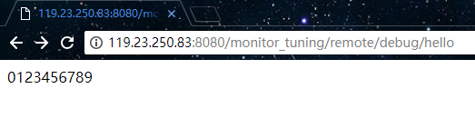

远程的服务器配置好后，回到我们的工程中，添加一个远程的Tomcat：

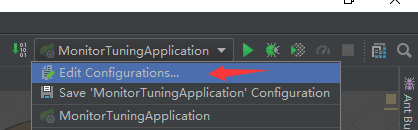
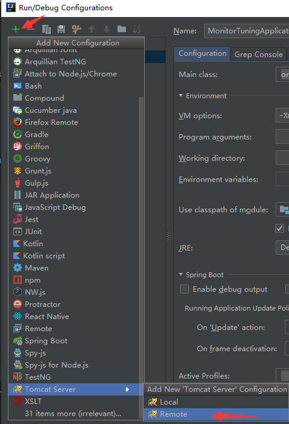

配置Debug的端口号：
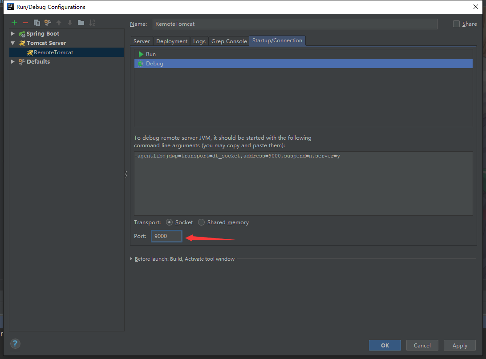

以及服务器的ip地址和端口号：

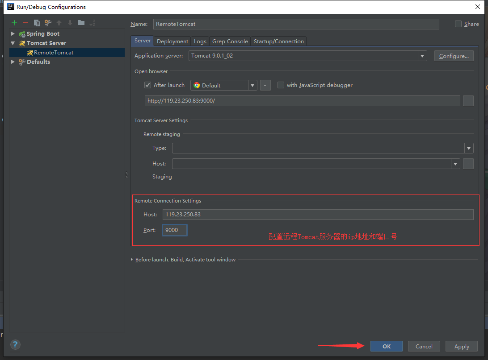

完成以上配置后，在测试的代码上打一个断点，如下：

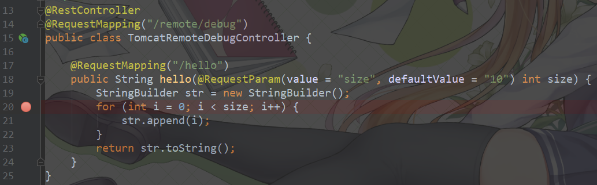

然后使用Debug模式进行启动：

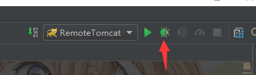

启动成功后，和之前一样到浏览器上访问测试接口。可以看到，成功进入到断点的位置了，这就表示我们可以进行远程Debug了：

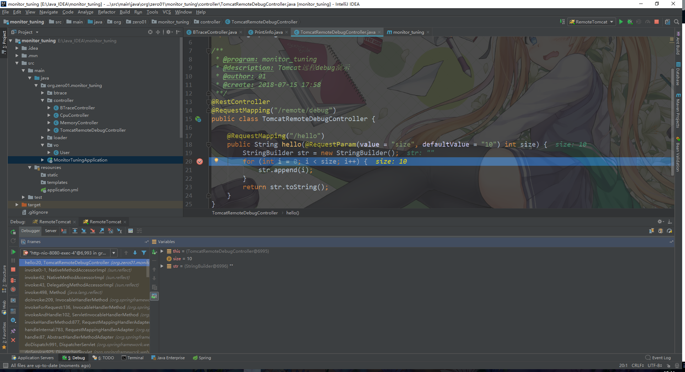

如果我们希望普通的Java进程也能支持远程Debug的话，只需要在启动的时候加入如下启动参数即可：

```shell
-agentlib:jdwp=transport=$JPDA_TRANSPORT address=$JPDA_ADDRESS,server=y,suspend=$JPDA_SUSPEND

例如Tomcat其实就是加了这段参数：
-agentlib:jdwp=transport=dt_socket,address=9000,server=y,suspend=n
```

## tomcat-manager监控

tomcat-manager是Tomcat自带的一个监控及管理工具，在低版本的Tomcat中，该监控工具默认是开启的。而在高版本的Tomcat中，由于一些安全上的问题，默认是不开启的。

官方文档地址如下（Tomcat9.0版本）：

https://tomcat.apache.org/tomcat-9.0-doc/manager-howto.html

在高版本的Tomcat中我们需要手动开启这个监控工具，开启步骤如下：

+ 1.在 conf/tomcat-users.xml 文件中添加管理员用户
+ 2.新建 conf/Catalina/localhost/manager.xml 文件，在该文件中配置允许的远程连接
+ 3.重启Tomcat服务

首先是第一步，在 conf/tomcat-users.xml 文件的 &lt; tomcat-users &gt; 标签内，增加如下配置内容：

```shell
[root@server ~]# vim /home/tomcat/apache-tomcat-8.5.8/conf/tomcat-users.xml  // 配置内容如下
<role rolename="tomcat"/>
<role rolename="manager-status"/>
<role rolename="manager-gui"/>
<user username="zeroJun" password="123456a." roles="tomcat,manager-status,manager-gui"/>
```

第二步，新建 conf/Catalina/localhost/manager.xml 文件，在该文件中配置允许的远程连接

```shell
[root@server ~]# vim /home/tomcat/apache-tomcat-8.5.8/conf/Catalina/localhost/manager.xml  // 配置内容如下
<?xml version="1.0" encoding="UTF-8"?>
<Context antiResourceLocking="false" privileged="true" >
  <Valve className="org.apache.catalina.valves.RemoteAddrValve"
         allow="127\.\d+\.\d+\.\d+|::1|0:0:0:0:0:0:0:1|101.106.102.*" />  // 配置允许访问的ip
  <Manager sessionAttributeValueClassNameFilter="java\.lang\.(?:Boolean|Integer|Long|Number|String)|org\.apache\.catalina\.filters\.CsrfPreventionFilter\$LruCache(?:\$1)?|java\.util\.(?:Linked)?HashMap"/>
</Context>
```

第三步，启动/重启Tomcat服务：

```shell
[root@server ~]# /home/tomcat/apache-tomcat-8.5.8/bin/startup.sh 
Using CATALINA_BASE:   /home/tomcat/apache-tomcat-8.5.8
Using CATALINA_HOME:   /home/tomcat/apache-tomcat-8.5.8
Using CATALINA_TMPDIR: /home/tomcat/apache-tomcat-8.5.8/temp
Using JRE_HOME:        /usr
Using CLASSPATH:       /home/tomcat/apache-tomcat-8.5.8/bin/bootstrap.jar:/home/tomcat/apache-tomcat-8.5.8/bin/tomcat-juli.jar
Tomcat started.
[root@server ~]#
```

启动好后，在浏览器上访问Tomcat的管理页面，会要求输入用户名和密码才能进行登录：

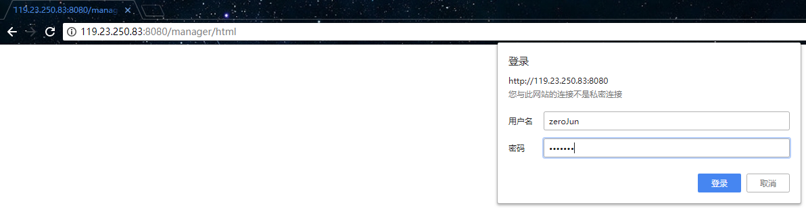

登录成功后，管理界面如下：

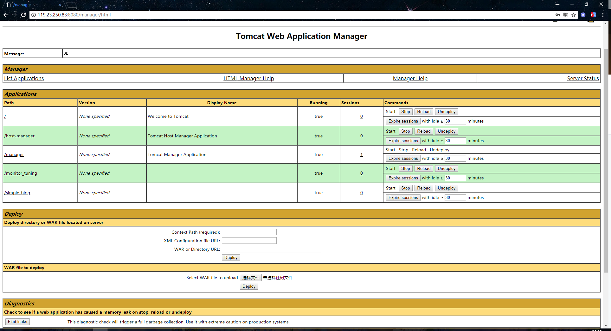

点击 ”List Applications“ 可以看到当前的Tomcat部署的web应用列表：
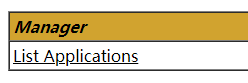

在这里点击相应的按钮，就可以重启、重载、取消部署以及设置session过期时间：

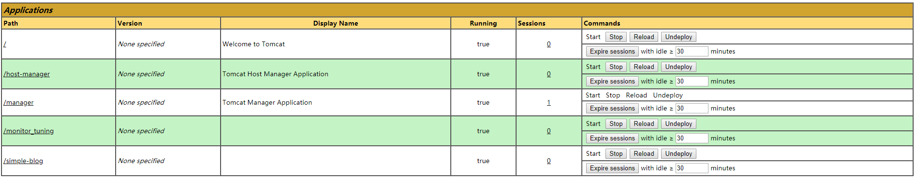

在这里可以上传war包进行部署：

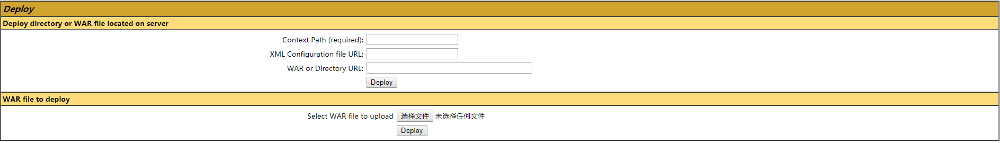

点击右上角的 “Server Status” 可以看到Tomcat服务器的状态信息：

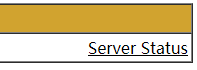
如下：
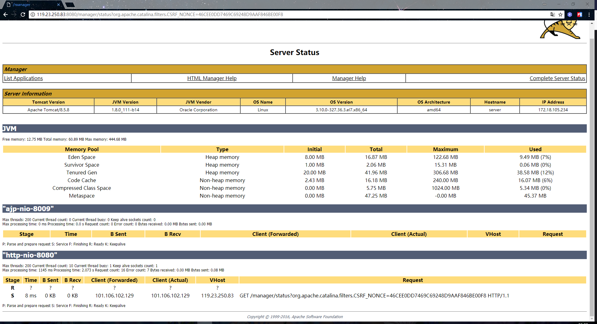

我们在监控Tomcat的时候，就主要是查看这个界面中展示的信息，JVM一栏展示的是内存信息，而http-nio-8080一栏则是展示线程信息，一般我们关注这两个地方就差不多了。

在该界面中，点击右上角的 “Complete Server Status” 则能够查看更完整的信息：

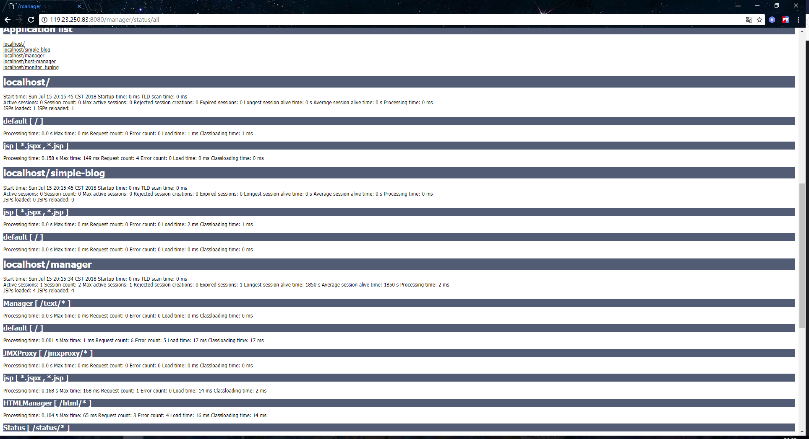

## psi-probe监控

在上一小节中，我们简单介绍了Tomcat自带的监控工具，因为是自带的，所以功能并不算很强大。而本小节将介绍更加强大的Tomcat监控工具，那就是psi-probe。

这家伙改了三次名，之前叫做lambdaprobe，最终的名字改为了psi-probe，之前是在googlecode下载，现在已经迁移到了github。

psi-probe的github地址如下：

https://github.com/psi-probe/psi-probe

使用git命令将psi-probe克隆到本地仓库中，或者直接下载zip包再上传到服务器也可以：

```shell
[root@01server ~]# cd /tmp
[root@01server /tmp]# git clone https://github.com/psi-probe/psi-probe.git
```

然后进入到psi-probe工程目录中，使用maven命令进行编译打包，这个编译打包过程需要一段时间：

```shell
[root@01server /tmp]# cd psi-probe/
[root@01server /tmp/psi-probe]# mvn package -Dmaven.skip.test
```

打包完成后，将war包放到Tomcat的webapps目录中：

```shell
[root@01server /tmp/psi-probe]# mv web/target/probe.war /usr/local/tomcat-8.5.32/webapps/
```

我这里为了保证流程的完整，我这里在另一台服务器上安装了新的Tomcat，所以我们还需要和之前一样去开启这个Tomcat的manager权限。

第一步，在 conf/tomcat-users.xml 文件的 &lt; tomcat-users &gt; 标签内，增加如下配置内容：

```shell
[root@01server ~]# vim /usr/local/tomcat-8.5.32/conf/tomcat-users.xml  // 配置内容如下
<role rolename="tomcat"/>
<role rolename="manager-status"/>
<role rolename="manager-gui"/>
<user username="zeroJun" password="123456a." roles="tomcat,manager-status,manager-gui"/>
```

第二步，新建 conf/Catalina/localhost/manager.xml 文件，在该文件中配置允许的远程连接

```shell
[root@01server ~]# vim /usr/local/tomcat-8.5.32/conf/Catalina/localhost/manager.xml  // 配置内容如下
<?xml version="1.0" encoding="UTF-8"?>
<Context antiResourceLocking="false" privileged="true" >
  <Valve className="org.apache.catalina.valves.RemoteAddrValve"
         allow="127\.\d+\.\d+\.\d+|::1|0:0:0:0:0:0:0:1|101.106.102.*" />  // 配置允许访问的ip
  <Manager sessionAttributeValueClassNameFilter="java\.lang\.(?:Boolean|Integer|Long|Number|String)|org\.apache\.catalina\.filters\.CsrfPreventionFilter\$LruCache(?:\$1)?|java\.util\.(?:Linked)?HashMap"/>
</Context>
```

第三步，启动/重启Tomcat服务：

```shell
[root@01server ~]# startup.sh 
Using CATALINA_BASE:   /usr/local/tomcat-8.5.32
Using CATALINA_HOME:   /usr/local/tomcat-8.5.32
Using CATALINA_TMPDIR: /usr/local/tomcat-8.5.32/temp
Using JRE_HOME:        /usr/local/jdk1.8
Using CLASSPATH:       /usr/local/tomcat-8.5.32/bin/bootstrap.jar:/usr/local/tomcat-8.5.32/bin/tomcat-juli.jar
Tomcat started.
[root@01server ~]#
```

启动好后，在浏览器上访问psi-probe的管理页面，同样的会要求输入用户名和密码才能进行登录：

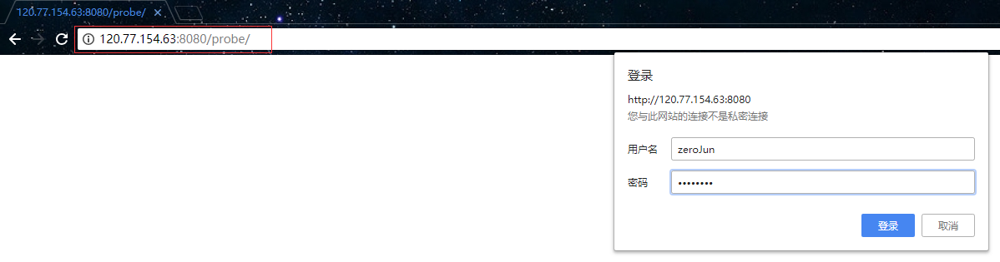

在这个页面上，可以看到web应用的统计信息、请求信息以及session信息，还可以对jsp进行预编译。

在 “Data Source” 选项卡里，可以看到数据源的相关信息，因为这里目前没有连接数据库的应用，所以这块是空的：

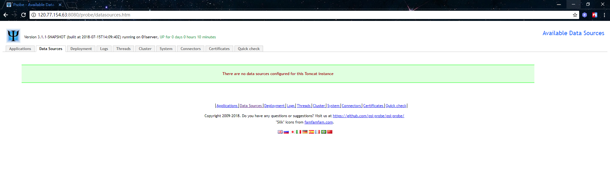

登录成功后，主页面如下，在这里可以看到当前这个Tomcat服务器上的web应用：

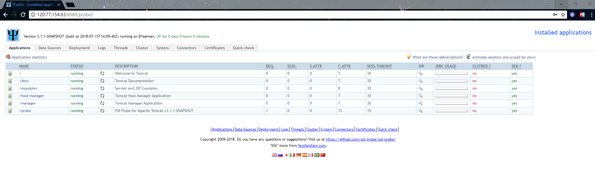

在 “Deployment” 选项卡里，可以上传war包到Tomcat上进行部署：

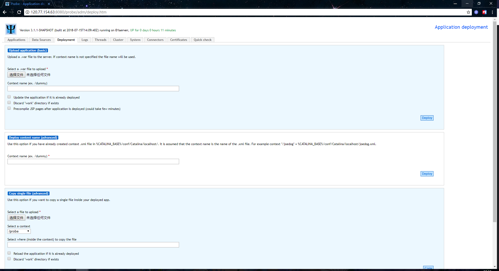

在 “logs” 选项卡里，可以查看应用的日志文件：


在 “Threads” 选项卡里，可以查看到很详细线程信息，和jstack打印出来的信息一样：

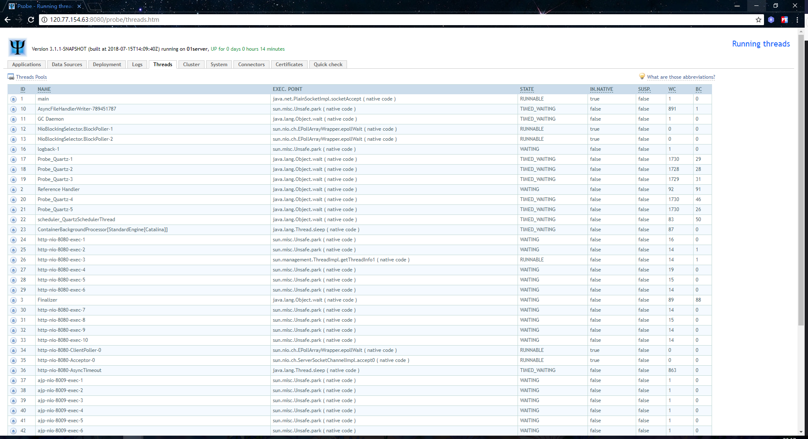

在 “Cluster” 选项卡里，可以查看到集群信息，由于没有进行集群，所以这里也是空的：

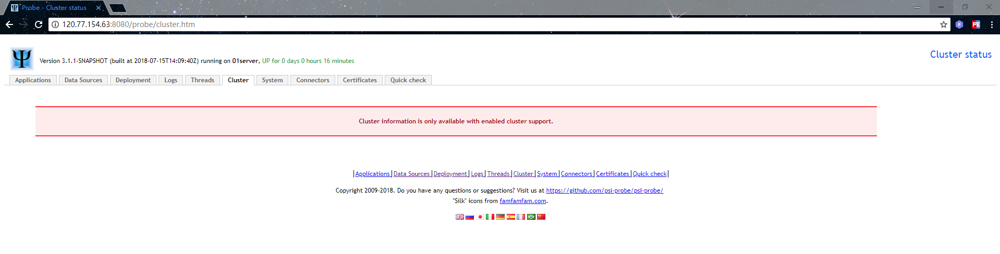

在 “System” 选项卡里，可以查看到系统信息，例如JVM内存信息、系统属性信息、操作系统信息等等：

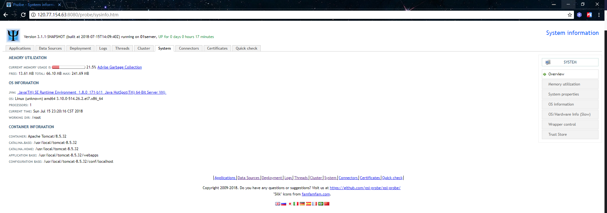


在 “Connectors” 选项卡里，可以查看到Tomcat的连接信息，例如请求数量、请求的处理时间以及请求响应字节数等信息，也是图表化的：

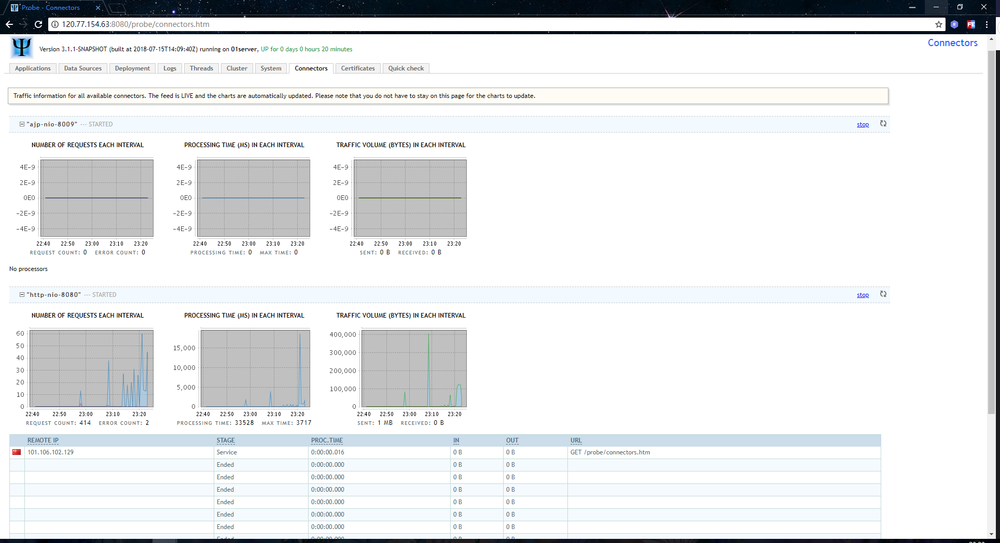

在 “Gertificates” 选项卡里，可以查看到证书相关的信息，我这里也没有配置证书，所以是空白的：

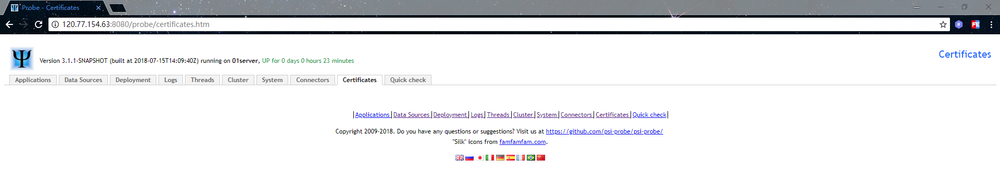

在 “Quick check” 选项卡里，可以进行快速检查，以此验证服务环境是否是正常的：

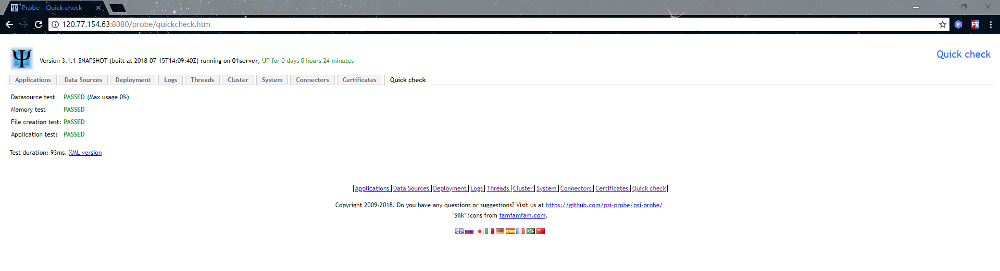

## Tomcat优化

在以上小节中，我们介绍了如何使用监控工具去监控Tomcat的运行状况，而在监控之上就是调优。所以本小节将介绍一些简单的Tomcat优化方式，主要涉及以下两种优化（因为内存优化方面会单独在另一篇JVM层GC调优文章中介绍）：

+ 线程优化
+ 配置优化

### 1.线程优化：

我们都知道Tomcat是一个Web服务器，所以对于线程优化这方面主要还是关注用于http连接的线程。在以下官方文档中，有对http连接线程相关参数的说明：

http://tomcat.apache.org/tomcat-8.5-doc/config/http.html

通过设置这些参数，我们能把Tomcat调整到一个较优的状态。当然，这个调整需要根据服务器的具体配置及Tomcat的实际监控数据进行调整。常用的线程优化参数如下：

+ `maxConnections`：最大连接数，当达到最大连接数时，请求会被放到请求队列里等待处理，对于NiO和NiO2，默认值为10000。对于APR/本机，默认值为8192
+ `acceptCount`：最大请求队列长度，当队列满时收到的任何请求都将被拒绝，默认值为100
+ `MaxThreads`：最大工作线程数量，该参数的值决定了可处理的并发请求的最大数量，默认值为200
+ `minSpareThreads`：最小空闲的工作线程数量，默认值为10
+ `enableLookups`：该参数用于在执行 request.getRemoteHost(); 语句时，能够以DNS方式进行查询，并返回远程客户端的实际主机名。默认值为false，会跳过DNS查询，直接以字符串形式返回IP地址（从而提高性能），所以在生产环境下不要打开这个参数。
+ `protocol`：该参数用于配置http协议，默认值为HTTP/1.1。该参数还可以设置连接器，默认情况下它使用自动切换机制来选择基于NIO的连接器或基于APR/本机的连接器。如果是高并发场景下使用APR连接器性能会更高些，可选的值如下：
  + org.apache.coyote.http11.Http11NioProtocol ： NIO连接器
  + org.apache.coyote.http11.Http11Nio2Protocol ：NIO2连接器
  + org.apache.coyote.http11.Http11AprProtocol ：APR连接器

### 2.配置优化：

关于配置参数方面的介绍，官方文档里描述的也比较详细了，地址如下：

http://tomcat.apache.org/tomcat-8.5-doc/config/host.html
http://tomcat.apache.org/tomcat-8.5-doc/config/context.html

常用的配置参数如下：

+ `autoDeploy`：该参数用于指定是否开启热部署，默认值为true。因为实现热部署需要单独开启一个线程去周期性的检查server.xml中appBase属性所配置的目录，默认为webapps目录，所以会影响Tomcat的性能。在线上一般都是关闭的，也就是设置为false
+ `reloadable`：该参数用于开启自动检测代码更改，当代码更改时，会自动重新加载Web应用程序。默认值为false，该参数不应该在生产环境中开启，会影响性能。但在开发过程中比较实用，所以挺多人会开启这个参数，在上线时应该检查该参数是否已关闭。


## 结束语

虽然现在的项目基本都是前后端分离了，JSP已经很少再用了，但不乏还是会出现JSP编写的项目。如果是JSP项目，可以在不需要使用到session的JSP页面上禁用session，不然每访问一个JPS都开启session的话，会影响性能。
