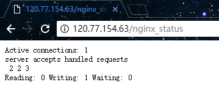
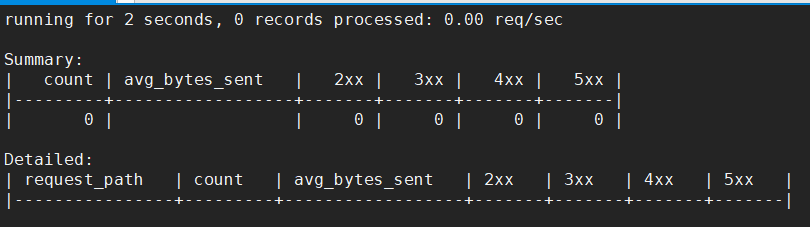
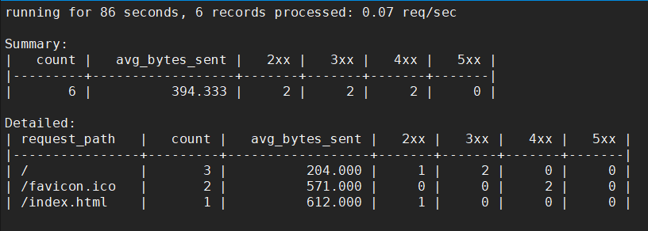
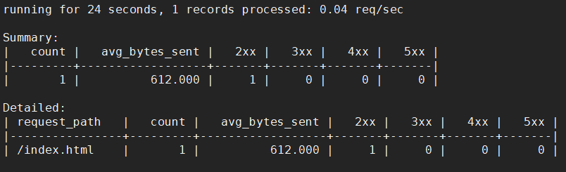
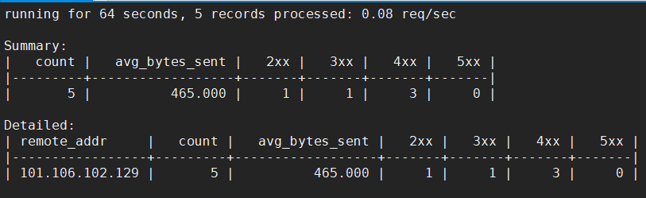
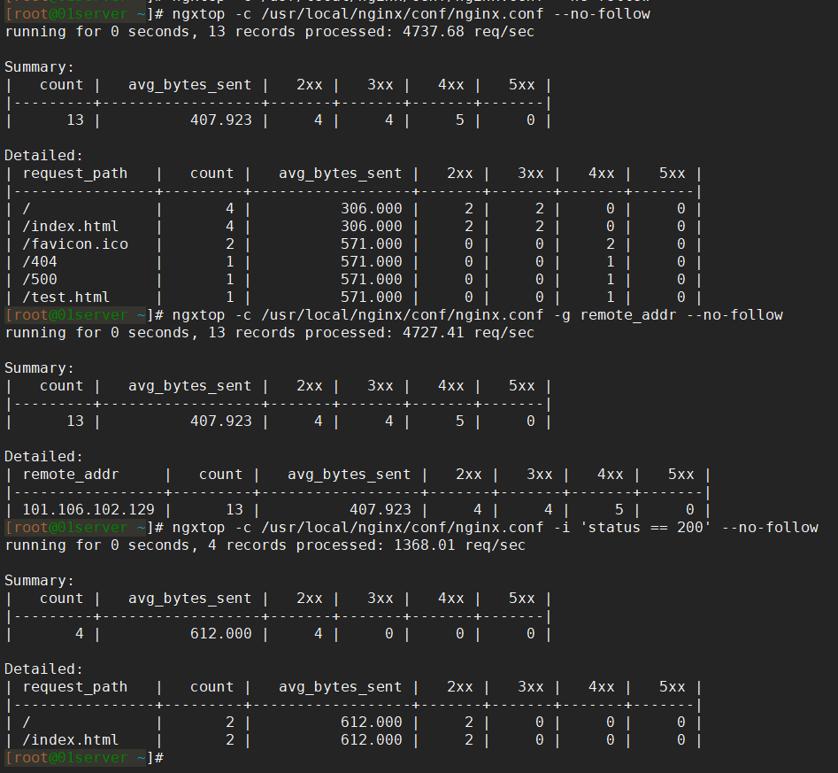
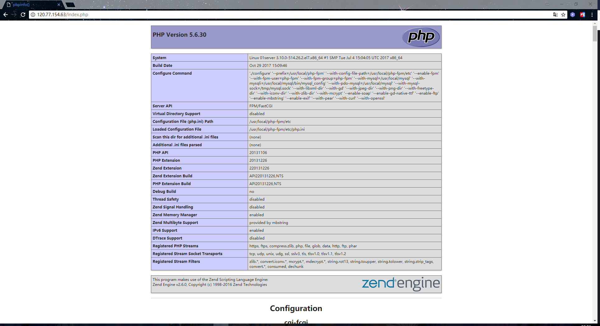
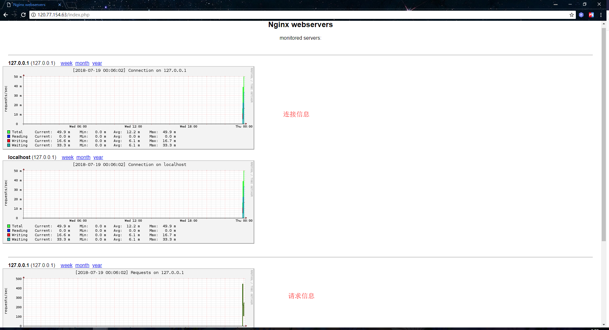

# 第6章 Nginx性能监控与调优

## ngx_http_stub_status监控连接信息

nginx现已成为目前使用最广泛的web服务器和反向代理服务器，我们线上的Tomcat服务器一般都会由nginx进行代理，以此实现负载均衡的效果。既然nginx被应用得那么广泛，我们自然也得学习如何去对nginx做性能监控。本小节将介绍如何使用nginx的ngx_http_stub_status模块来对连接信息进行监控。本文默认读者有nginx的基础，所以一些基础性的东西不会过多介绍。

关于该模块的官方文档地址如下：

http://nginx.org/en/docs/http/ngx_http_stub_status_module.html

如果你的nginx是使用yum进行安装的，那么一般会自带这个模块，可以忽略以下这段为了安装ngx_http_stub_status模块而重新编译安装nginx的部分。因为我的nginx是编译安装的，当时并没有加上这个模块进行编译，所以现在还需要重新去编译安装一次。过程如下：

```shell
[root@01server ~]# /usr/local/nginx/sbin/nginx -V  # 列出安装了哪些模块，可以看到我这里没有安装任何模块
nginx version: nginx/1.12.1
built by gcc 4.8.5 20150623 (Red Hat 4.8.5-11) (GCC) 
configure arguments: --prefix=/usr/local/nginx
[root@01server ~]# rm -rf /usr/local/nginx/  # 删除原本的nginx
[root@01server ~]# cd /usr/local/src/  # 进入存放安装包的路径  
[root@01server /usr/local/src]# ls  
nginx-1.12.1    nginx-1.12.1.tar.gz
[root@01server /usr/local/src]# cd nginx-1.12.1  # 进入之前已经解压好的目录
[root@01server /usr/local/src/nginx-1.12.1]# ./configure --prefix=/usr/local/nginx --with-http_stub_status_module  # 加入编译参数，指定需要安装的模块
[root@01server /usr/local/src/nginx-1.12.1]# make && make install  # 编译安装
[root@01server /usr/local/src/nginx-1.12.1]# cd /usr/local/nginx/sbin/
[root@01server /usr/local/nginx/sbin]# ./nginx -V # 可以已经把模块安装好了
nginx version: nginx/1.12.1
built by gcc 4.8.5 20150623 (Red Hat 4.8.5-11) (GCC) 
configure arguments: --prefix=/usr/local/nginx --with-http_stub_status_module  
[root@01server /usr/local/nginx/sbin]# 
```

安装好之后，还需要编辑一下配置文件，不使用nginx默认的配置文件：

```shell
[root@01server /usr/local/nginx/conf]# mv nginx.conf nginx.conf.bak  # 不使用nginx自带的配置文件
[root@01server /usr/local/nginx/conf]# vim nginx.conf  # 将以下内容粘贴进去
```

```nginx
user nobody nobody;
worker_processes 2;
error_log /usr/local/nginx/logs/nginx_error.log crit;
pid /usr/local/nginx/logs/nginx.pid;
worker_rlimit_nofile 51200;

events
{
    use epoll;
    worker_connections 1024;
}

http
{
    include mime.types;
    default_type application/octet-stream;
    server_names_hash_bucket_size 3526;
    server_names_hash_max_size 4096;
    log_format  main  '$remote_addr - $remote_user [$time_local] "$request" '
                      '$status $body_bytes_sent "$http_referer" '
                      '"$http_user_agent" "$http_x_forwarded_for"';
    access_log  /usr/local/nginx/logs/access.log  main;
    sendfile on;
    tcp_nopush on;
    keepalive_timeout 30;
    client_header_timeout 3m;
    client_body_timeout 3m;
    send_timeout 3m;
    connection_pool_size 256;
    client_header_buffer_size 1k;
    large_client_header_buffers 8 4k;
    request_pool_size 4k;
    output_buffers 4 32k;
    postpone_output 1460;
    client_max_body_size 10m;
    client_body_buffer_size 256k;
    client_body_temp_path /usr/local/nginx/client_body_temp;
    proxy_temp_path /usr/local/nginx/proxy_temp;
    fastcgi_temp_path /usr/local/nginx/fastcgi_temp;
    fastcgi_intercept_errors on;
    tcp_nodelay on;
    gzip on;
    gzip_min_length 1k;
    gzip_buffers 4 8k;
    gzip_comp_level 5;
    gzip_http_version 1.1;
    gzip_types text/plain application/x-javascript text/css text/htm 
    application/xml;
    include vhost/*.conf;
}
[root@01server /usr/local/nginx/conf]# mkdir vhost
[root@01server /usr/local/nginx/conf]# vim vhost/default.conf  # 虚拟主机配置文件，将以下内容粘贴进去
server{
        listen 80;
        server_name localhost;
        index index.html index.htm index.php;
        root /usr/local/nginx/html;

        location = /nginx_status{  # 配置访问路径，即uri
            stub_status on;  # 开启该模块
            access_log off;  # 关闭日志
            allow 101.106.102.129;  # 允许访问的ip，即白名单ip 
            allow 127.0.0.1;
            deny all;  # 拒绝白名单ip以外的ip访问
       }
}
[root@01server ~]# 
```

启动nginx：

```shell
[root@01server /usr/local/nginx/conf]# cd ../sbin/
[root@01server /usr/local/nginx/sbin]# ./nginx -t  # 检查nginx的配置文件是否正常
nginx: the configuration file /usr/local/nginx/conf/nginx.conf syntax is ok
nginx: configuration file /usr/local/nginx/conf/nginx.conf test is successful 
[root@01server /usr/local/nginx/sbin]# ./nginx -c /usr/local/nginx/conf/nginx.conf  # 启动nginx
[root@01server /usr/local/nginx/sbin]# netstat -lntp |grep nginx
tcp        0      0 0.0.0.0:80              0.0.0.0:*               LISTEN      22713/nginx: master 
[root@01server /usr/local/nginx/sbin]# 
```

启动成功后，使用浏览器访问/nginx_status，访问成功响应的信息如下：



说明：

+ `Active connections` 当前活动的连接数量（包括等待的）
+ `accepts` 已接收的连接总数
+ `handled` 已处理的连接总数
+ `requests` 当前的请求总数
+ `Reading` nginx正在读取的连接数量
+ `Writing` nginx正在响应的连接数量
+ `Waiting` 当前空闲的连接数量

如上，通过这些简单的参数可以看到nginx当前的连接信息。在高并发场景下，可以根据Active connections参数判断当前的一个并发数量，Reading 参数则可以告诉我们当前nginx是否繁忙。当然，这只是最简单的一个nginx的监控方式，参数也就只有那么几个。但这些都是其他更高级的监控工具的基础，所以了解这些基础监控也是有必要的

## ngxtop监控请求信息

在上一小节中，我们介绍了如何利用 ngx_http_stub_status 模块去监控nginx的连接信息。本小节将介绍如何使用ngxtop工具来监控nginx的请求信息。

ngxtop可以实时解析nginx访问日志，并且将处理结果输出到终端，功能类似于系统命令top，所以这个软件起名ngxtop。有了ngxtop，你可以实时了解到当前nginx的访问状况，再也不需要tail日志看屏幕刷新。

ngxtop项目地址：

https://github.com/lebinh/ngxtop

## 安装ngxtop

由于ngxtop是python编写的，我们可以使用pip进行安装。如果你的机器上没有安装pip，需要先把pip装上，安装命令如下：

```shell
[root@01server ~]# yum install -y epel-release
[root@01server ~]# yum install -y python-pip
```

然后通过pip安装ngxtop，命令如下：

```shell
[root@01server ~]# pip install ngxtop
```

ngxtop使用说明：
```shell
[root@01server ~]# ngxtop --help
ngxtop - ad-hoc query for nginx access log.

Usage:
    ngxtop [options]
    ngxtop [options] (print|top|avg|sum) <var> ...
    ngxtop info
    ngxtop [options] query <query> ...

Options:

-l <file>, --access-log <file>  # 需要分析的访问日志
    -f <format>, --log-format <format>  # log_format指令指定的日志格式 [默认: combined]
    --no-follow  ngxtop default behavior is to ignore current lines in log
                     and only watch for new lines as they are written to the access log.
                     Use this flag to tell ngxtop to process the current content of the access log instead.  # 简而言之，对历史信息进行统计
    -t <seconds>, --interval <seconds>  report interval when running in follow mode [default: 2.0]  # 指定监控信息刷新的间隔，单位为秒 [默认: 2.0]
    -g <var>, --group-by <var>  # 根据变量分组 [默认: request_path]
    -w <var>, --having <expr>  # 具备子句 [默认: 1] having clause [default: 1]
    -o <var>, --order-by <var>  # 排序 [默认: count]
    -n <number>, --limit <number>  # 显示的条数 [默认: 10]
    -a <exp> ..., --a <exp> ...  add exp (must be aggregation exp: sum, avg, min, max, etc.) into output  # 添加聚合表达式到输出信息中

    -v, --verbose  # 更多的输出
    -d, --debug  # 打印所有行和解析记录，debug
    -h, --help  # 当前帮助信息.
    --version  # 输出版本信息.
```

高级选项:

```shell
-c <file>, --config <file>  # 运行ngxtop解析nginx配置文件
-i <filter-expression>, --filter <filter-expression>  filter in, records satisfied given expression are processed.  # 根据指定的表达式进行过滤，仅显示过滤后的信息
-p <filter-expression>, --pre-filter <filter-expression> in-filter expression to check in pre-parsing phase.  # 在筛选器表达式中检查预解析阶段
```

范例:

```shell
If you want to specify the access log file and / or log format, use the -f and -a options.
"top" like view of nginx requests

指定配置文件启动ngxtop: 
$ ngxtop -c /usr/local/nginx/conf/nginx.conf

404前十的请求:
$ ngxtop top request_path --filter 'status == 404'

总流量前十的请求:
$ ngxtop --order-by 'avg(bytes_sent) * count'

访问量前十的ip地址:
$ ngxtop --group-by remote_addr

输出400以上状态码的请求以及请求来源:
$ ngxtop -i 'status >= 400' print request status http_referer

Average body bytes sent of 200 responses of requested path begin with 'foo':
$ ngxtop avg bytes_sent --filter 'status == 200 and request_path.startswith("foo")'
```

指定nginx的配置文件进行启动：

```shell
[root@01server ~]# ngxtop -c /usr/local/nginx/conf/nginx.conf
```

启动后如下：



注：Summary相当于请求的概览信息，Detailed就自然是请求的详细信息了。2xx、3xx、4xx以及5xx，都是表示的http状态。avg_bytes_sent表示请求所发送的字节数平均值，request_path则是请求路径，count表示请求的总次数。

默认情况下，ngxtop不会显示启动ngxtop之前的请求信息，只会显示ngxtop启动之后新的请求信息。所以我们可以到浏览器上刷新一下，随便访问一些页面，人为制造一些请求。如下图，这时就可以看到ngxtop成功监控到了请求信息：



我们可以通过选项来指定一些条件，例如我希望只显示http状态是200的，就可以使用-i进行指定：

```shell
[root@01server ~]# ngxtop -c /usr/local/nginx/conf/nginx.conf -i 'status == 200'
```



例如我希望显示访问最多的ip，就可以使用-g进行指定：

```shell
[root@01server ~]# ngxtop -c /usr/local/nginx/conf/nginx.conf -g remote_addr
```



如果想要查看之前的请求信息可以使用--no-follow选项，相当于是对历史的请求信息做了一个统计，如下：



关于ngxtop常用操作就先简单介绍到这，希望详细了解最直接的就是查阅该项目在github上的文档。

## nginx-rrd图形化监控

在上两小节中，我们介绍了两个基础的nginx工具，能够监控连接信息和请求信息，它们都是基于命令行的。本小节则介绍一个图形化的nginx监控工具，该工具就是nginx-rrd。nginx-rrd 也是 Nginx 官方推荐的一款 Nginx 监控工具，利用 nginx-rrd 可以很方便的生成图表，它可以监控连接信息和请求信息。

nginx-rrd 官网地址如下：

https://www.nginx.com/resources/wiki/modules/rrd_graph/

那么我们接下来就看看如何安装并使用nginx-rrd吧。nginx-rrd部分功能是基于上两小节所介绍的工具实现的，所以在安装nginx-rrd之前需要根据上两节的介绍安装好所需的工具。由于nginx-rrd是使用php实现的，所以在此之前，我们得先安装好php的运行环境，以及安装rrdtool的相关依赖。我这里使用yum进行安装，命令如下

```shell
[root@01server ~]# yum install -y php php-gd php-soap php-mbstring php-xmlrpc php-dom php-fpm
[root@01server ~]# yum install -y perl rrdtool perl-libwww-perl libwww-perl perl-rrdtool
```

安装好php运行环境以及rrdtool后，我们还需要把nginx和php-fpm进行一个整合。修改php-fpm的配置文件，将文件中的user和group修改为与nginx.conf中的user一致：

```shell
[root@01server ~]# vim /etc/php-fpm.d/www.conf
user = nobody
group = nobody
[root@01server ~]# 
```

还需要让nginx支持解析php，在虚拟主机配置文件中，增加如下内容：

```shell
[root@01server ~]# vim /usr/local/nginx/conf/vhost/default.conf  # 添加以下内容
location ~ \.php$
{
    include fastcgi_params;
    fastcgi_pass unix:/tmp/php-fcgi.sock;
    fastcgi_index index.php;
    fastcgi_param SCRIPT_FILENAME /usr/local/nginx/html$fastcgi_script_name;
}
[root@01server ~]# 
```

配置好后，启动php-fpm服务，并且重新加载nginx：

```shell
[root@01server ~]# systemctl start php-fpm
[root@01server ~]# netstat -lntp |grep 9000
tcp        0      0 127.0.0.1:9000          0.0.0.0:*               LISTEN      24418/php-fpm: mast 
[root@01server ~]# nginx -s reload
```

然后在虚拟主机配置文件中所指向的网站根目录下，新建一个简单的php文件，用于测试nginx是否已经能够正常解析php代码：

```shell
[root@01server ~]# vim /usr/local/nginx/html/index.php  # 文件内容如下
<?php phpinfo(); ?>
[root@01server ~]# 
```

接着到浏览器上进行访问，如下则是代表nginx已经能够支持解析php了：



现在我们就可以开始安装nginx-rrd了，首先使用如下命令，下载nginx-rrd的压缩包:

```shell
[root@01server ~]# cd /usr/local/src/
[root@01server /usr/local/src]# wget http://soft.vpser.net/status/nginx-rrd/nginx-rrd-0.1.4.tgz
```

然后解压，并且拷贝一些脚本文件及配置文件到相应的系统目录下：

```shell
[root@01server /usr/local/src]# tar -zvxf nginx-rrd-0.1.4.tgz
[root@01server /usr/local/src]# cd nginx-rrd-0.1.4
[root@01server /usr/local/src/nginx-rrd-0.1.4]# ls
etc  html  usr
[root@01server /usr/local/src/nginx-rrd-0.1.4]# cp etc/nginx-rrd.conf /etc
[root@01server /usr/local/src/nginx-rrd-0.1.4]# cp usr/sbin/* /usr/sbin
[root@01server /usr/local/src/nginx-rrd-0.1.4]# rm -rf /usr/local/nginx/html/index.php  # 删除之前测试用的php文件
[root@01server /usr/local/src/nginx-rrd-0.1.4]# cp html/index.php /usr/local/nginx/html/
```

修改nginx-rrd配置文件，配置数据存储目录以及图片存储目录，如下：

```shell
[root@01server ~]# vim /etc/nginx-rrd.conf
# dir where rrd databases are stored
RRD_DIR="/usr/local/nginx/html/nginx-rrd";  # 数据存储目录
# dir where png images are presented
WWW_DIR="/usr/local/nginx/html";  # 图片存储目录
[root@01server ~]# 
```

配置完之后，我们还需要使用 crontab 新建定时任务，用于定时执行nginx-rrd的两个脚本，因为nginx-rrd需要定时去采集数据才能实现一个监控的效果：

```shell
[root@01server ~]# crontab -e
* * * * * /bin/sh /usr/sbin/nginx-collect  # 采集数据脚本
*/1 * * * * /bin/sh /usr/sbin/nginx-graph  # 生成图片脚本
[root@01server ~]# 
```

我们这里设定的定时任务是每一分钟执行一次，可以使用如下命令查看定时任务是否有在执行：

```shell
[root@01server ~]# tail -f /var/log/cron
```

确认定时任务有正常执行后，我们来安装apache的一个压测工具，方便于我们生成大量的请求数据：

```shell
[root@01server ~]# yum -y install httpd-tools
```

安装完成后，使用以下命令，对nginx进行压测，可以多执行几次：

```shell
[root@01server ~]# ab -n 10000 -c 10 http://127.0.0.1/index.html
```

命令说明：

+ `-n` 指定总共发送多少个请求
+ `-c` 指定同时发送多少个请求

使用压测工具产生了一些请求数据后，到浏览器上访问nginx-rrd的index.php文件，效果如下：



## nginx优化

在以上小节中，我们介绍了一些nginx的监控工具。知道了如何对nginx进行性能监控后，我们自然就需要知道一些nginx的常用优化参数和配置，所以本小节就是介绍一些nginx的常见优化方式。

### 1.配置工作进程数和并发连接数。

默认情况下，nginx只有一个工作进程，1024个并发连接数。当我们需要提高nginx的并发负载能力时，可以适当的增加工作进程数和并发连接数。在nginx.conf里进行配置：

```shell
[root@01server ~]# vim /usr/local/nginx/conf/nginx.conf  # 修改或增加如下几个参数
worker_processes 2;  # 工作进程数受cpu核心数的限制，数量不能超过cpu的核心数
events
{
    use epoll;  # 使用epoll模型，可以提高并发效率
    multi_accept on;  # 开启一次建立多个连接
    worker_connections 10240; # 每一个工作进程能够打开的最大连接数，包含了nginx与客户端和nginx与upstream之间的连接
}
[root@01server ~]# 
```

### 2.配置反向代理（后端Server）的长连接

Nginx upstream与后端的连接默认为短连接，通过HTTP/1.0向后端发起连接，并把请求的"Connection" header设为"close"。Nginx与前端的连接默认为长连接，一个用户跟Nginx建立连接之后，通过这个长连接发送多个请求。如果Nginx只是作为reverse proxy的话，可能一个用户连接就需要多个向后端的短连接。如果后端的服务器（源站或是缓存服务器）处理并发连接能力不强的话，就可能导致瓶颈的出现。所以我们才需要配置反向代理的长连接，以此缓解瓶颈的问题。示例配置如下：

```shell
[root@01server ~]# vim /usr/local/nginx/conf/vhost/default.conf
upstream server_pool{
    server localhost:8080 weight=1 max_fails=2 fail_timeout=30s;
    server localhost:9080 weight=1 max_fails=2 fail_timeout=30s;
    keepalive 300;  # 设置300个长连接，长连接能够大大提高请求转换的效率
}

location / {
    proxy_set_header Upgrade $http_upgrade;
    proxy_set_header Connection "upgrade";
    proxy_pass http://server_pool/;
}
[root@01server ~]# 
```

### 3.配置gzip压缩

我们都知道http传输的基本都是文本数据，对文本数据进行压缩后，能够减小数据的体积。这样就能够大幅提高访问效率，与页面的加载速度，并且还能够降低带宽资源的消耗。示例配置如下：

```shell
[root@01server ~]# vim /usr/local/nginx/conf/nginx.conf
gzip on;  # 开启Gzip
gzip_http_version 1.1;
gzip_disable "MSIE [1-6]\.(?!.*SV1)";  # ie6不提供gzip
gzip_proxied any;
gzip_types text/plain application/x-javascript text/css application/xml application/json application/x-font-ttf application/sfg+xml application/x-icon text/javascript application/x-httpd-php image/jpeg image/gif image/png;  # 需要压缩的类型
gzip_vary on;
gzip_static on;  # 如果有压缩好的，直接使用
[root@01server ~]# 
```

### 4.操作系统优化

在Linux操作系统中，我们可以通过修改 /etc/sysctl.conf系统配置文件，以此来设置tcp/ip连接的相关参数，可以在操作系统层面上提高网络连接的效率。示例配置如下：

```shell
[root@01server ~]# vim /etc/sysctl.conf
net.ipv4.tcp_syncookies = 1 # 防止一个套接字在有过多试图连接到达时引起过载
net.core.somaxconn = 1024  # 连接队列的长度，默认值为128,
net.ipv4.tcp_fin_timeout = 10  # timewait的超时时间，设置短一些
net.ipv4.tcp_tw_reuse = 1  # os直接使用timewait的连接
net.ipv4.tcp_tw_recycle = 0  # 回收禁用，不回收timewait连接
[root@01server ~]#
```

还可以在 /etc/security/limits.conf 配置文件中，配置一个进程可以打开的最大文件数量。示例配置如下：

```shell
[root@01server ~]# vim /etc/security/limits.conf
* hard nofile 204800
* soft nofile 204800
* soft core unlimited
* soft stack 204800
[root@01server ~]#
```

### 5.其他优化：

```shell
[root@01server ~]# vim /usr/local/nginx/conf/nginx.conf
sendfile on;  # 减少文件在应用和内核之间的拷贝
tcp_nopush on;  # 当数据包达到一定大小再发送，避免频繁发送数据包
tcp_nodelay off;  # 关闭有数据就随时发送，也是避免频繁发送数据包
[root@01server ~]# 
```
