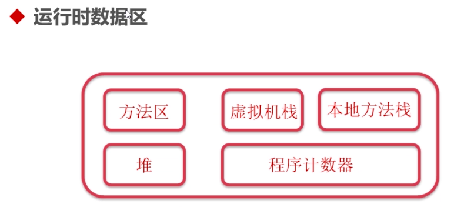
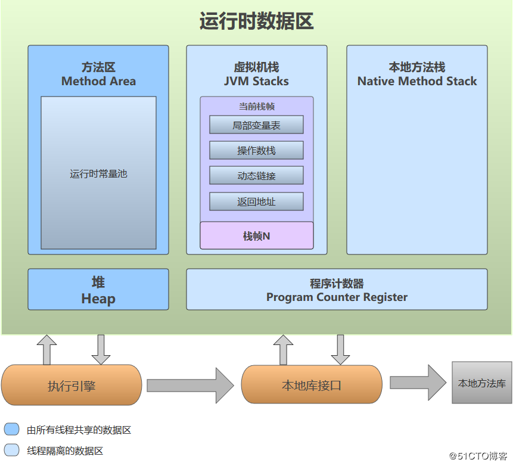
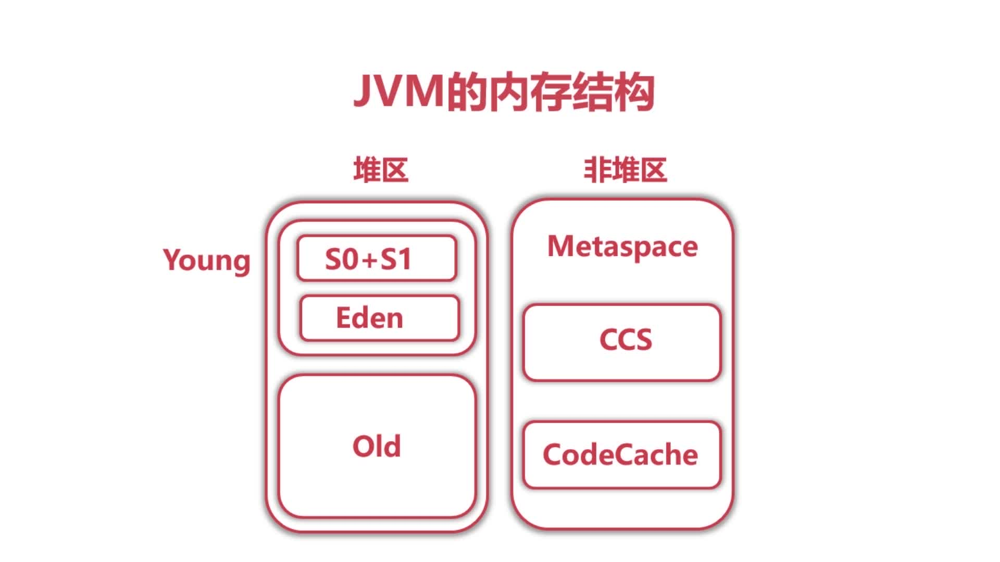
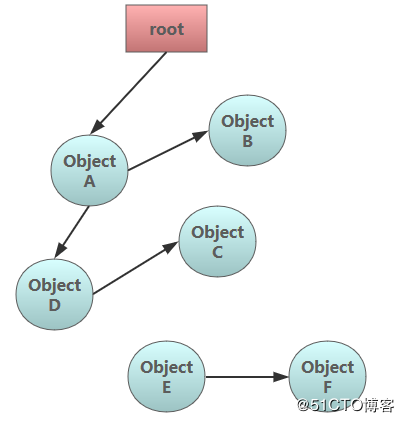
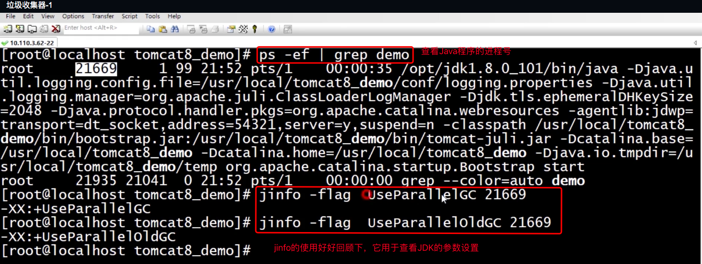
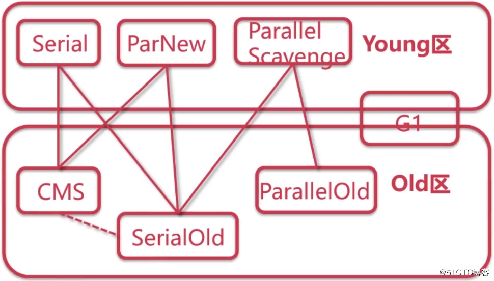
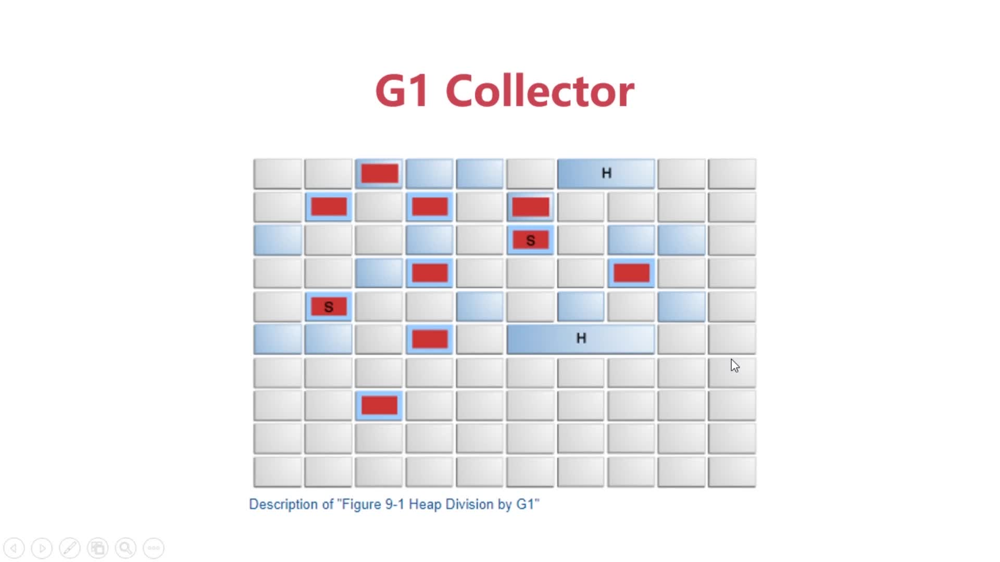
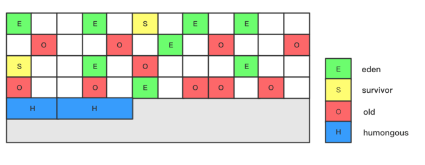
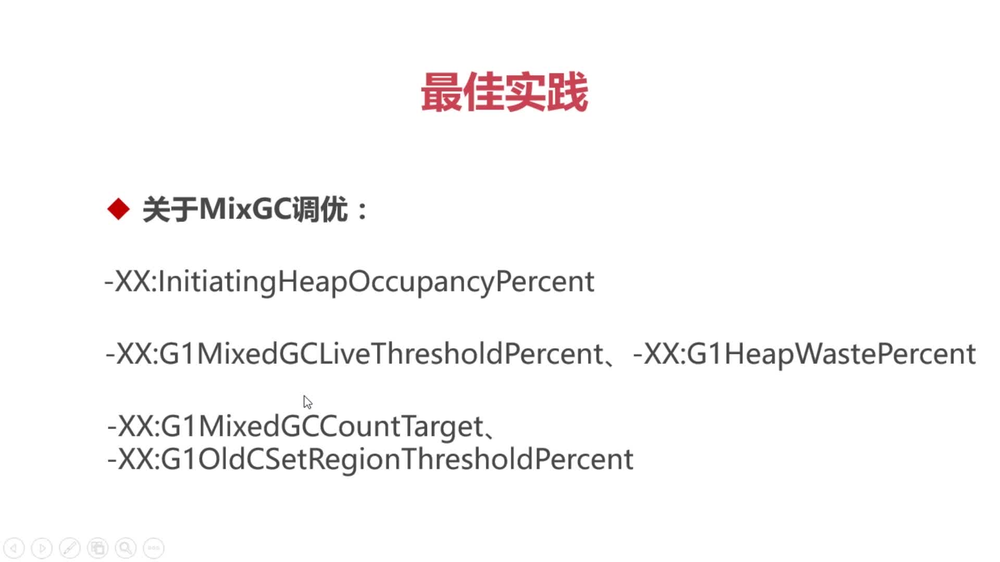

# 第7章 JVM层GC调优

JVM层的GC调优是生产环境上必不可少的一个环节，因为我们需要确定这个进程可以占用多少内存，以及设定一些参数的阀值。以此来优化项目的性能和提高可用性，而且这也是在面试中经常会被问到的问题。

想要进行GC调优，我们首先需要简单了解下JVM的内存结构，Java虚拟机的规范文档如下：

https://docs.oracle.com/javase/specs/jvms/se8/html/index.html

参考博客：

+ [jvm的运行时数据区](https://docs.oracle.com/javase/specs/jvms/se8/html/index.html)
+ [Metaspace](http://ifeve.com/jvm-troubleshooting-guide-4/)
+ [压缩类空间](https://blog.csdn.net/jijijijwwi111/article/details/51564271)
+ [CodeCache](https://blog.csdn.net/yandaonan/article/details/50844806)
+ [job-search-web-app-java-8-migration](http://engineering.indeedblog.com/blog/2016/09/job-search-web-app-java-8-migration/)
+ [GC调优指南](https://docs.oracle.com/javase/8/docs/technotes/guides/vm/gctuning/toc.html)
+ [如何选择垃圾收集器](https://docs.oracle.com/javase/8/docs/technotes/guides/vm/gctuning/collectors.html)
+ [G1最佳实践](https://docs.oracle.com/javase/8/docs/technotes/guides/vm/gctuning/g1_gc_tuning.html#recommendations)

本章大纲

+ JVM内存结构
+ 垃圾回收算法
+ 垃圾收集器
+ 可视化GC日志分析工具
+ Tomcat的GC调优实战

## 7.1 JVM内存结构

### 7.1.1 运行时数据区

> `运行时数据区`和`JVM内存结构`有一定不同，前者是一个规则标准，后者则是具体实现

在介绍JVM内存结构之前，我们需要先知道运行时数据区这样的一个东西，它与JVM的内存结构有着一定的关联。不过它属于是一个规范，所以与JVM内存结构是有着物理上的区别的。

运行时数据区的简略图和详细图如下：

#### 1.程序计数器(Program Count Register，简称PC Register)

JVM支持多线程同时执行，每一个线程都有自己的PC Register。当每一个新线程被创建时，它都将得到它自己的PC Register。线程正在执行的方法叫做当前方法。如果执行的是Java方法，那么PC Register里存放的就是**当前正在执行的指令的地址(也可以理解为代码行号)**，如果是native方法（C/C++编写的方法），则是为空。此内存区域是唯一一个在java虚拟机规范中没有规定任何OutOfMemoryError情况的区域。

#### 2.虚拟机栈(JVM Stacks)

  Java虚拟机栈（Java Virtual Machine Stacks）是线程私有的，它的生命周期与线程相同。

  虚拟机描述的是**Java方法执行的内存模型**：每个方法在执行的同时都会创建一个栈帧，用于存储局部变量表、操作数栈、动态链接、方法出口等信息。每一个方法从调用直至执行完成的过程，就对应着一个栈帧在虚拟机栈中入栈到出栈的过程，实际上就是所谓的线程堆栈。

  局部变量表存放了各种基本类型、对象引用和returnAddress类型（指向了一条字节码指令地址）。其中64位长度 long 和 double 占两个局部变量空间，其他只占一个。该区域中规定的异常情况有两种：1.线程请求的栈的深度大于虚拟机所允许的深度，将抛出StackOverflowError异常；2.如果虚拟机可以动态扩展，如果扩展时无法申请到足够的内存，就抛出OutOfMemoryError异常。

#### 3.堆(Heap)

> 几乎所有的数组和对象的创建都是在堆里

Java堆（Java Heap）是Java虚拟机所管理的内存中最大的一块。堆是被所有线程共享的一块内存区域，在虚拟机启动时创建。此内存区域的唯一目的就是存放对象实例，几乎所有的对象实例都在这里分配内存。

Java堆可以处于物理上不连续的内存空间中，只要逻辑上是连续的即可。堆中可细分为新生代和老年代，再细分可分为Eden空间、From Survivor空间、To Survivor空间。堆无法扩展时，会抛出OutOfMemoryError异常。

#### 4.方法区(Method Area)

方法区与Java堆一样，是各个线程共享的内存区域，它用于存储已被虚拟机加载的类信息、常量、静态变量、即时编译器编译后的代码等数据。虽然Java虚拟机规范把方法区描述为堆的一个逻辑部分，但是它却有一个别名叫做Non-Heap（非堆），目的是与Java堆区分开来。这个区在JDK8中叫MetaSpace，在JDK6和7中叫PermGen Space，止于为什么这么变化，可以参考博客[Metaspace 之一：Metaspace整体介绍（永久代被替换原因、元空间特点、元空间内存查看分析方法）](https://www.cnblogs.com/williamjie/p/9558094.html)

当方法区无法满足内存分配需求时，抛出OutOfMemoryError

#### 5.运行时常量池(Run-Time Constant Pool)

如上图所描述的一样，它是方法区的一部分。Class文件中除了有类的版本、字段、方法、接口等描述信息外，还有一项是常量池(Const Pool Table)，用于存放编译期生成的各种字面量和符号引用，这部分内容将在类加载后被放入方法区的运行时常量池中存储。并非预置入Class文件中常量池的内容才进入方法运行时常量池，运行期间也可能将新的常量放入池中，这种特性被开发人员利用得比较多的便是String类的intern()方法。

同样的，当方法区无法满足内存分配需求时，也会抛出OutOfMemoryError

#### 6.本地方法栈(Native Method Stacks)

本地方法栈与虚拟机栈所发挥的作用是非常相似的，它们之间的区别不过是虚拟机栈为虚拟机执行Java方法(字节码)服务，而本地方法栈则为虚拟机使用到的Native方法服务(本地库接口)

### 7.1.2 JVM的内存结构

> 这个是JDK8中的，6和7中略有不同

如上图，可以看到JVM内存被分为了两大区，非堆区和堆区

#### 非堆区

> 存储对象以外的数据

+ `Metaspace`：存放Class、Package、Method、Field、字节码、常量池、符号引用等等
+ `CCS`：这个区域存放32位指针的Class，也就是压缩类空间，默认关闭，需要使用JVM参数开启
+ `CodeCache`：存放JIT编译后的本地代码以及JNI使用的C/C++代码

#### 堆区

+ `Young`：新生代，存放新的或只经过几次Minor GC的对象
  + `Eden`：存放最新创建的对象，一些较大的对象则会特殊处理
  + `S0/S1`：当对象经过第一次Minor GC后，如果仍然存活，就会存放到这里。需要注意的是，S0和S1区域在同一时间上，只有其中一个是有数据的，而另一个则是空的。
+ `Old`：老年代，当S0或S1区域存满对象了，就会把这些对象存放到这个old区域中

`在图中也可以看到，堆区还被分为了年轻代（young）和老年代（old）。那么为什么会有年轻代?`

我们先来捋一捋，为什么需要把堆区分代？不分代不能完成它所做的事情么？其实不分代也完全可以，分代的唯一理由就是优化GC性能。你先想想，如果没有分代，那我们所有的对象都会存在同一个空间里。当进行GC的时候，我们就要找到哪些对象是没有用的，这样一来就需要对整个堆区进行扫描。而我们的很多对象都是只存活一瞬间的，所以GC就会比较频繁，而每次GC都得扫描整个堆区，就会导致性能低下。不进行GC的话，又会导致内存空间很快被占满。

因为GC性能的原因，所以我们才需要对堆区进行分代。如果进行分代的话，我们就可以把新创建的对象专门存放到一个单独的区域中，当进行GC的时候就优先把这块存放“短命”对象的区域进行回收，这样就会腾出很大的空间出来，并且由于不用去扫描整个堆区，也能极大提高GC的性能。

`年轻代中的GC：`

从上图中也可以看到年轻代被分为了三部分：1个Eden区和2个Survivor区，一般我们都会简称为S0、S1（同时它们还分为from和to两种角色），默认比例为8:1。一般情况下，最新创建的对象都会被分配到Eden区(一些大对象会特殊处理)，这些对象经过第一次Minor GC后，如果仍然存活，将会被移到Survivor区。对象在Survivor区中每熬过一次Minor GC，年龄就会增加1岁，当它的年龄增加到一定程度时，就会被移动到年老代中。

因为年轻代中的对象基本都是"短命"的(80%以上)，所以在年轻代的垃圾回收算法使用的是复制算法，复制算法的基本思想就是将内存分为两块，每次只用其中一块，当这一块内存用完，就将还活着的对象复制到另外一块上面。所以才会有S0和S1区，复制算法的优点就是吞吐量高、可实现高速分配并且不会产生内存碎片，所以才适用于作为年轻代的GC算法。

在GC开始的时候，对象只会存在于Eden区和名为“From”的Survivor区，Survivor区“To”是空的。紧接着进行GC，Eden区中所有存活的对象都会被复制到“To”，而在“From”区中，仍存活的对象会根据他们的年龄值来决定去向。年龄达到一定值(年龄阈值，可以通过-XX:MaxTenuringThreshold来设置)的对象会被移动到年老代中，没有达到阈值的对象会被复制到“To”区域。经过这次GC后，Eden区和From区已经被清空。这个时候，“From”和“To”会交换他们的角色，也就是新的“To”就是上次GC前的“From”，新的“From”就是上次GC前的“To”。不管怎样，都会保证名为To的Survivor区域是空的。Minor GC会一直重复这样的过程，直到“To”区被填满，“To”区被填满之后，会将所有对象移动到年老代中。

`JVM中的对象分配：`

+ 对象优先在Eden区分配
+ 大对象则会直接进入老年代

### 7.1.3 常用的JVM参数

> 我们了解完JVM内存结构后，再来看看一些常用的JVM参数,在第2章的jstat命令介绍时也有涉及，在结合上面JVM的结构来看体会更深

+ 1.设置年轻代的大小，和年轻代的最大值，具体的值需要根据实际业务场景进行判断。如果存在大量临时对象就可以设置大一些，否则小一些，一般为整个堆大小的1/3或者1/4。为了防止年轻代的堆收缩，两个参数的值需设为一样大：
  + `-XX:NewSize`
  + `-XX:MaxNewSize`
+ 2.设置Metaspace的大小，和Metaspace的最大值，同样需设为一样大：
  + `-XX:MetaspaceSize`
  + `-XX:MaxMetaspaceSize`
+ 3.设置Eden和其中一个Survivor的比例，这个值也比较重要：
  + `-XX:SurvivorRatio`
+ 4.设置young和old区的比例：
  + `-XX:NewRatio`
+ 5.这个参数用于显示每次Minor GC时Survivor区中各个年龄段的对象的大小：
  + `-XX:+PrintTenuringDistribution`
+ 6.用于设置晋升到老年代的对象年龄的最小值和最大值，每个对象在坚持过一次Minor GC之后，年龄就加1：
  + `-XX:InitialTenuringThreshold`
  + `-XX:MaxTenuringThreshold`
+ 7.使用短直针，也就是启用压缩类空间(CCS)
  + `-XX:+UseCompressedClassPointers`
+ 8.设置CCS空间的大小，默认是一个G：
  + `-XX:CompressedClassSpaceSize`
+ 9.设置CodeCache的一个初始大小：
  + `-XX:InitialCodeCacheSize`
+ 10.设置CodeCache的最大值：
  + `-XX:ReservedCodeCacheSize`
+ 11.设置多大的对象会被直接放进老年代：
  + `+-XX:PretenureSizeThreshold`
+ 12.长期存活的对象会被放入Old区，使用以下参数设置就可以设置对象的最大存活年龄：
  + `-XX:MaxTenuringThreshold`
  > 注：如果设置为0的话，则年轻代对象不经过Survivor区，直接进入年老代。对于年老代比较多的应用，可以提高效率。如果将此值设置为一个较大值，则年轻代对象会在Survivor区进行多次复制，这样可以增加对象再年轻代的存活时间，增加在年轻代即被回收的概论，linux64的java6默认值是15：
+ 13.设置Young区每发生GC的时候，就打印有效的对象的岁数情况：
  + `-XX:+PrintTenuringDistribution`
+ 14.设置Survivor区发生GC后对象所存活的比例值：
  + `-XX:TargetSurvivorRatio`

## 7.2 常见垃圾回收算法

本小节我们来简单介绍一些常见的垃圾回收算法，众所周知Java区别与C/C++的一点就是，Java是可以自动进行垃圾回收的。所以在Java中的内存泄露概念和C/C++中的内存泄露概念不一样。在Java中，一个对象的指针一直被应用程序所持有得不到释放就属于是内存泄露。而C/C++则是把对象指针给弄丢了，该对象就永远无法得到释放，这就是C/C++里的内存泄露。

在进行垃圾回收的是时候，要如何确认一个对象是否是垃圾呢？在很久以前有一种方式就是使用引用计数，当一个对象指针被其他对象所引用时就会进行一个计数。在进行垃圾回收时，只要这个计数存在，那么就会判断该对象就是存活的。而没有引用计数的对象，就会被判断为垃圾，可以进行回收。但是这种方法缺陷很明显，计数会占用资源不说，如果当一个A对象和一个B对象互相持有对方引用时，那么这两个对象的引用计数都不会为0，就永远不会被回收掉，这样就会导致内存泄露的问题。

在Java中，则是采用枚举根节点的方式：

+ 思想：枚举根节点，做可达性分析
+ 根节点：可以是类加载器、Thread、虚拟机栈的本地变量表、static成员、常量引用、本地方法栈的变量等等

如上图，JVM会从根节点开始遍历引用，只要顺着引用路线所遍历到的对象都会判断为存活对象，即是具有可达性的，这些对象就不会被回收。而没有被遍历到的对象，也就是图中的E和F对象，即便它们俩互相都还存在引用，也会被回收掉，因为它们不存在根节点的引用路线中，即是不具有可达性的。

既然了解了JVM如何判断一个对象是否为垃圾后，我们就可以来看看一些垃圾回收算法了：

### 1.标记-清除

+ `算法`：该算法分为“标记” 和 “清除” 两个阶段：首先标记出所有需要回收的对象，在标记完成后统一进行回收
+ `缺点`：效率不高，标记和清除两个过程的效率都不高。容易产生内存碎片，碎片太多就会导致提前GC。

### 2.复制算法

+ `算法`：它将可用内存按容量划分为大小相等的两个块，每次只使用其中的一块。当这一块内存用完了，就将还存活的对象复制到另一个块上，然后再把已使用过的内存空间一次清理掉。
+ `优缺点`：实现简单，运行高效，吞吐量大，但是空间利用率低，一次只能利用50%

### 3.标记-整理

+ `算法`：标记过程仍然与 “标记-清除” 算法一样，当后续步骤不是直接对可回收对象进行清理，而是让所有存活的对象都向一端移动，然后直接清理掉边界以外的内存。
+ `优缺点`：没有了内存碎片，但是整理内存比较耗时

### 4.分代垃圾回收

+ `算法`：这就是目前JVM所使用的垃圾回收算法，可以看到以上所介绍到的算法都各自有优缺点。而JVM就是把这些算法都整合了起来，在不同的区域使用不同的垃圾回收算法。Young区使用复制算法，Old区则使用标记清除或者标记整理算法。

### JVM中的对象分配原则

+ 对象优先在Eden区分配
+ 大对象则会直接进入老年代：`-XX:PretenureSizeThreshold`,超过这个大小的对象直接进入老年代
+ 长期存活的对象进入老年代
  + `-XX:MaxTenuringThreshold`:最大存活年龄的阈值,每次Young GC则对象的存货年龄加1，达到一定年龄进入老年代
  + `-XX:+PrintTenuringDistribution`:发生Young GC时打印存活的对象的年龄分布情况，从而可以看清存活对象各有多少岁了
  + `-XX:TargetSurvivorRatio`

## 7.3 垃圾收集器基础讲解

### 常见的垃圾收集器

在上一小节了解了一些常见的垃圾回收算法后，我们再来看看JVM中常见的垃圾收集器：

+ 1.串行收集器Serial：Serial、Serial Old
+ 2.并行收集器Parallel：Parallel Scavenge、Parallel Old，`吞吐量优先`，是Server模式下的默认收集器。默认在内存大于2G，CPU核心数大于2核的环境下为Server模式
+ 3.并发收集器Concurrent：CMS、G1，`停顿时间优先`

`注：串行收集器几乎不会在web应用中使用，所以主要介绍并行和并发收集器`

### 串行 VS 并行 VS 并发

> 这里务必和Java本身的并发编程概念进行区分

+ 串行（Serial）：指只有单个垃圾收集线程进行工作，也就是单线程的，当垃圾收集线程启动的时候，用户线程会处于一个等待状态。适合内存较小的嵌入式开发中
+ 并行（Parallel）：指多条垃圾收集线程并行工作，但此时用户线程仍然处于等待状态。适合科学计算、后台处理等弱交互场景
+ 并发（Concurrent）：指用户线程与垃圾收集线程同时执行（但不一定是并行的，可能会交替执行），垃圾收集线程在执行的时候不会停顿用户程序的运行。适合对响应时间有要求、交互性强的场景，比如Web开发

### 停顿时间 VS 吞吐量

+ 停顿时间：指垃圾收集器在进行垃圾回收时所中断应用执行的时间。可以使用以下参数进行设置：`-XX:MaxGCPauseMillis`
+ 吞吐量：指花在垃圾收集的时间和花在应用时间的占比。可以使用以下参数进行设置：`-XX:GCTimeRatio=< n >`, 垃圾收集时间占：`1/1+n`

评价一个垃圾收集器的标准：吞吐量最大的情况下，停顿时间最小

### 开启串行收集器

+ `-XX:+UseSerialGC(Young区)`
+ `-XX:+UseSerialOldGC(Old区)`

### 开启并行收集器

> 吞吐量优先，是Server模式下的默认收集器(当系统内存大于2G时是Server模式，小于2G时是Client模式)

+ `-XX:+UseParallelGC(Young区)`,手动开启，Server默认开启
+ `-XX:+UseParallelOldGC(Old区)`
+ `-XX:ParallelGCThreads=< N >` 设置N个GC线程，N取决于CPU核心数

### 开启并发收集器

> 响应时间优先，在JDK1.8里有两个

+ 一个是CMS，CMS因为具有响应时间优先的特点，所以是`低延迟`、`低停顿的`，CMS是`老年代收集器`。开启该收集器的参数如下：
  + `-XX:+UseConcMarkSweepGC(Old区)`
  + `-XX:+UseParNewGC(Young区)`
+ 另一个是G1，开启该收集器的参数如下：
  + `-XX:+UseG1GC(Young区、Old区)`

### 垃圾收集器搭配图

> 注：实线代表可搭配使用的，虚线表示当内存分配失败的时候CMS会退化成SerialOld。JDK1.8中建议使用的是G1收集器

有这么多的垃圾收集器，那么我们要`如何去选择合适的垃圾收集器呢？`这个是没有具体答案的，都得按照实际的场景进行选择，但一般都会按照以下原则来进行选择：

+ 优先调整堆的大小让服务器自己来选择
+ 如果内存小于100M，使用串行收集器
+ 如何是单核，并且没有停顿时间的要求，就可以使用串行或由JVM自己选择
+ 如果允许停顿时间超过1秒，选择并行或者JVM自己选择
+ 如果响应时间最重要，并且不能超过1秒，则使用并发收集器

可以参考以下博客：

+ [如何选择垃圾收集器](https://docs.oracle.com/javase/8/docs/technotes/guides/vm/gctuning/collectors.html)
+ [GC调优指南](https://docs.oracle.com/javase/8/docs/technotes/guides/vm/gctuning/toc.html)

## 7.4 垃圾收集器参数设置

### 7.4.1 开启 并行垃圾收集器Parallel Collector

+ `-XX:+UseParallelGC(Young区)`,手动开启，Server默认开启
+ `-XX:+UseParallelOldGC(Old区)`
+ `-XX:ParallelGCThreads=< N >` 设置N个GC线程，N取决于CPU核心数
  + CPU>8, N=5/8
  + CPU<8, N=CPU
  
### 7.4.2 并行垃圾收集器自适应 Parallel Collector Ergonomics

> 并行收集器是支持自适应的，通过设置以下几个参数，并行收集器会以停顿时间优先去动态调整参数。ps:这种自适应的方式用地较少

+ `-XX:MaxGCPauseMillis=< N >`:最大停顿时间
+ `-XX:GCTimeRatio=< N >`：吞吐量
+ `-Xmx< N >`：堆的大小

### 7.4.3 动态内存调整

> 当内存不够的时候并行收集器可以动态调整内存，虽然实际生产环境中用的比较少，至于每次动态调整多少内存，则使用以下参数进行设置：

+ `-XX:YoungGenerationSizeIncrement=< Y >` （增加，Young区，默认20%）
+ `-XX:TenuredGenerationSizeIncrement=< T >` （增加，Old区，默认20%）
+ `-XX:AdaptiveSizeDecrementScaleFactor=< D >`（减少，默认4%）

### 7.4.4 并发垃圾收集器之CMS Collector

特点：
+ 并发收集
+ 低停顿、低延迟
+ 老年代收集器

CMS垃圾收集过程：
+ 1.CMS initial mark：初识标记Root，STW
+ 2.CMS concurrent mark：并发标记
+ 3.CMS-concurrent-preclean：并发预清理
+ 4.CMS remark：重新标记，STW
+ 5.CMS concurrent sweep：并发清除
+ 6.CMS concurrent-reset：并发重置

CMS的缺点：
+ CPU敏感
+ 会产生浮动垃圾
+ 会产生空间碎片

虽然有上述种种缺点，其实在JDK1.8出G1垃圾收集器之前，JDK的主要垃圾收集器就是CMS

CMS的相关调优参数：

+ 设置并发的GC线程数：`-XX:ConcGCThreads`
+ 在Full GC之后对内存进行一个压缩，以此减少空间碎片：`-XX:+UseCMSCompactAtFullCollection`
+ 设置多少次Full GC之后才进行压缩：`-XX:CMSFullGCsBeforeCompaction`
+ 设置Old区存满多少对象的时候触发Full GC，默认值为92%：`-XX:CMSInitiatingOccupancyFraction`
+ 设置不可动态调整以上参数的值：`-XX:+UseCMSInitiatingOccupancyOnly`
+ 在Full GC之前先做Young GC：`-XX:+CMSScavengeBeforeRemark`
+ 在jdk1.7之前可以使用以下参数，启用回收Perm区：`-XX:+CMSClassUnloadingEnable`

### 7.4.5 并发垃圾收集器之G1 Collector

#### 官网介绍如下：

The Garbage-First (G1) garbage collector is fully supported in Oracle JDK 7 update 4 and later releases. The G1 collector is a server-style garbage collector, targeted for multi-processor machines with large memories. It meets garbage collection (GC) pause time goals with high probability, while achieving high throughput. Whole-heap operations, such as global marking, are performed concurrently with the application threads. This prevents interruptions proportional to heap or live-data size. The first focus of G1 is to provide a solution for users running applications that require large heaps with limited GC latency. This means heap sizes of around 6GB or larger, and stable and predictable pause time below 0.5 seconds.

Oracle JDK 7 Update 4及更高版本完全支持Garbage-First（G1）垃圾收集器。 G1收集器是一种服务器式垃圾收集器，适用于具有大容量存储器的多处理器机器。它以高概率满足垃圾收集（GC）暂停时间目标，同时实现高吞吐量。全堆操作（例如全局标记）与应用程序线程同时执行。这可以防止与堆或实时数据大小成比例的中断。 G1的第一个重点是为运行需要具有有限GC延迟的大堆的应用程序的用户提供解决方案。这意味着堆大小约为6GB或更大，稳定且可预测的暂停时间低于0.5秒。

#### 官方文档地址：

http://www.oracle.com/technetwork/java/javase/tech/g1-intro-jsp-135488.html

#### 原理概述

G1 也是属于分代收集器的，但是G1的分代是逻辑上的，而不是物理上的

G1 将整个对区域划分为若干个Region，每个Region的大小是2的倍数（1M,2M,4M,8M,16M,32M，通过设置堆的大小和Region数量计算得出。

Region区域划分与其他收集类似，不同的是单独将大对象分配到了单独的region中，会分配一组连续的Region区域（Humongous start 和 humonous Contoinue 组成），所以一共有四类Region（Eden，Survior，Humongous和Old），G1 作用于整个堆内存区域，设计的目的就是减少Full GC的产生。在Full GC过程中由于G1 是单线程进行，会产生较长时间的停顿。

G1的OldGC标记过程可以和YoungGC并行执行，但是OldGC一定在YoungGc之后执行，即MixedGC在YoungGC之后执行。

#### G1的应用场景

G1垃圾收集算法主要应用在多CPU大内存的服务中，在满足高吞吐量的同时，尽可能的满足垃圾回收时的暂停时间，该设计主要针对如下应用场景：

+ 垃圾收集线程和应用线程并发执行，和CMS一样
+ 空闲内存压缩时避免冗长的暂停时间
+ 应用需要更多可预测的GC暂停时间
+ 不希望牺牲太多的吞吐性能

#### G1的几个概念

+ `Region`：G1收集器所划分的内存区域
+ `SATB`：Snapshot-At-TheBeginning，它是通过Root Tracing得到的，GC开始时候存活对象的快照
+ `RSet`：记录了其他Region中的对象，引用本Region中对象的关系，属于points-into结构（谁引用了我的对象）

#### G1的YoungGC过程

> G1中的Young GC过程，和以往的是一样的：

+ 新对象进入Eden区
+ 存活对象拷贝到Survivor区
+ 存活时间达到年龄阈值时，对象晋升到Old区
+ 但是G1中没有Full GC，取而代之的是**Mixed GC**：它不是Full GC，所以触发Mixed GC时回收的是所有的Young区和部分Old区的垃圾

#### G1的全局并发标记

G1里还有一个概念叫全局并发标记（global concurrent marking），和CMS的并发标记是类似的：

+ 1.`Initial marking phase`：标记GC Root，STW
+ 2.`Root region scanning phase`：根区扫描
+ 3.`Concurrent marking phase`：并发标记存活对象
+ 4.`Remark phase`：重新标记，STW
+ 5.`Cleanup phase`：部分STW

#### MixedGC的时机

+ 设置堆占有率达到这个参数值则触发global concurrent marking，默认值为45%：`-XX:InitiatingHeapOccupancyPercent`
+ 设置在global concurrent marking结束之后，可以知道Region里有多少空间要被回收，在每次YGC之后和再次发生Mixed GC之前，会检查垃圾占比是否达到此参数的值，只有达到了，下次才会发生Mixed GC：`-XX:G1HeapWastePercent`

#### MixedGC的相关参数

+ 设置Old区的Region被回收时的存活对象占比：`-XX:G1MixedGCLiveThresholdPercent`
+ 设置一次global concurrent marking之后，回收对象最多执行Mixed GC的次数：`-XX:G1MixedGCCountTarget`
+ 设置一次Mixed GC中能被选入CSet的最多Old区的Region数量：`-XX:G1OldCSetRegionThresholdPercent`

#### MixedGC的其他常用参数

+ 开启G1收集器：`-XX:+UseG1GC`
设置Region的大小，大小范围：1-32M，数量上限：2048个: `-XX:G1HeapRegionSize=n`
+ 设置最大停顿时间: `-XX:MaxGCPauseMillis=200`
+ 设置Young区大小:`-XX:G1NewSizePercent`
+ 设置Young区最大占整个Java Heap的大小，默认值为60%: `-XX:G1MaxNewSizePercent`
+ 保留防止to space溢出: `-XX:G1ReservePercent=10`
+ 设置SWT线程数:`-XX:ParallelGCThreads=n`
+ `并发线程数=1/4*并行`: `-XX:ConcGCThreads=n`

#### G1调优最佳实践

+ 年轻代大小：避免使用`-Xmn`、`-XX:NewRatio`等显式设置Young区大小，会覆盖暂停时间目标
+ 暂停时间目标：暂停时间不要太严苛，其吞吐量目标是90%的应用程序时间和10%的垃圾回收时间，太严苛会直接影响到吞吐量
+ 关于MixedGC调优
  > 

#### 至于是否需要切换到G1收集器，可以根据以下原则进行选择：

+ 50%以上的堆被存活对象占用
+ 对象分配和晋升的速度变化非常大
+ 垃圾回收时间特别长，超过了1秒

#### 如何判断一个垃圾收集器的好坏

> 关于在Web应用中，如何判断一个垃圾收集器的好坏，主要是看以下两点，以下两点都需为优才是好的垃圾收集器：

+ 1.响应时间
+ 2.吞吐量

[G1调优最佳实践官方文档](https://docs.oracle.com/javase/8/docs/technotes/guides/vm/gctuning/g1_gc_tuning.html#recommendations)

