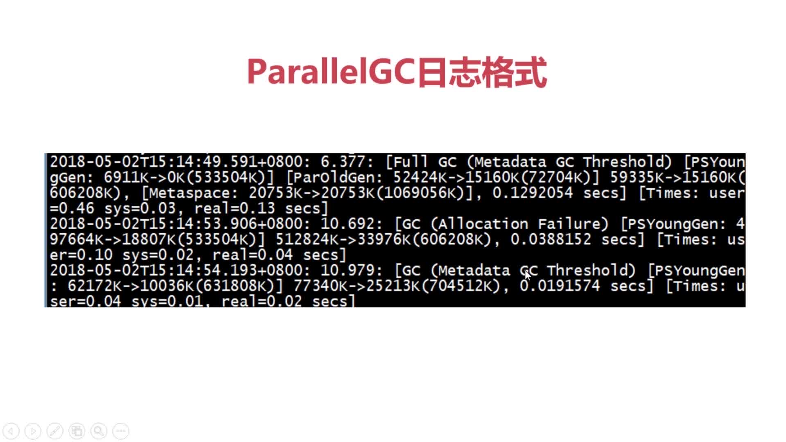

# 第7章 JVM层GC调优

参考博客：

+ [G1 GC的一些关键技术](https://zhuanlan.zhihu.com/p/22591838)
+ [CMS日志格式](https://blogs.oracle.com/poonam/understanding-cms-gc-logs)
+ [G1日志格式](https://blogs.oracle.com/poonam/understanding-g1-gc-logs)
+ 可视化GC日志分析工具：[gceasy](http://gceasy.io) 和 [GCViewer](https://github.com/chewiebug/GCViewer)
+ [ZGC](http://openjdk.java.net/jeps/333)

## 7.5 GC日志格式详解

在[上一篇文章](README.md)中，我们介绍了JVM的内存结构、常见的垃圾回收算法以及垃圾收集器和不同收集器中的一些GC调优参数。所以通过上文，我们也对GC相关的内容有了一定的了解。

但是光知道一些调优参数是没用的，我们需要能够从GC的日志中去分析可以调优的地方，这样才能使用这些参数去进行相应的调整，所以本小节将介绍一下不同收集器的GC日志格式。

### 7.5.1 Parallel GC的日志格式

我们这里以Tomcat为例，首先需要在Tomcat的catalina.sh脚本文件中加入打印GC日志的相关参数，如下：

```shell
[root@01server ~]# vim /usr/local/tomcat-8.5.32/bin/catalina.sh
JAVA_OPTS="$JAVA_OPTS -XX:+PrintGCDetails -XX:+PrintGCTimeStamps -XX:+PrintGCDateStamps -Xloggc:$CATALINA_HOME/logs/gc.log -XX:+PrintHeapAtGC -XX:+PrintTenuringDistribution"
[root@01server ~]# shutdown.sh  # 重启Tomcat
...
[root@01server ~]# startup.sh 
...
[root@01server ~]# ls /usr/local/tomcat-8.5.32/logs/ |grep gc.log  # 有生成gc.log这个文件代表成功
gc.log
[root@01server ~]#
```

参数说明：
+ `-XX:+PrintGCDetails`:打印GC的详细信息
+ `-XX:+PrintGCTimeStamps`和`-XX:+PrintGCDateStamps`:打印GC的时间
+ `-Xloggc:$CATALINA_HOME/logs/gc.log`:指定GC日志文件所存放的路径
+ `-XX:+PrintHeapAtGC`:在GC发生的前后打印堆信息
+ `-XX:+PrintTenuringDistribution`:打印对象的年龄分布信息

默认情况下，JDK1.8使用的是Parallel GC，Parallel GC里的GC类型如下，三个分别是
+ `FullGC(Metadata GC ThresHold)`:Full GC
+ `GC (Allocation Failure)`YoungGC
+ `GC(Metadata GC ThresHold)`:MetaSpace GC



以下是我们设置了参数后，所输出的日志格式片段如下：

```shell
{Heap before GC invocations=1 (full 0):  # GC发生前的堆信息
 PSYoungGen      total 4608K, used 4088K [0x00000000fad00000, 0x00000000fb200000, 0x0000000100000000)
  eden space 4096K, 99% used [0x00000000fad00000,0x00000000fb0fe340,0x00000000fb100000)
  from space 512K, 0% used [0x00000000fb180000,0x00000000fb180000,0x00000000fb200000)
  to   space 512K, 0% used [0x00000000fb100000,0x00000000fb100000,0x00000000fb180000)
 ParOldGen       total 11264K, used 0K [0x00000000f0600000, 0x00000000f1100000, 0x00000000fad00000)
  object space 11264K, 0% used [0x00000000f0600000,0x00000000f0600000,0x00000000f1100000)
 Metaspace       used 5773K, capacity 5904K, committed 6144K, reserved 1056768K
  class space    used 646K, capacity 696K, committed 768K, reserved 1048576K
# GC的详细信息
2018-07-25T21:07:10.876+0800: 0.293: [GC (Allocation Failure) # GC原因，YoungGC
Desired survivor size 524288 bytes, new threshold 7 (max 15)
[PSYoungGen: 4088K->496K(4608K)] 4088K->1599K(15872K), 0.0045483 secs] [Times: user=0.01 sys=0.00, real=0.00 secs]
Heap after GC invocations=1 (full 0):  # GC发生后的堆信息
 PSYoungGen      total 4608K, used 496K [0x00000000fad00000, 0x00000000fb600000, 0x0000000100000000)
  eden space 4096K, 0% used [0x00000000fad00000,0x00000000fad00000,0x00000000fb100000)
  from space 512K, 96% used [0x00000000fb100000,0x00000000fb17c010,0x00000000fb180000)
  to   space 512K, 0% used [0x00000000fb580000,0x00000000fb580000,0x00000000fb600000)
 ParOldGen       total 11264K, used 1103K [0x00000000f0600000, 0x00000000f1100000, 0x00000000fad00000)
  object space 11264K, 9% used [0x00000000f0600000,0x00000000f0713ce0,0x00000000f1100000)
 Metaspace       used 5773K, capacity 5904K, committed 6144K, reserved 1056768K
  class space    used 646K, capacity 696K, committed 768K, reserved 1048576K
}
```

我们主要关注GC的详细信息，所以我就截取这一部分进行一个简单的说明：

```shell
2018-07-25T21:07:10.876+0800: 0.293:  # GC发生的时间,精确到了毫秒
[GC (Allocation Failure)  # 触发GC的原因,这里是YoungGC，此外`FullGC(Metadata GC ThresHold)`:Full GC， `GC(Metadata GC ThresHold)`:MetaSpace GC
Desired survivor size 524288 bytes,  # 期望存活对象的大小为524288字节
new threshold 7 (max 15)  # 存活的对象年龄为7，最大值为15，表示年龄大于15岁则会晋升到老年代
[PSYoungGen:  # GC发生的区域，可以看到这里是Young区
4088K->496K(4608K)]  # GC后的Young区内存占用大小从4088K减小到了496K，括号里的4608K是Young区的总大小
4088K->1599K(15872K), # GC后堆的内存占用大小从4088K减小到了1599K，括号里的15872K是堆的总大小
0.0045483 secs]  # 本次GC总耗费的时间，单位为秒
[Times: user=0.01 sys=0.00, real=0.00 secs]  # 本次GC所耗费的时间的统计信息，user是用户态耗费的时间，sys是内核态耗费的时间，real是整个过程实际花费的时间。单位为秒
```

### 7.5.2 CMS GC的日志格式

到catalina.sh中配置启用CMS GC，主要是`-XX:+UseConcMarkSweepGC`,如下示例：
```shell
[root@01server ~]# vim /usr/local/tomcat-8.5.32/bin/catalina.sh
JAVA_OPTS="$JAVA_OPTS -XX:+PrintGCDetails -XX:+PrintGCTimeStamps -XX:+PrintGCDateStamps -Xloggc:$CATALINA_HOME/logs/gc.log -XX:+PrintHeapAtGC -XX:+PrintTenuringDistribution -XX:+UseConcMarkSweepGC"
[root@01server ~]# shutdown.sh  # 重启Tomcat
...
[root@01server ~]# startup.sh 
...
[root@01server ~]#
```
启用CMS GC后，所输出的日志格式片段如下：

```shell
{Heap before GC invocations=0 (full 0):  # GC发生前的堆信息
 par new generation   total 4928K, used 4416K [0x00000000f0600000, 0x00000000f0b50000, 0x00000000f58a0000)
  eden space 4416K, 100% used [0x00000000f0600000, 0x00000000f0a50000, 0x00000000f0a50000)
  from space 512K,   0% used [0x00000000f0a50000, 0x00000000f0a50000, 0x00000000f0ad0000)
  to   space 512K,   0% used [0x00000000f0ad0000, 0x00000000f0ad0000, 0x00000000f0b50000)
 concurrent mark-sweep generation total 10944K, used 0K [0x00000000f58a0000, 0x00000000f6350000, 0x0000000100000000)
 Metaspace       used 5828K, capacity 5968K, committed 6144K, reserved 1056768K
  class space    used 655K, capacity 696K, committed 768K, reserved 1048576K
# GC的详细信息
2018-07-26T10:13:12.984+0800: 0.296: [GC (Allocation Failure) 2018-07-26T10:13:12.985+0800: 0.296: [ParNew
Desired survivor size 262144 bytes, new threshold 1 (max 6)
- age   1:     521072 bytes,     521072 total
: 4416K->512K(4928K), 0.0082787 secs] 4416K->1598K(15872K), 0.0083763 secs] [Times: user=0.00 sys=0.00, real=0.01 secs] 
Heap after GC invocations=1 (full 0):  # GC发生后的堆信息
 par new generation   total 4928K, used 512K [0x00000000f0600000, 0x00000000f0b50000, 0x00000000f58a0000)
  eden space 4416K,   0% used [0x00000000f0600000, 0x00000000f0600000, 0x00000000f0a50000)
  from space 512K, 100% used [0x00000000f0ad0000, 0x00000000f0b50000, 0x00000000f0b50000)
  to   space 512K,   0% used [0x00000000f0a50000, 0x00000000f0a50000, 0x00000000f0ad0000)
 concurrent mark-sweep generation total 10944K, used 1086K [0x00000000f58a0000, 0x00000000f6350000, 0x0000000100000000)
 Metaspace       used 5828K, capacity 5968K, committed 6144K, reserved 1056768K
  class space    used 655K, capacity 696K, committed 768K, reserved 1048576K
}
# 老年代GC的详细信息
2018-07-26T10:13:14.275+0800: 1.586: [GC (CMS Initial Mark) [1 CMS-initial-mark: 6375K(10944K)] 7541K(15872K), 0.0017697 secs] [Times: user=0.00 sys=0.00, real=0.00 secs] 
2018-07-26T10:13:14.277+0800: 1.588: [CMS-concurrent-mark-start]
2018-07-26T10:13:14.288+0800: 1.599: [CMS-concurrent-mark: 0.011/0.011 secs] [Times: user=0.01 sys=0.00, real=0.01 secs] 
2018-07-26T10:13:14.288+0800: 1.599: [CMS-concurrent-preclean-start]
2018-07-26T10:13:14.288+0800: 1.599: [CMS-concurrent-preclean: 0.000/0.000 secs] [Times: user=0.00 sys=0.00, real=0.00 secs] 
2018-07-26T10:13:14.303+0800: 1.614: [GC (CMS Final Remark) [YG occupancy: 1645 K (4928 K)]2018-07-26T10:13:14.303+0800: 1.614: [Rescan (parallel) , 0.0018194 secs]2018-07-26T10:13:14.304+0800: 1.616: [weak refs processing, 0.0002306 secs]2018-07-26T10:13:14.305+0800: 1.616: [class unloading, 0.0019443 secs]2018-07-26T10:13:14.307+0800: 1.618: [scrub symbol table, 0.0011837 secs]2018-07-26T10:13:14.308+0800: 1.619: [scrub string table, 0.0003768 secs][1 CMS-remark: 6375K(10944K)] 8020K(15872K), 0.0058148 secs] [Times: user=0.00 sys=0.00, real=0.00 secs] 
2018-07-26T10:13:14.316+0800: 1.628: [CMS-concurrent-sweep-start]
2018-07-26T10:13:14.318+0800: 1.630: [CMS-concurrent-sweep: 0.002/0.002 secs] [Times: user=0.00 sys=0.00, real=0.00 secs] 
2018-07-26T10:13:14.318+0800: 1.630: [CMS-concurrent-reset-start]
2018-07-26T10:13:14.319+0800: 1.631: [CMS-concurrent-reset: 0.001/0.001 secs] [Times: user=0.00 sys=0.00, real=0.00 secs]
```

同样的，我们主要关注GC的详细信息，所以我就截取这一部分进行一个简单的说明：

```shell
2018-07-26T10:13:12.984+0800: 0.296:  # GC发生的时间
[GC (Allocation Failure) # 触发GC的原因，只是GC的话就表示的是Young GC，Full GC会显示为Full GC
2018-07-26T10:13:12.985+0800: 0.296:  # GC发生的时间
[ParNew  # 搭配的年轻代收集器为ParNew，因为CMS是老年代的收集器
Desired survivor size 262144 bytes,  # 期望存活对象的大小为262144字节
new threshold 1 (max 6)  # 存活的对象年龄为1，最大值为6，表示年龄大于6岁则会晋升到老年代
- age   1:   # 当前存活对象的年龄  
521072 bytes,     521072 total  # 存活对象所占的Young区内存大小，单位为字节
: 4416K->512K(4928K),  # GC后的Young区内存占用大小从4416K减小到了512K，括号里的4928K是Young区的总大小
0.0082787 secs] # 本次Yong GC所耗费的时间，单位为秒
4416K->1598K(15872K),  # GC后堆的内存占用大小从4416K减小到了1598K，括号里的15872K是堆的总大小
0.0083763 secs] # 本次GC总耗费的时间，单位为秒
[Times: user=0.00 sys=0.00, real=0.01 secs] # 本次GC所耗费的时间的统计信息，user是用户态耗费的时间，sys是内核态耗费的时间，real是整个过程实际花费的时间。单位为秒
```

然后还有老年代的GC信息，以下这个片段是CMS GC特有的日志信息格式，也就是完整的一次Full GC过程：

```shell
2018-07-26T10:13:14.275+0800: 1.586: # 标记开始的时间
[GC (CMS Initial Mark) [1 CMS-initial-mark:  # 表示初始化标记
6375K(10944K)] # 初始化标记后Old区的内存占用大小为6375K，括号里的10944K是Old区的总大小
7541K(15872K),  # 初始化标记后堆的内存占用大小为7541K，括号里的15872K是堆的总大小 
0.0017697 secs] # 本次初始化标记所耗时
[Times: user=0.00 sys=0.00, real=0.00 secs] # 之前已介绍过了，不再赘述

2018-07-26T10:13:14.277+0800: 1.588: [CMS-concurrent-mark-start] # 开始并发标记

2018-07-26T10:13:14.288+0800: 1.599: [CMS-concurrent-mark: 0.011/0.011 secs] [Times: user=0.01 sys=0.00, real=0.01 secs] # 并发标记结束，以及本次并发标记所耗时

2018-07-26T10:13:14.288+0800: 1.599: [CMS-concurrent-preclean-start]  # 开始标记预清理

2018-07-26T10:13:14.288+0800: 1.599: [CMS-concurrent-preclean: 0.000/0.000 secs] [Times: user=0.00 sys=0.00, real=0.00 secs] # 标记预清理结束，以及本次标记预清理所耗时

2018-07-26T10:13:14.303+0800: 1.614: [GC (CMS Final Remark)  # 收集阶段，这个阶段会标记老年代全部的存活对象，包括那些在并发标记阶段更改的或者新创建的引用对象
[YG occupancy: 1645 K (4928 K)] # young区当前占用为1645K，括号里的4928k是young区的总大小 
2018-07-26T10:13:14.303+0800: 1.614: [Rescan (parallel) , 0.0018194 secs]  # 在应用停止的阶段完成存活对象的标记工作，以及耗时
2018-07-26T10:13:14.304+0800: 1.616: [weak refs processing, 0.0002306 secs] # 弱引用处理，以及耗时
2018-07-26T10:13:14.305+0800: 1.616: [class unloading, 0.0019443 secs]  # 类卸载，以及耗时
2018-07-26T10:13:14.307+0800: 1.618: [scrub symbol table, 0.0011837 secs] # 清理符号表，以及耗时
2018-07-26T10:13:14.308+0800: 1.619: [scrub string table, 0.0003768 secs] # 清理字符串表，以及耗时
[1 CMS-remark: 6375K(10944K)] # remark后Old区的内存占用大小为6375K，括号里的10944K是Old区的总大小
8020K(15872K), # remark后堆的内存占用大小为8020K，括号里的15872K是堆的总大小 
0.0058148 secs] # 本次remark所耗时
[Times: user=0.00 sys=0.00, real=0.00 secs]  # 之前已介绍过了，不再赘述

2018-07-26T10:13:14.316+0800: 1.628: [CMS-concurrent-sweep-start] # 开始清理标记

2018-07-26T10:13:14.318+0800: 1.630: [CMS-concurrent-sweep: 0.002/0.002 secs] [Times: user=0.00 sys=0.00, real=0.00 secs] # 清理标记结束，以及本次清理标记所耗时

2018-07-26T10:13:14.318+0800: 1.630: [CMS-concurrent-reset-start]  # 开始重置标记

2018-07-26T10:13:14.319+0800: 1.631: [CMS-concurrent-reset: 0.001/0.001 secs] [Times: user=0.00 sys=0.00, real=0.00 secs] # 重置标记结束，以及本次重置标记所耗时
```

### 7.5.3 G1 GC的日志格式

G1在JDK1.8后被广泛使用，所以是需要好好了解一下它的日志格式的。同样的，需要先到catalina.sh中配置启用G1，如下示例：

```shell
[root@01server ~]# vim /usr/local/tomcat-8.5.32/bin/catalina.sh
JAVA_OPTS="$JAVA_OPTS -XX:+PrintGCDetails -XX:+PrintGCTimeStamps -XX:+PrintGCDateStamps -Xloggc:$CATALINA_HOME/logs/gc.log -XX:+PrintHeapAtGC -XX:+PrintTenuringDistribution -XX:+UseG1GC"
[root@01server ~]# shutdown.sh  # 重启Tomcat
...
[root@01server ~]# startup.sh 
...
[root@01server ~]#
```

启用C1 GC后，所输出的日志格式片段如下，可以看到与之前的的日志格式区别就比较大了，因为G1的垃圾回收过程也比较复杂：

```shell
{Heap before GC invocations=0 (full 0):  # GC发生前的堆信息
 garbage-first heap   total 16384K, used 3072K [0x00000000f0600000, 0x00000000f0700080, 0x0000000100000000)
  region size 1024K, 3 young (3072K), 0 survivors (0K)
 Metaspace       used 4729K, capacity 5024K, committed 5248K, reserved 1056768K
  class space    used 530K, capacity 600K, committed 640K, reserved 1048576K
# GC的详细信息
2018-07-26T11:07:32.970+0800: 0.222: [GC pause (G1 Evacuation Pause) (young)
Desired survivor size 524288 bytes, new threshold 15 (max 15)
, 0.0039562 secs]
   [Parallel Time: 3.1 ms, GC Workers: 1]
      [GC Worker Start (ms):  222.0]
      [Ext Root Scanning (ms):  1.5]
      [Update RS (ms):  0.0]
         [Processed Buffers:  0]
      [Scan RS (ms):  0.0]
      [Code Root Scanning (ms):  0.1]
      [Object Copy (ms):  1.5]
      [Termination (ms):  0.0]
         [Termination Attempts:  1]
      [GC Worker Other (ms):  0.0]
      [GC Worker Total (ms):  3.1]
      [GC Worker End (ms):  225.1]
   [Code Root Fixup: 0.0 ms]
   [Code Root Purge: 0.0 ms]
   [Clear CT: 0.0 ms]
   [Other: 0.8 ms]
      [Choose CSet: 0.0 ms]
      [Ref Proc: 0.7 ms]
      [Ref Enq: 0.0 ms]
      [Redirty Cards: 0.0 ms]
      [Humongous Register: 0.0 ms]
      [Humongous Reclaim: 0.0 ms]
      [Free CSet: 0.0 ms]
   [Eden: 3072.0K(3072.0K)->0.0B(2048.0K) Survivors: 0.0B->1024.0K Heap: 3072.0K(16.0M)->1206.5K(16.0M)]
Heap after GC invocations=1 (full 0):  # GC发生后的堆信息
 garbage-first heap   total 16384K, used 1206K [0x00000000f0600000, 0x00000000f0700080, 0x0000000100000000)
  region size 1024K, 1 young (1024K), 1 survivors (1024K)
 Metaspace       used 4729K, capacity 5024K, committed 5248K, reserved 1056768K
  class space    used 530K, capacity 600K, committed 640K, reserved 1048576K
}
 [Times: user=0.00 sys=0.00, real=0.01 secs] 
{Heap before GC invocations=13 (full 0): # GC发生前的堆信息
 garbage-first heap   total 16384K, used 13949K [0x00000000f0600000, 0x00000000f0700080, 0x0000000100000000)
  region size 1024K, 2 young (2048K), 1 survivors (1024K)
 Metaspace       used 14224K, capacity 14504K, committed 14848K, reserved 1062912K
  class space    used 1607K, capacity 1685K, committed 1792K, reserved 1048576K
# GC的详细信息，这里就触发了全局并发标记
2018-07-26T11:07:34.649+0800: 1.901: [GC pause (G1 Evacuation Pause) (young) (initial-mark)
Desired survivor size 524288 bytes, new threshold 15 (max 15)
- age   1:     122776 bytes,     122776 total
, 0.0030431 secs]
   [Parallel Time: 2.9 ms, GC Workers: 1]
      [GC Worker Start (ms):  1901.5]
      [Ext Root Scanning (ms):  1.3]
      [Update RS (ms):  0.9]
         [Processed Buffers:  4]
      [Scan RS (ms):  0.0]
      [Code Root Scanning (ms):  0.0]
      [Object Copy (ms):  0.7]
      [Termination (ms):  0.0]
         [Termination Attempts:  1]
      [GC Worker Other (ms):  0.0]
      [GC Worker Total (ms):  2.9]
      [GC Worker End (ms):  1904.4]
   [Code Root Fixup: 0.0 ms]
   [Code Root Purge: 0.0 ms]
   [Clear CT: 0.0 ms]
   [Other: 0.1 ms]
      [Choose CSet: 0.0 ms]
      [Ref Proc: 0.0 ms]
      [Ref Enq: 0.0 ms]
      [Redirty Cards: 0.0 ms]
      [Humongous Register: 0.0 ms]
      [Humongous Reclaim: 0.0 ms]
      [Free CSet: 0.0 ms]
   [Eden: 1024.0K(1024.0K)->0.0B(1024.0K) Survivors: 1024.0K->1024.0K Heap: 13.6M(16.0M)->12.6M(16.0M)]
Heap after GC invocations=14 (full 0): # GC发生后的堆信息
 garbage-first heap   total 16384K, used 12890K [0x00000000f0600000, 0x00000000f0700080, 0x0000000100000000)
  region size 1024K, 1 young (1024K), 1 survivors (1024K)
 Metaspace       used 14224K, capacity 14504K, committed 14848K, reserved 1062912K
  class space    used 1607K, capacity 1685K, committed 1792K, reserved 1048576K
}
 [Times: user=0.00 sys=0.00, real=0.01 secs] 
# 全局并发标记的过程
2018-07-26T11:07:34.652+0800: 1.905: [GC concurrent-root-region-scan-start]
2018-07-26T11:07:34.653+0800: 1.905: [GC concurrent-root-region-scan-end, 0.0003898 secs]
2018-07-26T11:07:34.653+0800: 1.905: [GC concurrent-mark-start]
2018-07-26T11:07:34.677+0800: 1.930: [GC concurrent-mark-end, 0.0245824 secs]
2018-07-26T11:07:34.678+0800: 1.930: [GC remark 2018-07-26T11:07:34.678+0800: 1.931: [Finalize Marking, 0.0000376 secs] 2018-07-26T11:07:34.678+0800: 1.931: [GC ref-proc, 0.0000413 secs] 2018-07-26T11:07:34.678+0800: 1.931: [Unloading, 0.0052688 secs], 0.0054642 secs]
 [Times: user=0.00 sys=0.00, real=0.01 secs] 
2018-07-26T11:07:34.684+0800: 1.936: [GC cleanup 12M->12M(16M), 0.0001071 secs]
 [Times: user=0.00 sys=0.00, real=0.00 secs] 
```

同样的，我们主要关注GC的详细信息，所以我就截取这一部分进行一个简单的说明：

```shell
2018-07-26T11:07:32.970+0800: 0.222: [GC pause (G1 Evacuation Pause) (young)  # 触发GC的原因及触发的是哪个区的GC
Desired survivor size 524288 bytes,  # 期望存活对象的大小为524288字节
new threshold 15 (max 15) # 当前存活的对象年龄为15，最大值为15，表示年龄大于15岁则会晋升到老年代
, 0.0039562 secs]  # GC耗时
   [Parallel Time: 3.1 ms, # 停止应用的时间
   GC Workers: 1]  # GC工作线程数
      [GC Worker Start (ms):  222.0]  # GC工作线程启动的时间点
      [Ext Root Scanning (ms):  1.5] # 根节点扫描，以及耗时
      [Update RS (ms):  0.0]  # 每一个线程更新Remembered Sets花费的时间
         [Processed Buffers:  0] # 每一个线程处理的Update Buffers的数量
      [Scan RS (ms):  0.0]  # 每一个工作线程扫描Remembered Sets花费的时间
      [Code Root Scanning (ms):  0.1] # 根节点扫描耗时
      [Object Copy (ms):  1.5] # 每一个工作线程把Collection Sets的区域里的活跃对象复制到另一个区域里花费时间
      [Termination (ms):  0.0]  # 每一个工作线程提供中断花费的时间
         [Termination Attempts:  1]  # 每一个线程提供中断的次数
      [GC Worker Other (ms):  0.0] # 每个工作线程执行其他任务（上述未统计的内容）的耗时
      [GC Worker Total (ms):  3.1] # 每一个工作线程的总生存时间
      [GC Worker End (ms):  225.1]  # 每一个工作线程的终止时间
   [Code Root Fixup: 0.0 ms]  # 修正根节点耗时
   [Code Root Purge: 0.0 ms]  # 根节点清除耗时
   [Clear CT: 0.0 ms]  # 清理CT（Card Table）的耗时
   [Other: 0.8 ms]  # 其他任务（上述未统计的内容）的耗时
      [Choose CSet: 0.0 ms]  # 选择分区的耗时
      [Ref Proc: 0.7 ms]  # 执行关联（Reference objects）的耗时
      [Ref Enq: 0.0 ms]  # 将references放入ReferenceQueues的耗时
      [Redirty Cards: 0.0 ms] # 清理垃圾碎片耗时
      [Humongous Register: 0.0 ms]  # 注册大对象耗时
      [Humongous Reclaim: 0.0 ms]  # 回收大对象耗时
      [Free CSet: 0.0 ms]  # 释放CS（collection set）的耗时
   [Eden: 3072.0K(3072.0K)->0.0B(2048.0K)  # Eden区容量为3072.0K，使用了3072.0K，GC后变为0，容量目标大小增加到2048.0K。
   Survivors: 0.0B->1024.0K  # Survivors区在GC前为0，GC后为1024.0K
   Heap: 3072.0K(16.0M)->1206.5K(16.0M)]  # GC前，堆容量为16M，使用3072.0K。GC后，Heap容量为16M，使用1206.5K。
```

我们也知道，G1收集器里还有一个全局并发标记（global concurrent marking）概念，触发时其日志格式如下，与CMS的标记过程有些类似，这里截取出来做一个简单的说明：

```shell
2018-07-26T11:07:34.649+0800: 1.901: [GC pause (G1 Evacuation Pause) (young) (initial-mark)  # 初始化标记，从根上直接可达的对象都被标记，这个阶段背负着一个完整的疏散暂停

... 略 ...

2018-07-26T11:07:34.652+0800: 1.905: [GC concurrent-root-region-scan-start] # 开始并发根区扫描，扫描从初始标记阶段的存活对象直接可达的根区集合
2018-07-26T11:07:34.653+0800: 1.905: [GC concurrent-root-region-scan-end, 0.0003898 secs] # 并发根区扫描结束及耗时
2018-07-26T11:07:34.653+0800: 1.905: [GC concurrent-mark-start]  # 开始并发标记存活的对象
2018-07-26T11:07:34.677+0800: 1.930: [GC concurrent-mark-end, 0.0245824 secs]  # 并发标记结束及耗时

# 这个是stop-the-world的重新标记阶段。它完成了从上一个阶段的标记工作(SATB buffers processing)的剩余部分。
2018-07-26T11:07:34.678+0800: 1.930: [GC remark 2018-07-26T11:07:34.678+0800: 1.931: [Finalize Marking, 0.0000376 secs]  # 完成重新标记及耗时
2018-07-26T11:07:34.678+0800: 1.931: [GC ref-proc, 0.0000413 secs] 
2018-07-26T11:07:34.678+0800: 1.931: [Unloading, 0.0052688 secs], 0.0054642 secs] # 卸载及耗时
 [Times: user=0.00 sys=0.00, real=0.01 secs] 

2018-07-26T11:07:34.684+0800: 1.936: [GC cleanup 12M->12M(16M), 0.0001071 secs]  # 独占清理空的区域及耗时
 [Times: user=0.00 sys=0.00, real=0.00 secs] 
```

## 7.6 可视化工具分析GC日志

在上一小节中，我们已经了解了常用的几种垃圾收集器的GC日志格式。俗话说：工欲善其事，必先利其器。在进行GC调优之前我们需要先学习如何使用可视化的GC日志分析工具，去分析GC的日志格式，以此来得知该收集器的响应时间和吞吐量是多少，然后才能针对这两个点去进行调优。这里要介绍的工具是：

可视化GC日志分析工具：[gceasy](http://gceasy.io) 和 [GCViewer](https://github.com/chewiebug/GCViewer)，使用教程见[JVM层GC调优(下)](https://blog.51cto.com/zero01/2150696)

## 7-7 ParallelGC调优

GC调优无外乎一下几个步骤：

+ 打印GC日志
+ 根据日志得到关键性能指标
+ 分析GC原因，调整JVM参数

Parallel GC调优的指导原则：
+ 除非确定，否则不要设置最大堆内存
+ 优先设置吞吐量目标
+ 如果吞吐量目标达不到


Todo:更多笔记见https://blog.51cto.com/zero01/2150696 自己实际从头操作一遍

## 7.8 G1调优

在上一小节中，我们介绍了Parallel GC的调优，而在本小节中，将介绍一下G1收集器的调优。G1 GC的最佳实践：

+ `轻代大小`避免使用-Xmn、-XX:NewRatio等显式设置Young区大小，会覆盖暂停时间目标
+ `暂停时间目标`暂停时间不要太严苛，其吞吐量目标是90%的应用程序时间和10%的垃圾回收时间，太严苛会直接影响到吞吐量
同样的，我们先不设置任何调优参数，只是设置一些初始参数，然后再来做对比，也是以Tomcat为例（之前Parallel GC相关的参数要去掉），如下：

```shell
[root@01server ~]# vim /usr/local/tomcat-8.5.32/bin/catalina.sh
JAVA_OPTS="$JAVA_OPTS -XX:+UseG1GC -XX:+DisableExplicitGC -XX:+HeapDumpOnOutOfMemoryError -XX:HeapDumpPath=$CATALINA_HOME/logs/ -XX:+PrintGCDetails -XX:+PrintGCTimeStamps -XX:+PrintGCDateStamps -Xloggc:$CATALINA_HOME/logs/gc.log -XX:+PrintHeapAtGC -XX:+PrintTenuringDistribution"
[root@01server ~]# shutdown.sh  # 重启Tomcat
...
[root@01server ~]# startup.sh 
...
[root@01server ~]#
```

和之前一样，重启Tomcat完成后，把GC日志下载到本地，然后上传到工具上进行分析，可以看到使用了G1后，停顿时间明显小了很多，但吞吐量变化不大，因为G1是停顿时间优先的收集器：

Todo:更多笔记见https://blog.51cto.com/zero01/2150696 自己实际从头操作一遍
