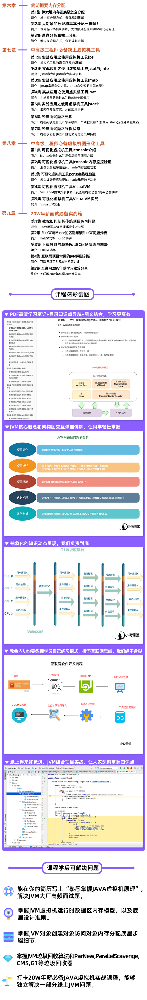

# 小D课堂_JVM从入门到实战

+ 1）开门见山，JVM大厂高频面试题Java内存区域分布与概述，动手实战各个区域 
+ 2）Java工程师不可不知的对象创建底层步骤细节，生动剖析对象结构和访问方式
+ 3）内功深厚招数才易懂垃圾回收算法，带你一步步解析GC垃圾回收算法和常用垃圾回收器的原理
+ 4）简明扼要内存分配，JVM堆内存分配遵循哪些原则，什么是栈上分配？什么是逃逸分析？
+ 5）20W年薪面试必备实战，从传统公司和互联网公司出发，不同公司会遇到哪些JVM问题，以及每个实战

## 目录

+ 第1章 开门见山，JVM大厂高频面试题Java内存区域分布15分钟1节
  + 1-1互联网架构之JAVA虚拟机课程介绍

+ 第2章开门见山大厂面试题之运行时数据区57分钟7节
  + 2-1大厂高频面试题Java内存区域分布与概述06:42
  + 2-2动手实战Java内存区域程序计算器08:28
  + 2-3动手实战Java内存区域JAVA虚拟机栈11:53
  + 2-4动手实战Java内存区域本地方法栈07:05
  + 2-5动手实战Java内存区域Java堆07:27
  + 2-6动手实战Java内存区域方法区06:46
  + 2-7带你用上神秘的运行时常量池08:51

+ 第3章你真的了解对象吗？32分钟3节
  + 3-1你的对象是怎么来的？16:58
  + 3-2new这么多对象，你知道它们的结构吗？08:27
  + 3-3你是怎么访问你的对象的07:15

+ 第4章内功深厚招数才易懂垃圾回收算法51分钟6节
  + 4-1你不得不懂的GC垃圾回收？09:53
  + 4-2对象存活算法引用计数法11:42
  + 4-3对象存活算法可达性分析07:18
  + 4-4算法内功之剖析标记清除06:37
  + 4-5算法内功之剖析复制算法08:55
  + 4-6剖析标记整理算法与分代收集算法06:40

+ 第5章偷偷在干活的JVM垃圾收集器49分钟5节
  + 5-1Serial收集器内容精讲07:59
  + 5-2ParNew收集器内容精讲07:33
  + 5-3Parallel Scavenge收集器10:25
  + 5-4你不得不懂的CMS收集器10:42
  + 5-5你不得不懂的G1收集器13:00

+ 第6章简明扼要内存分配32分钟3节
  + 6-1探索堆内存到底是怎么分配13:49
  + 6-2大对象的分配和基本分配一样吗？07:49
  + 6-3逃逸分析和栈上分配10:34

+ 第7章中高级工程师必备线上虚拟机工具1小时14分钟7节
  + 7-1实战应用之使用虚拟机工具jps10:49
  + 7-2实战应用之使用虚拟机工具jstat与jinfo06:11
  + 7-3实战应用之使用虚拟机工具jmap12:07
  + 7-4实战应用之使用虚拟机工具jhat11:36
  + 7-5实战应用之使用虚拟机工具jstack11:23
  + 7-6经典面试题之死锁10:00
  + 7-7经典面试题之线程状态12:05

+ 第8章中高级工程师必备虚拟机图形化工具1小时5节
  + 8-1可视化虚拟机工具Jconsole介绍25:08
  + 8-2可视化虚拟机工具Jconsole内存监控验证12:08
  + 8-3可视化虚拟机工具Jconsole线程验证07:15
  + 8-4可视化虚拟机工具VisualVM06:35
  + 8-5可视化虚拟机工具VisualVM实战09:09

+ 第9章20W年薪面试必备实战篇54分钟5节
  + 9-1教你如何剖析传统项目JVM问题16:22
  + 9-2FullGC与Minor的区别频繁FullGC问题分析05:50
  + 9-3下载导致的频繁FullGC问题演练与解决11:55
  + 9-4互联网项目常见的JVM问题剖析11:19
  + 9-5互联网20W年薪学习秘笈分享

## 课程介绍

## 课程精彩摘录

