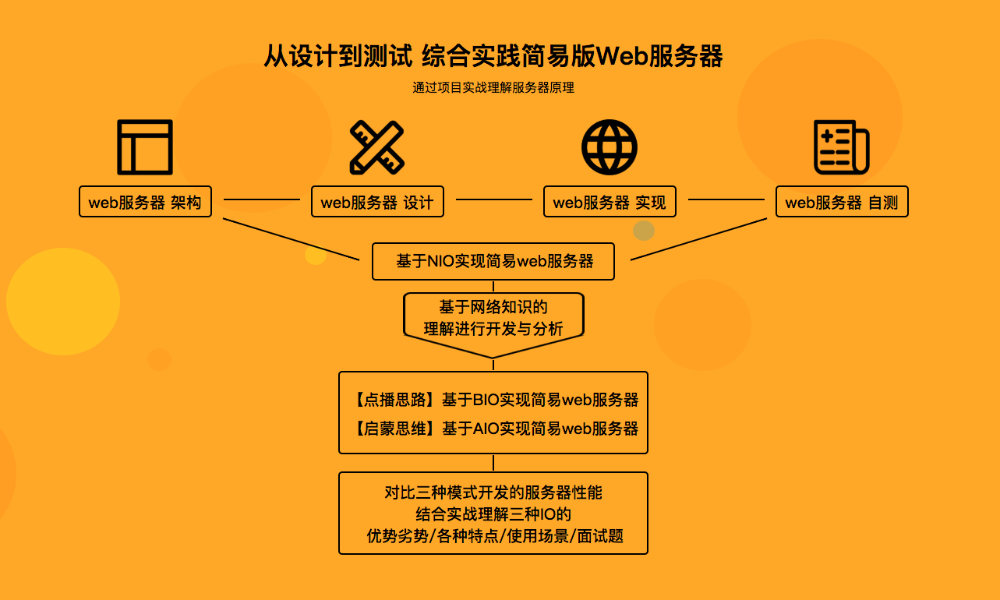

# 一站式学习Java网络编程 全面理解BIO/NIO/AIO

> 网络层编程，是每一个开发者都要面对的技术。课程为解决大家学习网络层知识的难题，以创新性的“对比式学习”搭建网络编程课程，课程主线清晰（网络层基础铺垫-->java网络编程前置技术讲解-->阻塞式编程BIO-->非阻塞式编程NIO-->异步编程AIO-->综合实战）适合每一位需要理解网络编程的同学们学习。以“项目驱动”为导向的学习，与企业刚需灵魂契合

## 课程特色

+ 三种版本实现 “多人聊天室项目”（BIO版->NIO版->AIO版）
  + 采用三种模式实现聊天室
  + 对比式学习
  + 让你真正感受模型演进带来的性能提升
+ NIO实现：web服务器设计与实现（NIO+BIO+AIO）
  + 以“NIO实战web服务器”为蓝本
  + 全程手把手实现
  + 最终助你掌握
  + 独立利用BIO、AIO进行项目演进实战的诀窍

## 模块概览

### BIO

+ 理论
  + 引入编程模型概念
  + 了解BIO设计思想
  + 核心类和网络编程原理
  + 对伪异步IO原理进行讲解
+ 实现
  + 实现基于BIO的多人聊天室
  + 使用伪异步IO改写聊天室
  + 观察改造前后系统资源消耗情况
+ BIO编程模型
  > 

### NIO

+ 理论
  + 对比BIO与NIO
  + 讲解NIO中核心类
  + 利用BIO和NIO实战本地文件
  + 拷贝功能并分析性能差异引起的原因
  + 实现原理并梳理NIO编程步骤
+ 实现
  + 对聊天室进行NIO改造
  + 观察改造前后系统资源消耗情况
+ NIO编程模型
  > 

### AIO

+ 理论
  + 对照BIO、NIO介绍AIO编程模型
  + 总结IO网络编程的演化历史
  + JDK中AIO核心类与实现原理
  + 梳理AIO编程步骤
+ 实现
  + 对多人聊天室进行AIO改造
  + 观察改造前后系统资源消耗情况
+ AIO编程模型
  > 

## 课程整体图示

## 课程目录

+ 第1章 【开宗明义】网络编程三剑客BIO、NIO、AIO
  + 1-1 【探秘java.io】始于BIO,陷于NIO,终于AIO  (13:26)

+ 第2章 网络层的解析与协议
  + 2-1 URL解析与构造  (06:27)
  + 2-2 域名DNS的解析过程  (07:02)
  + 2-3 域名DNS查询的两种方式：递归与迭代  (06:47)
  + 2-4 网络协议快速扫盲  (09:32)
  + 2-5 网络协议分门别类  (02:11)
  + 2-6 连接一切（物理、网卡、主机、端口的连接）  (06:48)
  + 2-7 网络各个层的数据包格式  (10:25)

+ 第3章 解读java.io专业术语也可以变得生动精辟
  + 3-1 java.io之字符流  (18:01)
  + 3-2 java.io之字节流  (13:53)
  + 3-3 Socket概述  (13:29)
  + 3-4 同步异步阻塞非阻塞  (12:47)
  + 3-5 网络通信中的线程池  (14:04)

+ 第4章 JavaIO的“前世”：BIO阻塞模型
  + 4-1 Socket与ServerSocket  (05:43)
  + 4-2 实战：ServerSocket  (18:22)
  + 4-3 实战：Socket  (15:01)
  + 4-4 运行简单的服务器客户端实例  (06:04)
  + 4-5 运行改进的服务器客户端实例(上)  (06:40)
  + 4-6 运行改进的服务器客户端实例(下)  (03:58)

+ 第5章 实战：基于BIO的多人聊天室设计与实现
  + 5-1 BIO编程模型简析  (06:21)
  + 5-2 多人聊天室功能概述  (02:02)
  + 5-3 多人聊天室设计  (07:26)
  + 5-4 多人聊天室设计UML建模之时序图  (12:36)
  + 5-5 实现聊天室服务端：ChatServer  (31:50)
  + 5-6 实现聊天室监听器：ChatHandler(上)  (05:03)
  + 5-7 实现聊天室监听器：ChatHandler(下)  (21:32)
  + 5-8 实现聊天室客户端：ChatClient  (21:50)
  + 5-9 实现聊天室用户输入监听器：UserInputHandler（上）  (10:27)
  + 5-10 实现聊天室用户输入监听器：UserInputHandler（下）  (00:28)
  + 5-11 多人聊天室演示（上）  (03:13)
  + 5-12 多人聊天室演示（下）  (02:20)
  + 5-13 伪异步IO编程模型简析  (06:32)
  + 5-14 使用伪异步IO改进多人聊天室  (07:45)

+ 第6章 JavaIO的“今生”：NIO非阻塞模型
  + 6-1 NIO概述  (13:29)
  + 6-2 Buffer简析  (16:38)
  + 6-3 Channel简析  (02:21)
  + 6-4 实战：多方法实现本地文件拷贝  (25:41)
  + 6-5 本地文件拷贝演示（上）  (15:02)
  + 6-6 本地文件拷贝演示（下）  (09:41)
  + 6-7 Selector简析  (17:20)

+ 第7章 实战：使用NIO改造多人聊天室
  + 7-1 NIO编程模型精讲  (16:43)
  + 7-2 NIO模型实现ChatServe_1  (15:51)
  + 7-3 NIO模型实现ChatServer_2  (19:28)
  + 7-4 NIO模型实现ChatServer-accept事件  (04:53)
  + 7-5 NIO模型实现ChatServer_read事件  (16:40)
  + 7-6 NIO模型实现ChatServer_4  (17:39)
  + 7-7 NIO模型实现ChatServer_6  (10:31)
  + 7-8 NIO模型实现ChatClient_1  (13:54)
  + 7-9 NIO模型实现ChatClient_2  (13:55)
  + 7-10 NIO模型多人聊天室演示  (08:51)

+ 第8章 JavaIO的“后世”之师：AIO异步通信模型 内容更新中
+ 第9章 实战：基于AIO改造多人聊天室 内容更新中
+ 第10章 综合实战：简易版Web服务器【“道”与“术”的进阶】 内容更新中
+ 第11章 JavaIO经典再现【面试装逼必备佳品】 内容更新中
+ 第12章 曲终人散，江湖再会
