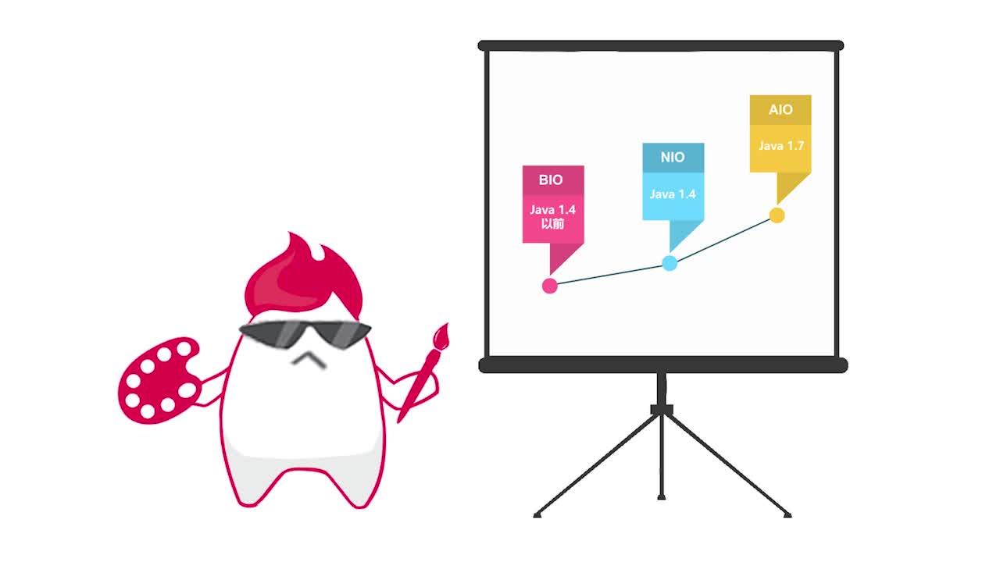

# 第1章 【开宗明义】网络编程三剑客BIO、NIO、AIO

> 网络层编程，是每一个开发者都要面对的技术。课程为解决大家学习网络层知识的难题，以创新性的“对比式学习”搭建网络编程课程，课程主线清晰（网络层基础铺垫-->java网络编程前置技术讲解-->阻塞式编程BIO-->非阻塞式编程NIO-->异步编程AIO-->综合实战）适合每一位需要理解网络编程的同学们学习。以“项目驱动”为导向的学习，与企业刚需灵魂契合

## 课程特色

+ 三种版本实现 “多人聊天室项目”（BIO版->NIO版->AIO版）
  + 采用三种模式实现聊天室
  + 对比式学习
  + 让你真正感受模型演进带来的性能提升
+ NIO实现：web服务器设计与实现（NIO+BIO+AIO）
  + 以“NIO实战web服务器”为蓝本
  + 全程手把手实现
  + 最终助你掌握
  + 独立利用BIO、AIO进行项目演进实战的诀窍
  
## IO的发展历史

## 模块概览

### BIO

+ 理论
  + 引入编程模型概念
  + 了解BIO设计思想
  + 核心类和网络编程原理
  + 对伪异步IO原理进行讲解
+ 实现
  + 实现基于BIO的多人聊天室
  + 使用伪异步IO改写聊天室
  + 观察改造前后系统资源消耗情况
+ BIO编程模型
  > 

### NIO

+ 理论
  + 对比BIO与NIO
  + 讲解NIO中核心类
  + 利用BIO和NIO实战本地文件
  + 拷贝功能并分析性能差异引起的原因
  + 实现原理并梳理NIO编程步骤
+ 实现
  + 对聊天室进行NIO改造
  + 观察改造前后系统资源消耗情况
+ NIO编程模型
  > 

### AIO

+ 理论
  + 对照BIO、NIO介绍AIO编程模型
  + 总结IO网络编程的演化历史
  + JDK中AIO核心类与实现原理
  + 梳理AIO编程步骤
+ 实现
  + 对多人聊天室进行AIO改造
  + 观察改造前后系统资源消耗情况
+ AIO编程模型
  > 

## 课程整体图示

