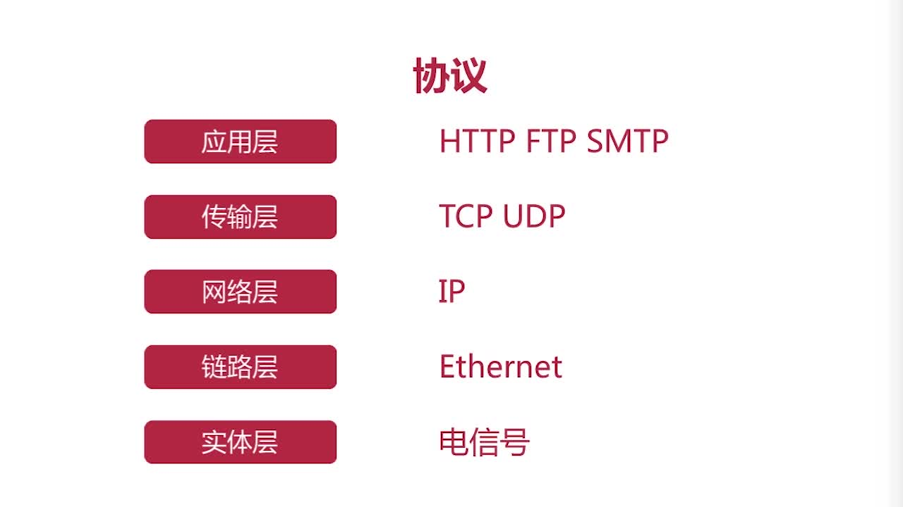
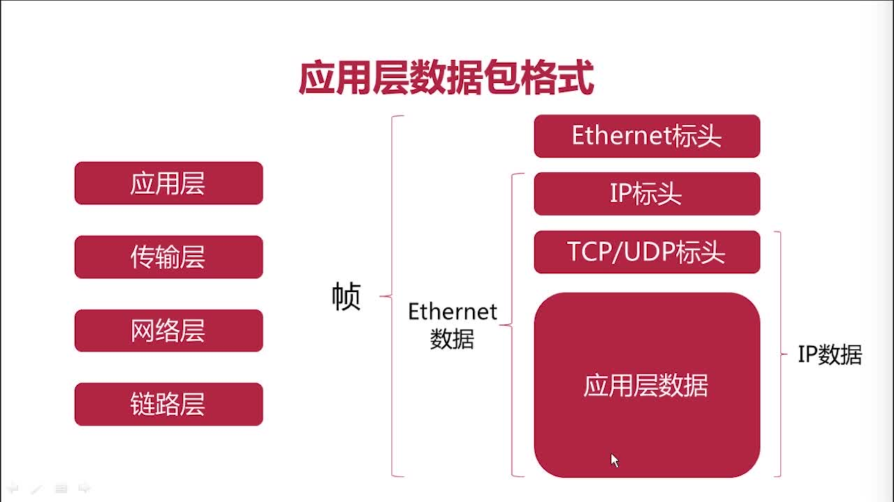

# 第2章 网络层的解析与协议

## 2.1 URL解析和构造

构造一个完整URL例子： 

http://www.aspxfans.com:8080/news/index.asp?boardID=5&ID=24618&page=1#r_70732423

一个完整的URL包括：协议部分、域名部分、端口部分、虚拟目录部分、文件名部分、参数部分、锚部分

+ 1.协议部分：该URL的协议部分为“http：”，这代表网页使用的是HTTP协议。在Internet中可以使用多种协议，如HTTP，FTP等等本例中使用的是HTTP协议。在”HTTP”后面的“//”为分隔符
+ 2.域名部分：该URL的域名部分为"www.aspxfans.com", 一个URL中，也可以使用IP地址作为域名使用
+ 3.端口部分：跟在域名后面的是端口，域名和端口之间使用“:”作为分隔符。端口不是一个URL必须的部分，如果省略端口部分，将采用默认端口
+ 4.虚拟目录部分：从域名后的第一个“/”开始到最后一个“/”为止，是虚拟目录部分。虚拟目录也不是一个URL必须的部分。本例中的虚拟目录是“/news/”
+ 5.文件名部分：从域名后的最后一个“/”开始到“？”为止，是文件名部分，如果没有“?”,则是从域名后的最后一个“/”开始到“#”为止，是文件部分，如果没有“？”和“#”，那么从域名后的最后一个“/”开始到结束，都是文件名部分。本例中的文件名是“index.asp”。文件名部分也不是一个URL必须的部分，如果省略该部分，则使用默认的文件名
+ 6.参数部分：从“？”开始到“#”为止之间的部分为参数部分，又称搜索部分、查询部分。本例中的参数部分为“boardID=5&ID=24618&page=1”。参数可以允许有多个参数，参数与参数之间用“&”作为分隔符。
+ 7.锚部分：HTTP请求不包括锚部分，从“#”开始到最后，都是锚部分。本例中的锚部分是“r_70732423“。锚部分也不是一个URL必须的部分。 
  锚点作用：打开用户页面时滚动到该锚点位置。如：一个html页面中有一段代码，该url的hash为r_70732423

  ```html
  <div name='r_70732423'>...</div>
  ```
  打开上面url，用户页面时滚动到name=’r_70732423’ 
  [锚部分更多用法和注意事项](https://blog.csdn.net/somanygenius/article/details/48000285)

## 2.2~2.3 DNS

参考博客 [DNS原理及其解析过程](https://www.cnblogs.com/gopark/p/8430916.html)

## 2.4~2.6 网络协议



## 2.7 各个网络协议层的数据格式


