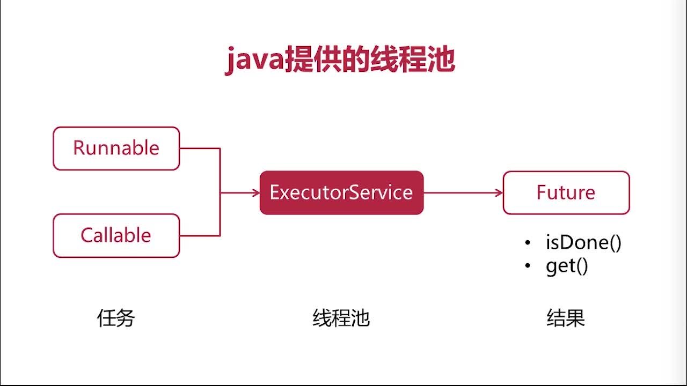
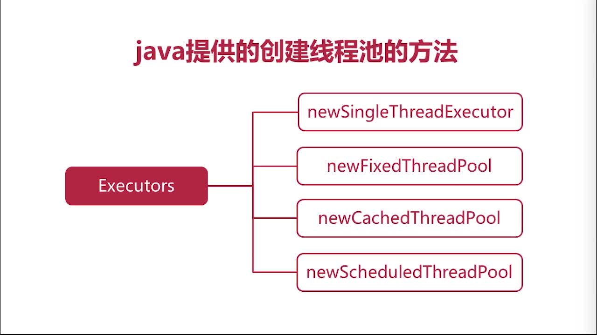

# 第3章 解读java.io专业术语也可以变得生动精辟

## 3.1~3.2 java.io简介

参考文章 [看完这个，Java IO从此不在难](https://www.jianshu.com/p/715659e4775f)

## 3.3 Socket概述

> 参考： http://c.biancheng.net/view/2123.html

网络编程就是编写程序使两台联网的计算机相互交换数据。这就是全部内容了吗？是的！网络编程要比想象中的简单许多。

那么，这两台计算机之间用什么传输数据呢？首先需要物理连接。如今大部分计算机都已经连接到互联网，因此不用担心这一点。

在此基础上，只需要考虑如何编写数据传输程序。但实际上这点也不用愁，因为操作系统已经提供了 socket。即使对网络数据传输的原理不太熟悉，我们也能通过 socket 来编程。

### 什么是 socket？

socket 的原意是“插座”，在计算机通信领域，socket 被翻译为“套接字”，它是计算机之间进行通信的一种约定或一种方式。通过 socket 这种约定，一台计算机可以接收其他计算机的数据，也可以向其他计算机发送数据。

我们把插头插到插座上就能从电网获得电力供应，同样，为了与远程计算机进行数据传输，需要连接到因特网，而 socket 就是用来连接到因特网的工具。

socket 的典型应用就是 Web 服务器和浏览器：浏览器获取用户输入的 URL，向服务器发起请求，服务器分析接收到的 URL，将对应的网页内容返回给浏览器，浏览器再经过解析和渲染，就将文字、图片、视频等元素呈现给用户。

学习 socket，也就是学习计算机之间如何通信，并编写出实用的程序。

### UNIX/Linux 中的 socket 是什么？

在 UNIX/Linux 系统中，为了统一对各种硬件的操作，简化接口，不同的硬件设备也都被看成一个文件。对这些文件的操作，等同于对磁盘上普通文件的操作。

你也许听很多高手说过，UNIX/Linux 中的一切都是文件！那个家伙说的没错。

为了表示和区分已经打开的文件，UNIX/Linux 会给每个文件分配一个 ID，这个 ID 就是一个整数，被称为文件描述符（File Descriptor）。例如：
+ 通常用 0 来表示标准输入文件（stdin），它对应的硬件设备就是键盘；
+ 通常用 1 来表示标准输出文件（stdout），它对应的硬件设备就是显示器。

UNIX/Linux 程序在执行任何形式的 I/O 操作时，都是在读取或者写入一个文件描述符。一个文件描述符只是一个和打开的文件相关联的整数，它的背后可能是一个硬盘上的普通文件、FIFO、管道、终端、键盘、显示器，甚至是一个网络连接。

请注意，网络连接也是一个文件，它也有文件描述符！你必须理解这句话。

我们可以通过 socket() 函数来创建一个网络连接，或者说打开一个网络文件，socket() 的返回值就是文件描述符。有了文件描述符，我们就可以使用普通的文件操作函数来传输数据了，例如：
+ 用 `read()` 读取从远程计算机传来的数据
+ 用 `write()` 向远程计算机写入数据。

你看，只要用 socket() 创建了连接，剩下的就是文件操作了，网络编程原来就是如此简单！

### Window 系统中的 socket 是什么？

Windows 也有类似“文件描述符”的概念，但通常被称为“文件句柄”。因此，本教程如果涉及 Windows 平台将使用“句柄”，如果涉及 Linux 平台则使用“描述符”。

与 UNIX/Linux 不同的是，Windows 会区分 socket 和文件，Windows 就把 socket 当做一个网络连接来对待，因此需要调用专门针对 socket 而设计的数据传输函数，针对普通文件的输入输出函数就无效了。

## 3.4 同步、异步、阻塞、非阻塞

参考文章：
+ [同步、异步、阻塞、非阻塞傻傻分不清？](https://baijiahao.baidu.com/s?id=1623908582750588151&wfr=spider&for=pc)
+ [最准确的理解同步/异步，阻塞/非阻塞](https://www.cnblogs.com/pettyColorcat/p/10794839.html)

### 各种情况的图示


### 各种情况的阐述

+ 1.**同步机制**
  > 发送方发送请求之后，需要等接收方发回响应后才接着发
+ 2.**异步机制**
  > 发送方发送一个请求之后不等待接收方响应这个请求，就继续发送下个请求
+ 3.**阻塞调用** 
  > 调用结果返回之前，当前线程会被挂起。调用线程只有在得到结果之后才会返回，该线程在此过程中不能进行其他处理
+ 4.**非阻塞调用**
  > 调用结果不能马上返回，当前线程也不会被挂起，而是立即返回执行下一个调用。（网络通信中主要指的是网络套接字Socket的阻塞和非阻塞方式，而soket 的实质也就是IO操作）
+ 5.**同步阻塞方式**
  > 发送方发送请求之后一直等待响应。接收方处理请求时进行的IO操作如果不能马上等到返回结果，就一直等到返回结果后，才响应发送方，期间不能进行其他工作
+ 6.**同步非阻塞方式**
  > 发送方发送请求之后，一直等待响应，接受方处理请求时进行的IO操作如果不能马上的得到结果，就立即返回，取做其他事情。但是由于没有得到请求处理结果，不响应发送方，发送方一直等待。一直等到IO操作完成后，接收方获得结果响应发送发后，接收方才进入下一次请求过程。（实际不应用）
+ 7.**异步阻塞方式** 
  > 发送方向接收方请求后，不等待响应，可以继续其他工作，接收方处理请求时进行IO操作如果不能马上得到结果，就一直等到返回结果后，才响应发送方，期间不能进行其他操作。 （实际不应用）
+ 8.**异步非阻塞方式**
  > 发送方向接收方请求后，不等待响应，可以继续其他工作，接收方处理请求时进行IO操作如果不能马上得到结果，也不等待，而是马上返回取做其他事情。当IO操作完成以后，将完成状态和结果通知接收方，接收方在响应发送方。（效率最高）

### 举例

相信不少同学都看过，（普通水壶，简称水壶；会响的水壶，简称响水壶）。具体如下：

```text
同步阻塞：小明把水壶放到火上，然后在那傻等水开

同步非阻塞：小明把水壶放到火上，然后去客厅看电视，时不时的去厨房看看水开没有

异步阻塞：小明把响水壶放到火上，然后在那傻等水开

异步非阻塞：小明把响水水壶放到火上，去客厅看电视，水壶响之前不再去看它了，响了再去处理
```

刚看到这个例子的时候，我也觉得讲的很生动，一看就明白，但是过一段时间之后，发现自己还是会混淆上面的几个概念（冥冥之中觉得有bug）。反复查阅网上资料之后，发现网上基本都是这个例子。最后查阅书籍，终于明白了上述概念的真正含义。

上面的例子让人有以下感觉：

+ 一、如果是同步，那一定就是阻塞的啊，因为调用者需要拿到结果才能执行后面的任务
+ 二、如果是异步，那一定是非阻塞的啊，调用者可以继续往后执行

### 现在是我给大家解惑的时候了，直接给出概念

+ 同步/异步：形容一次方法的调用，在**单线程**中。描述的是执行者是否具备`主动通知`功能
  + `同步`，调用者会等到方法调用返回后才能继续后面的行为
  + `异步`，调用者不需要等到方法返回，方法执行完毕后会主动通知调用者

+ 阻塞/非阻塞：调用者是否可以执行多个任务，在**多线程**中。描述的是调用者的`多个线程是否可以同时执行`
  + 阻塞，线程1和线程2不能同时进行
  + 非阻塞，线程1和线程2可以同时进行

 总结：

  看明白了吗？网上小明烧水的这个例子完全没有提及多线程（被隐藏起来，需要我们自己去发现和理解），但是`同步和阻塞完全是在单线程和多线程这两个维度上的概念`。简单的说，`如果是单线程，不管是同步还是异步，肯定是阻塞的。阻塞和非阻塞只有在多线程中才有意义`。并且小明烧水的时候去看电视，隐含了这里就是另外新开了一个线程去看电视，而不是在烧水的这个线程中去执行看电视，否则毫无意义。以上，欢迎指正！

## 3.5 网络通信中的线程池

参考以前自己的学习笔记
+ [Runnable、Callable与Future](https://github.com/19920625lsg/JavaThread/blob/master/Part3SoutionOfJavaThread/第07章_JUC组件扩展.md)
+ [线程池](https://github.com/19920625lsg/JavaThread/blob/master/Part3SoutionOfJavaThread/第08章_JUC之线程池.md)

### Runnable无返回值、Callable有返回值，Future可以阻塞查询任务状态



### Javac创建线程池的方法


