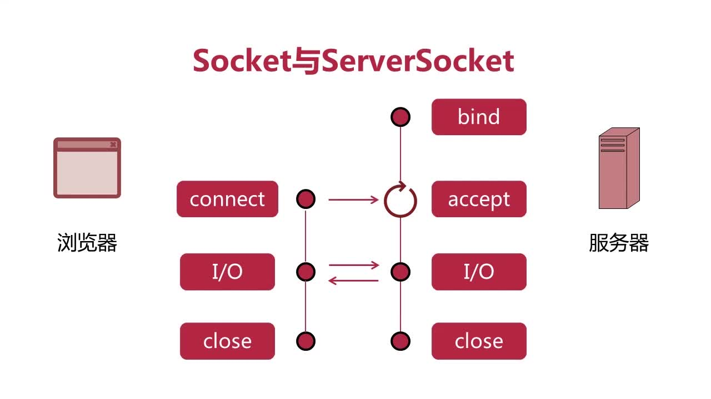

# 第04章_JavaIO的前世之BIO阻塞模型

> BIO:Blocked IO

## 4.1 Socket与ServerSocket

浏览器与服务器之间的Socket通信过程如下



## 4.2 Server实战

```java
package com.huawei.l00379880.mythread.Chapter04BIO.Section2ServerSocket;

import java.io.*;
import java.net.ServerSocket;
import java.net.Socket;

/***********************************************************
 * @note      : 
 * @author    : l00379880 梁山广
 * @version   : V1.0 at 2019/9/11 20:16
 ***********************************************************/
public class Server {
    public static void main(String[] args) {
        final int DEFAULT_PORT = 8888;
        // 解决消息中文乱码的问题
        final String CHARSET = "UTF-8";
        ServerSocket serverSocket = null;
        try {
            System.out.println("我是服务端......");
            serverSocket = new ServerSocket(DEFAULT_PORT);
            System.out.println("启动服务器，监听端口：" + DEFAULT_PORT);
            while (true) {
                // 等待客户端连接
                Socket socket = serverSocket.accept();
                String clientIp = socket.getInetAddress().getHostAddress();
                int clientPort = socket.getPort();
                System.out.println("客户端【" + clientIp + ":" + clientPort + "】已连接");
                BufferedReader reader = new BufferedReader(new InputStreamReader(socket.getInputStream(), CHARSET));
                BufferedWriter writer = new BufferedWriter(new OutputStreamWriter(socket.getOutputStream(), CHARSET));
                // 读取客户端发来地消息
                String msg = reader.readLine();
                if (msg != null) {
                    System.out.println("客户端发过来的消息【" + clientIp + ":" + clientPort + "】" + msg);
                    // 回复客户端发送地消息
                    writer.write("服务器：" + msg + "\n");
                    writer.flush();
                }
            }
        } catch (IOException e) {
            e.printStackTrace();
        } finally {
            if (serverSocket != null) {
                try {
                    serverSocket.close();
                } catch (IOException e) {
                    e.printStackTrace();
                }
            }
        }

    }
}
```

## 4.3 Client实战

```java
package com.huawei.l00379880.mythread.Chapter04BIO.Section2ServerSocket;

import java.io.*;
import java.net.Socket;

/***********************************************************
 * @note      : 
 * @author    : l00379880 梁山广
 * @version   : V1.0 at 2019/9/12 8:35
 ***********************************************************/
public class Client {
    public static void main(String[] args) {
        final String DEFAULT_SERVER_HOST = "127.0.0.1";
        final int DEFAULT_SERVER_PORT = 8888;
        // 解决消息中文乱码的问题
        final String CHARSET = "UTF-8";
        Socket socket = null;
        try {
            System.out.println("我是客户端......");
            while (true) {
                // 创建socket
                socket = new Socket(DEFAULT_SERVER_HOST, DEFAULT_SERVER_PORT);
                // 等待客户端连接
                String clientIp = socket.getInetAddress().getHostAddress();
                int clientPort = socket.getPort();

                // 创建IO流
                BufferedReader reader = new BufferedReader(new InputStreamReader(socket.getInputStream(), CHARSET));
                BufferedWriter writer = new BufferedWriter(new OutputStreamWriter(socket.getOutputStream(), CHARSET));
                // 等待用户输入信息
                BufferedReader consoleReader = new BufferedReader(new InputStreamReader(System.in));
                String inputStr = consoleReader.readLine();
                // 把用户输入地信息发送给服务器
                writer.write(inputStr + "\n");
                writer.flush();
                // 读取服务器返回的消息
                String msg = reader.readLine();
                System.out.println("服务端发过来地消息【" + clientIp + ":" + clientPort + "】" + msg);
            }
        } catch (IOException e) {
            e.printStackTrace();
        }
    }
}
```

## 4.4 Server改进

```java
package com.huawei.l00379880.mythread.Chapter04BIO.Section2ServerSocket;

import java.io.*;
import java.net.ServerSocket;
import java.net.Socket;

/***********************************************************
 * @note      : Server改进，实现长连接接受多条消息，并可以检测客户端退出
 * @author    : l00379880 梁山广
 * @version   : V1.0 at 2019/9/11 20:16
 ***********************************************************/
public class Server {
    public static void main(String[] args) {
        final String QUIT = "quit";
        final int DEFAULT_PORT = 9999;
        // 解决消息中文乱码的问题
        final String CHARSET = "UTF-8";
        ServerSocket serverSocket = null;
        try {
            System.out.println("我是服务端......");
            serverSocket = new ServerSocket(DEFAULT_PORT);
            System.out.println("启动服务器，监听端口：" + DEFAULT_PORT);
            while (true) {
                // 等待客户端连接
                Socket socket = serverSocket.accept();
                String clientIp = socket.getInetAddress().getHostAddress();
                int clientPort = socket.getPort();
                System.out.println("客户端【" + clientIp + ":" + clientPort + "】已连接");
                BufferedReader reader = new BufferedReader(new InputStreamReader(socket.getInputStream(), CHARSET));
                BufferedWriter writer = new BufferedWriter(new OutputStreamWriter(socket.getOutputStream(), CHARSET));
                // 读取客户端发来地消息
                String msg;
                while ((msg = reader.readLine()) != null) {
                    System.out.println("客户端发过来的消息【" + clientIp + ":" + clientPort + "】" + msg);
                    // 回复客户端发送地消息
                    writer.write("服务器：" + msg + "\n");
                    writer.flush();

                    // 查询客户端是否退出
                    if (QUIT.equals(msg)) {
                        System.out.println("客户端【" + socket.getPort() + "】已断开连接");
                        break;
                    }
                }
            }
        } catch (IOException e) {
            e.printStackTrace();
        } finally {
            if (serverSocket != null) {
                try {
                    serverSocket.close();
                } catch (IOException e) {
                    e.printStackTrace();
                }
            }
        }

    }
}
```

## 4.5 Client改进

```java
package com.huawei.l00379880.mythread.Chapter04BIO.Section2ServerSocket;

import java.io.*;
import java.net.Socket;

/***********************************************************
 * @note      : 客户端支持长连接，并支持退出
 * @author    : l00379880 梁山广
 * @version   : V1.0 at 2019/9/12 8:35
 ***********************************************************/
public class Client {
    public static void main(String[] args) {
        final String QUIT = "quit";
        final String DEFAULT_SERVER_HOST = "127.0.0.1";
        final int DEFAULT_SERVER_PORT = 9999;
        // 解决消息中文乱码的问题
        final String CHARSET = "UTF-8";
        Socket socket;
        BufferedWriter writer = null;
        try {
            System.out.println("我是客户端......");
            while (true) {
                // 创建socket
                socket = new Socket(DEFAULT_SERVER_HOST, DEFAULT_SERVER_PORT);
                // 等待客户端连接
                String clientIp = socket.getInetAddress().getHostAddress();
                int clientPort = socket.getPort();

                // 创建IO流
                BufferedReader reader = new BufferedReader(new InputStreamReader(socket.getInputStream(), CHARSET));
                writer = new BufferedWriter(new OutputStreamWriter(socket.getOutputStream(), CHARSET));
                // 等待用户输入信息
                BufferedReader consoleReader = new BufferedReader(new InputStreamReader(System.in));
                while (true) {
                    String inputStr = consoleReader.readLine();
                    // 把用户输入地信息发送给服务器
                    writer.write(inputStr + "\n");
                    writer.flush();
                    // 读取服务器返回的消息
                    String msg = reader.readLine();
                    System.out.println("服务端发过来地消息【" + clientIp + ":" + clientPort + "】" + msg);

                    // 查询客户端是否退出
                    if (QUIT.equals(inputStr)) {
                        break;
                    }
                }

            }
        } catch (IOException e) {
            e.printStackTrace();
        }finally {
            try {
                assert writer != null;
                writer.close();
                System.out.println("客户端关闭socket");
            } catch (IOException e) {
                e.printStackTrace();
            }
        }
    }
}
```
