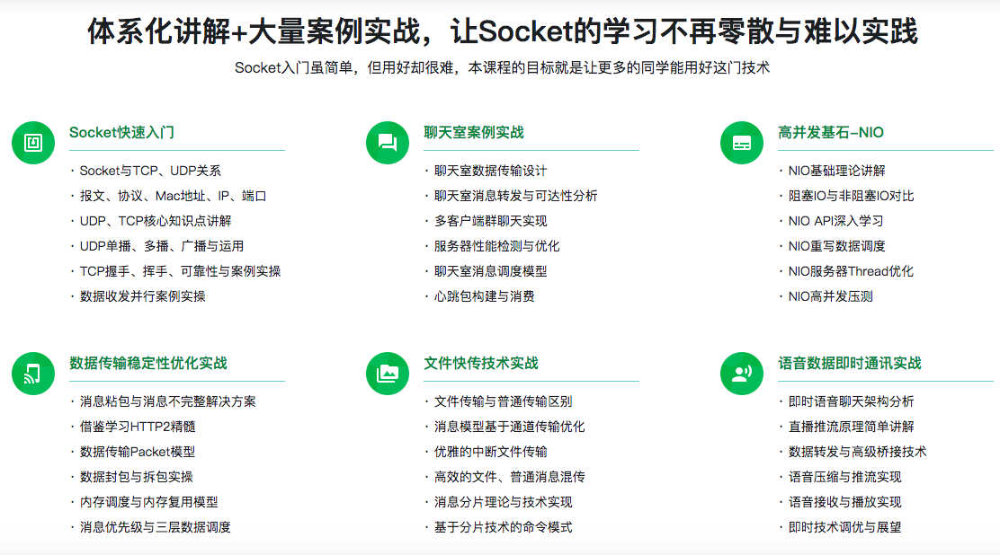
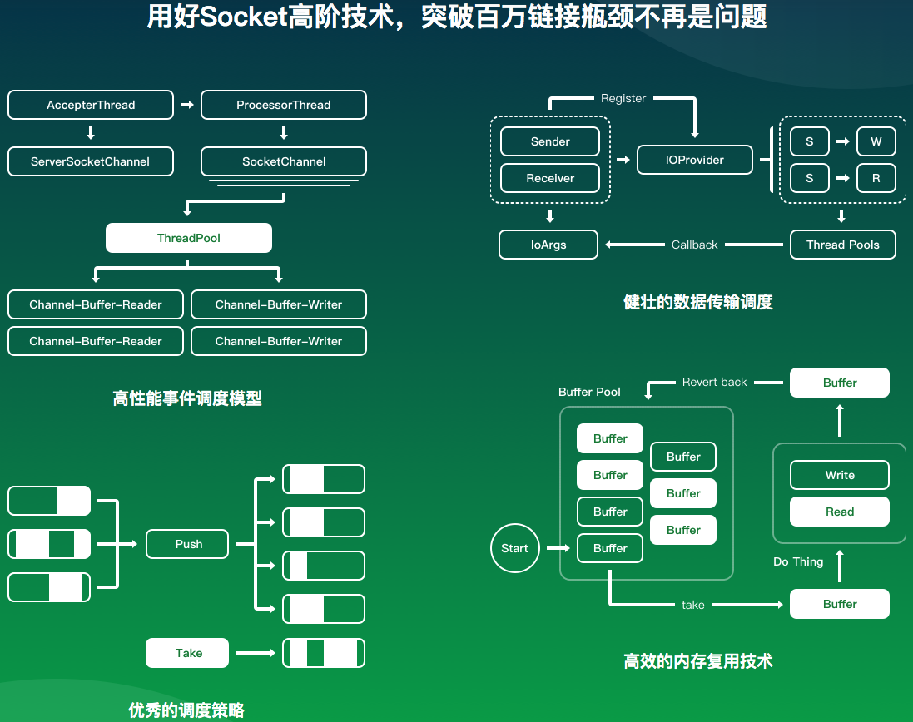

# [Socket网络编程进阶与实战](https://coding.imooc.com/learn/list/286.html)

> Socket对于每个工程师的重要性不言而喻。本课程将理论结合实践，带你从零开始，系统学习Socket编程技术，让Socket的学习不再那么零散与难以掌握，同时会提炼出Socket网络传输的核心思想与构架，并带你踩坑出坑，增加你的分析与处理问题的能力，完善你的编程思想与知识体系。最终助力你轻松应对企业中各种Socket应用场景（比如：群聊天、文件传输、直播传流、中断、心跳等）【说明：课程案例部分以Java语言实现】

## 学习完课程达到的水平

+ 1.推送，IM等SDK很多，但命脉都在别人手里，自己定制才安全
+ 2.学习本课程后物联网相关通信工作不再是难题、且你有能力成为协议的制定者
+ 3.学习本课程后IM消息推送不再是难点，且你有能力同时实现客户端与服务端
+ 4.学习本课程后…你可以尽情去吹牛，因为你学到的技术一听就是大牛

## 课程大纲

## Socket的各种编程模型

## 目录

+ 第1章 课程导学（Java语言教学）
  + 1-1 课前必读（不看会错过一个亿）
  + 1-2 课程导学（课前必看） (08:53)

+ 第2章 Socket网络编程快速入门
  + 2-1 什么是网络编程？ (12:26)
  + 2-2 Socket与TCP、UDP (13:34)
  + 2-3 Socket TCP牛刀小试-客户端实现 (13:51)
  + 2-4 Socket TCP牛刀小试-服务端实现 (12:55)
  + 2-5 报文、协议、Mac地址 (06:41)
  + 2-6 IP、端口及远程服务器 (11:45)

+ 第3章 Socket UDP快速入门
  + 3-1 UDP是什么 (08:35)
  + 3-2 UDP核心API讲解 (10:14)
  + 3-3 UDP单播、广播、多播-1 (07:58)
  + 3-4 UDP单播、广播、多播-2 (08:41)
  + 3-5 案例实操-局域网搜索案例-1 (13:56)
  + 3-6 案例实操-局域网搜索案例-2 (16:29)
  + 3-7 案例实操-局域网搜索案例-3 (15:19)

+ 第4章 Socket TCP快速入门
  + 4-1 TCP是什么、能做什么 (07:18)
  + 4-2 TCP核心API讲解 (09:26)
  + 4-3 TCP连接可靠性-三次握手、四次挥手 (15:17)
  + 4-4 TCP传输可靠性-排序、丢弃、重发 (08:06)
  + 4-5 案例实操-TCP传输初始化配置-1 (16:14)
  + 4-6 案例实操-TCP传输初始化配置-2 (14:34)
  + 4-7 案例实操-TCP基础数据传输-1 (13:53)
  + 4-8 案例实操-TCP基础数据传输-2 (17:20)

+ 第5章 UDP辅助TCP实现点对点传输案例
  + 5-1 UDP搜索IP与端口-1 (16:31)
  + 5-2 UDP搜索IP与端口-2 (15:14)
  + 5-3 点对点传输实现 (12:14)
  + 5-4 数据发送与接收并行-1 (16:38)
  + 5-5 数据发送与接收并行-2 (12:58)
  + 5-6 数据发送与接收并行-3 (10:00)

+ 第6章 简易聊天室案例
  + 6-1 聊天室数据传输设计 (07:17)
  + 6-2 聊天室消息接收实现 (16:23)
  + 6-3 聊天室消息转发实现 (10:39)
  + 6-4 服务器状态与测试用例构建-1 (09:57)
  + 6-5 服务器状态与测试用例构建-2 (08:22)
  + 6-6 服务器性能分析与压测 (11:29)
  + 6-7 服务器性能总结与优化方案 (06:20)

+ 第7章 服务器传输优化-NIO
  + 7-1 阻塞IO和⾮非阻塞IO (16:43)
  + 7-2 NIO Family一览 (09:22)
  + 7-3 NIO常⽤用API学习 (14:55)
  + 7-4 NIO重写服务器-1 (18:53)
  + 7-5 NIO重写服务器-2 (17:01)
  + 7-6 NIO重写服务器-3 (12:25)
  + 7-7 NIO服务器Thread优化-1 (06:06)
  + 7-8 NIO服务器Thread优化-2 (12:33)
  + 7-9 NIO服务器Thread优化-3 (17:56)
  + 7-10 NIO服务器Thread优化-4 (10:22)
  + 7-11 NIO服务器Thread优化-5 (11:11)
  + 7-12 NIO服务器Thread优化-6 (20:00)
  + 7-13 NIO知识归纳梳理 (08:45)

+ 第8章 数据传输稳定性优化
  + 8-1 消息不完整与消息粘包 (11:17)
  + 8-2 复现数据传输异常现象 (16:21)
  + 8-3 传输分析-如何有序的混传数据 (07:41)
  + 8-4 传输分析-借鉴学习HTTP精髓 (11:31)
  + 8-5 构建有序消息体-调度接口定义 (17:09)
  + 8-6 构建有序消息体-基本发送调度实现 (18:05)
  + 8-7 构建有序消息体-基本接收调度实现-1 (10:53)
  + 8-8 构建有序消息体-基本接收调度实现-2 (11:26)
  + 8-9 消息粘包与消息不全测试 (14:49)

+ 第9章 局域网文件快传技术实战
  + 9-1 混传数据总结与梳理 (09:53)
  + 9-2 文件传输与普通传输的区别 (11:57)
  + 9-3 文件消息模型基础实现-1 (14:44)
  + 9-4 文件消息模型基础实现-2 (14:42)
  + 9-5 文件消息模型基础实现-3 (16:02)
  + 9-6 发送文件到服务器-1 (17:12)
  + 9-7 发送文件到服务器-2 (15:37)
  + 9-8 发送文件到服务器-3 (10:47)
  + 9-9 消息分片传输设计与实现-1 (19:36)
  + 9-10 消息分片传输设计与实现-2 (14:46)
  + 9-11 消息分片传输设计与实现-3 (17:09)
  + 9-12 消息分片传输设计与实现-4 (13:44)
  + 9-13 消息分片设计与实现-发送调度-1 (17:15)
  + 9-14 消息分片设计与实现-发送调度-2 (17:27)
  + 9-15 消息分片设计与实现-接收调度-1 (16:21)
  + 9-16 消息分片设计与实现-接收调度-2 (17:49)
  + 9-17 文件快传收尾与总结 (11:29)

+ 第10章 聊天室升级版实战
  + 10-1 消息调度分析 (14:55)
  + 10-2 并发客户端BUG修复与性能优化-1 (21:16)
  + 10-3 并发客户端BUG修复与性能优化-2 (18:57)
  + 10-4 并发客户端BUG修复与性能优化-3 (17:03)
  + 10-5 数据三层缓冲区IoArgs调度优化 (16:38)
  + 10-6 服务器消息调度逻辑规范化-1 (16:20)
  + 10-7 服务器消息调度逻辑规范化-2 (17:29)
  + 10-8 服务器消息调度逻辑规范化-3 (21:03)
  + 10-9 服务器消息调度逻辑规范化-4 (19:15)
  + 10-10 心跳包必要性与策略选择 (19:26)
  + 10-11 心跳包构建与消费调度-1 (17:27)
  + 10-12 心跳包构建与消费调度-2 (23:27)
  + 10-13 心跳包构建与消费调度-3 (18:09)

+ 第11章 语音数据即时通信实战
  + 11-1 语音即时通信分析 (12:04)
  + 11-2 语音数据直流传输扩展-1 (12:49)
  + 11-3 语音数据直流传输扩展-2 (14:09)
  + 11-4 服务器桥接改造实现-1 (05:48)
  + 11-5 服务器桥接改造实现-2 (15:03)
  + 11-6 服务器桥接改造实现-3 (15:27)
  + 11-7 服务器桥接改造实现-4 (11:11)
  + 11-8 客户端数据编码技术选型 (11:11)
  + 11-9 客户端搭建与界面交互-1 (16:44)
  + 11-10 客户端搭建与界面交互-2 (12:06)
  + 11-11 客户端采集、传输、播放-1 (17:37)
  + 11-12 客户端采集、传输、播放-2 (04:53)
  + 11-13 语音即时通信总结 (10:12)

+ 第12章 整体代码结构梳理与升华
  + 12-1 框架性能瓶颈压测 (19:10)
  + 12-2 调度优化之发送数据调度优化 (15:27)
  + 12-3 多线程调度瓶颈分析 (14:47)
  + 12-4 调度优化之单线程IO调度-1 (18:50)
  + 12-5 调度优化之单线程IO调度-2 (13:00)
  + 12-6 案例分析不是BUG的BUG (09:52)
  + 12-7 调度优化之多线程窃取模式IO调度 (15:37)
  + 12-8 简单内存复用与细节优化-1 (18:03)
  + 12-9 简单内存复用与细节优化-2 (18:28)
  + 12-10 简单内存复用与细节优化-3 (22:00)
  + 12-11 简单内存复用与细节优化-4 (21:20)
  + 12-12 结构梳理与性能总结 (09:14)
