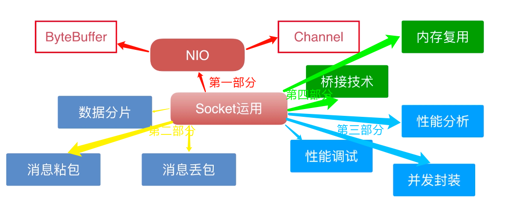
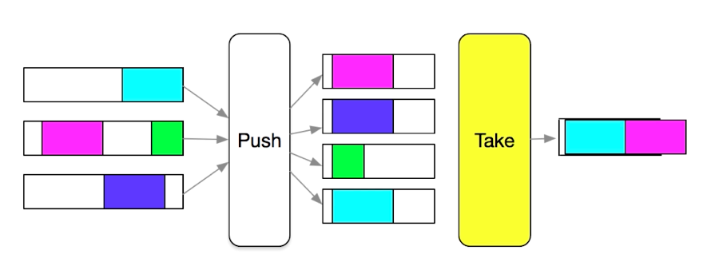
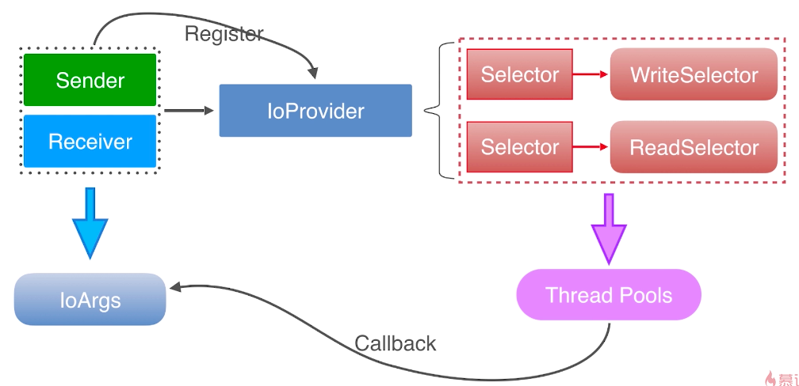

# 第1章 课程导学

## 1.2 课程导学

### Socket难在哪？

+ HTTP很简单，但自己造一个HTTP框架很难
+ 平时都在用推送、IM聊天但是自己写一个推送框架很难
+ 物联网正在蓬勃发展，但是进行数据传输很难
+ 归根到底：知识会用而不知内部原理+高大上，难直接使用

### 为什么Socket难直接使用？

+ 数据粘包
+ 数据丢包
+ 心跳维持
+ 性能问题
+ 系统学习难
+ 网上教程较浅

### 本课程学习目标

+ 拆开盒子，自己放东西
+ 提升技术，提升逼格；愉快写代码
+ 可以自主实现一套推送框架
+ 让IM传输原理不再成为你技术的盲点
+ 让你有能力胜任物联网相关开发职位，甚至是协议定制者
+ 让你对其他相关库的底层原理理解更透彻

### 本课程学习收获

### 授课方式

+ 从零开始、从原理开始、从API讲解开始
+ 不规避问题、入坑出坑是整个课程的基调
+ 按需求迭代，所有的代码更改都有理有据
+ 大量的原理图、流程图、架构图讲解，让学习不再困难

### 课程安排

+ 1.底层协议
  + 报文
  + 协议
  + Mac地址
  + IP
  + 端口
  + 服务器
+ 2.UDP和TCP
  + 协议区别
  + 性能比较(这里引出NIO大家族)
  + 适用场景
+ 3.NIO大家族
  + Selector
  + Channel
    + FileChannel
    + SocketChannel
    + ReadChannel
  + Buffer
    + ByteBuffer
    + CharBuffer
    + IntBuffer
+ 4.实战
  + 群聊天室
    + 多客户端连接
    + UDP扫描功能
    + 聊天消息转发
    + 向NIO的转型
    + 心跳包的实现
  + 文件快传
    + 基于流的传输
    + 文件发送中断
      + 消息分片
      + 消息混发
  + 即时语音
    + 直播推流
    + 语音采集
    + 语音压缩
      + 服务器桥接技术
    + 接收与播放
    + 实时消息类型

### 本课程实现的高性能的调度规则

> 通过多通道线程池、多端写入、并发消费的原理达到高性能的数据调度

### 本课程实现的健壮的数据消费流程

### 适合人群

+ 想深入学习Socket技术
+ 正在从事IM、推送、物联网相关的工作
+ 对于网络的组成原理、传输原理想要深入了解
+ 有目的或者没目的却想要使用Socket技术做款软件或APP
