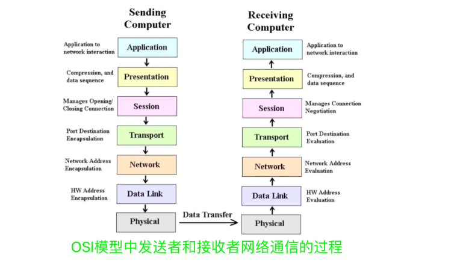
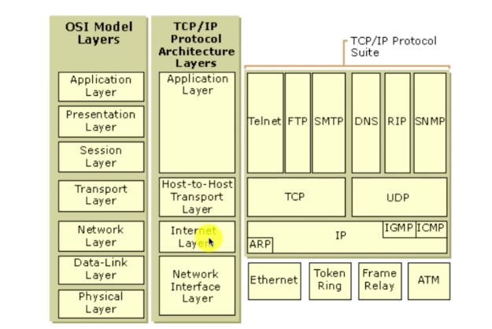
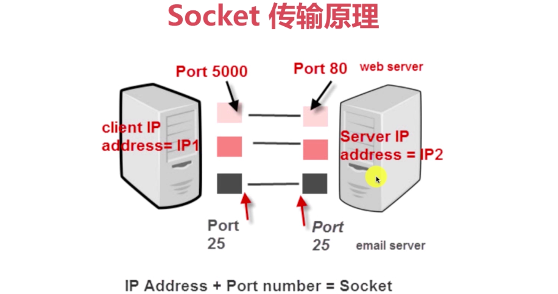
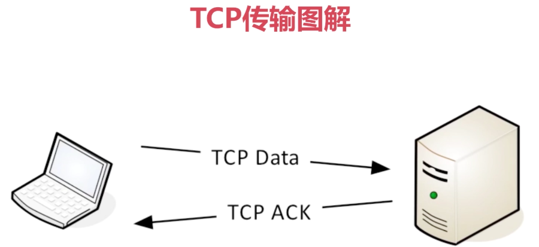
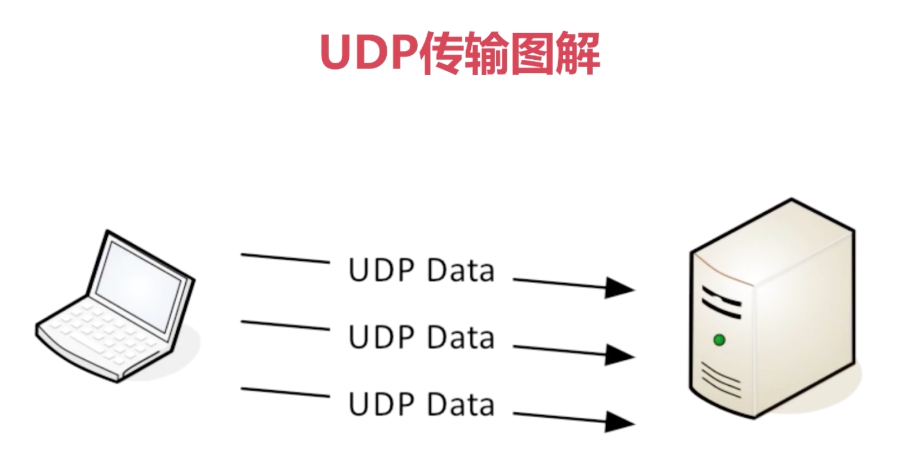
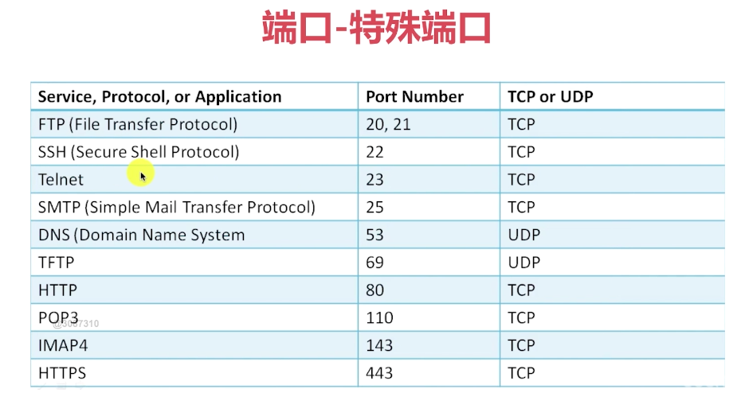
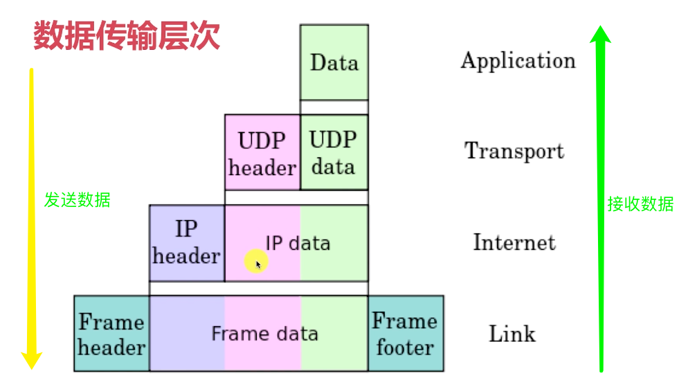

# 第02章 Socket网络编程快速入门

## 2-1 什么是网络编程

### 什么是网络？计算机网络的构成是什么？

+ 在计算机领域中，网络是信息传输、接收、共享的虚拟平台
+ 通过它把各个点、面、体的信息联系到一起，从而实现这些资源的共享
+ 网络是人类发展史上最重要的发明，提高了科技和人类社会的发展

### 什么是网络编程？

+ 从大的方面来说就是信息的发送和接收
+ 通过操作相应API调度计算机硬件资源，并利用传输管道(网线)进行数据交换的过程
+ 更为具体的涉及：网络模型、套接字、数据包

### 7层网络模型--OSI

+ 基础层：物理层(Physical)、数据链路层(DataLink)、网络层(Network)
+ 传输层(Transport)：TCP-UDP协议层、Socket
+ 高级层：会话层(Session)、表示层(Presentation)、应用层(Application)

### OSI模型和TCP/IP模型的对应关系

## 2-2 Socket与TCP、UDP

### 什么是Socket?

+ 简单来说是IP地址和端口的结合协议
+ 一种地址和端口的结合描述协议
+ TCP/IP协议的相关API的总称；是网络API的集合实现
+ 涵盖了：Stream(流) Socket和DataGram(数据报) Socket

### Socket的作用与组成

+ 在网络传输中用于唯一标识两个端点之间的连接
+ 端点：ip+port
+ 4个要素：客户端ip、客户端端口、服务端ip、服务端端口

### Socket传输原理

### Socket之TCP

+ TCP是面向连接的通信协议
+ 通过三次握手建立连接，通讯完成时要拆除连接
+ 由于TCP是面向连接的，所以只能用于端到端的通讯

### Socket之UDP

+ UDP是面向无连接的通讯协议
+ UDP数据包包括目的端口号和源端口号信息
+ 由于通讯不需要连接，所以可以实现广播发送，并不局限于端到端

### Client-Server Application(CS通信模型)

+ TCP/IP协议中，两个进程间同通信的主要模型为：CS模型
+ 主要目的：协同网络中的计算机资源、服务模式、进程间数据共享
+ 常见的CS模型：FTP、SMTP、HTTP，这些为Socket通信的具体应用

## 2-3 Socket TCP牛刀小试--客户端实现

例子的实现目标是：

+ 构建TCP客户端、服务端
+ 客户端发送数据
+ 服务器端读取数据并打印

[客户端代码](../src/main/java/Chapter02Start/Client.java)

## 2-4 Socket TCP牛刀小试--服务端实现

[代码](../src/main/java/Chapter02Start/Server.java)

## 2.5 报文、协议和Mac地址

### 报文段

+ 报文段是指TCP/IP协议网络传输过程中，起着路由导航作用的部分
+ 用以查询各个网络路由网段、IP地址、交换协议等IP数据包
+ 报文段充当整个TCP/IP协议数据包的导航路由功能
+ 报文在传输过程中会不断地封装成分组、包、帧来传输
+ 封装方式就是添加一些控制信息组成的首部，即报文头

### 传输协议

+ 协议顾名思义，一种规定、约束
+ 约定大于配置，在网络传输中依然适用；网络的传输流程是健壮的、稳定的，得益于基础的协议组成
+ 简单来说：A-->B的传输数据，B能识别；反之B-->A的传输数据A也能识别，这就是协议

### MAC地址

+ 全程：Media Access Control或者Medium Access Control
+ 翻译为：媒体访问控制，或称为物理地址、硬件地址
+ 用来**定义网络设备的位置**
+ 形如：44-45-53-54-00-00，与身份证类似，是设备的唯一标识

## 2.6 IP、端口与远程服务器

### IP地址

+ 全程：互联网协议地址(英语：Internet Protocol Address,又译为网际协议地址)，缩写为IP地址(英语：IP Address)
+ 是分配给网络上使用网际协议(英语：Internet Protocol, IP)设备的数字标签
+ 常见的IP地址分为IPv4和IPv6两大类

### 端口

+ 0~1023以及1024~49151端口都是特殊端口
+ 计算机之间依照互联网传输层TCP/IP协议的协议通信，不同的协议都对应不同的端口
+ 49152~65535号端口属于"动态端口"范围，没有端口可以被正式地注册占用

### 数据传输层次

