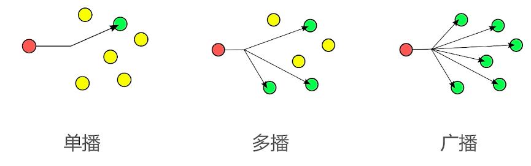
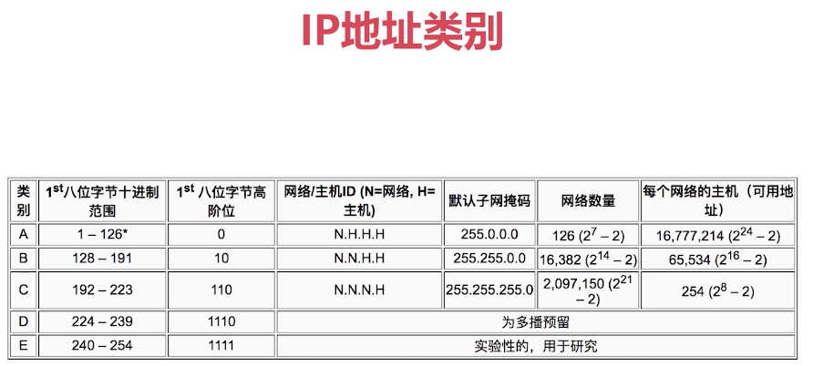
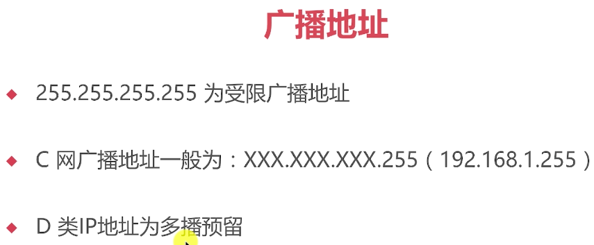
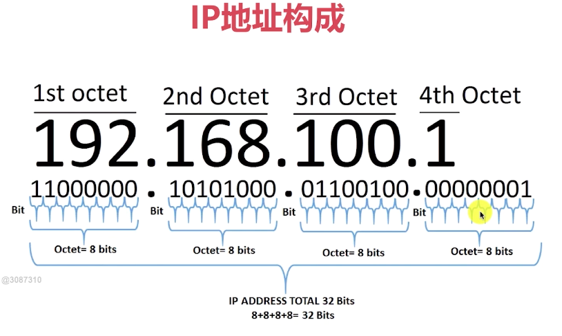

# 第03章 Socket UDP快速入门

## 3.1 UDP是什么

### UDP是什么？

+ 英语：User Datagram Protocol,用户数据报协议，缩写为UDP
+ 一种`用户数据报协议`，又称`用户数据报文协议`
+ 是一个简单的面向"数据报"的`传输层协议`，正式规范为RFC 768
+ 用户数据协议、非连接协议

### 为什么不可靠？

+ 它一旦把应用程序发给网络层的数据发送出去，就不保留数据备份
+ UDP在IP数据报的头部仅仅加入了复用和数据校验字段
+ 发送端产生数据，接收端从网络中抓取数据
+ 结构简单、无校验、速度快、容易丢包、可广播

### UDP能做什么？

+ DNS、TFTP、SNMP
+ 视频、音频、普通数据(无关紧要数据)

### UDP包最大长度

+ 16位-->2字节 存储长度信息
+ 2^16 - 1 = 64K -1 = 65536 - 1 = 65535
+ 自身协议占用：32+32位=64位=8字节
+ 所以最终的UDP最大数据长度为：65535-8 = 65507byte(字节)

## 3.2 UDP核心API讲解

### DatagramSocket

> UDP通信最重要的一个类

+ 用于接收和发送UDP的类
+ 负责发送某一个UDP包，或者接收UDP包
+ 不同于TCP，UDP并没有合并到Socket API中
+ 构造函数
  + `DatagramSocket()`创建简单实例，不指定端口和IP
  + `DatagramSocket(int port)`创建监听固定端口的实例(接听数据的端口)
  + `DatagramSocket(int port， InetAddress localAddr)`创建固定端口指定IP的实例
+ `receive(DatagramPacket d)`:接收数据
+ `send(DatagramPacket d)`:发送数据
+ `setSoTimeout(int timeout`:设置超时时间，毫秒ms
+ `close()`:关闭、释放资源

### DatagramPacket

+ 用于处理报文
+ 将byte数组、目标地址、目标端口等数据包装成报文或者将报文拆卸层Byte数组
+ 它是UDP的发送实体，也是接收实体
+ 构造函数
  + `DatagramPacket(byte[] buf, int offset, int length, InetAddress address, int port)`:前3个参数指定buf的使用区间；后面两个参数指定目标机器地址与端口
  + `DatagramPacket(byte[] buf, int length, SocketAddress address)`:前面3个参数指定buf的使用区间;SocketAddress相当于InetAddress+Port
+ `setData(byte[] buf, int offset, int length)`
+ `setData(byte[] buf)`
+ `setLength(int length)`
+ `getData()`、`getOffset()`、`getLength()`
+ `setAddress(InetAddress iaddr)`、`setPort(int port)`
+ `getAddress()`、`getPort()`
+ `setSocketAddress(SocketAddress address)`
+ `getSocketAddress()`

## 3.3~3.4 UDP单播、多播、广播

### 单播、多播与广播的区别

+ 单播：点对点
+ 多播：也称组播，对一部分人发送消息
+ 广播：给所有人发送消息

### IP地址类别

### 如何得到广播地址

### IP地址组成

### 如何根据IP得到广播地址，需要好好复习下

## 3.5~3.7 局域网搜索案例实战

### 功能如下

+ UDP接收消息并回送功能实现
+ UDP局域网广播发送实现
+ UDP局域网回送消息实现