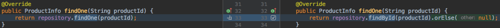
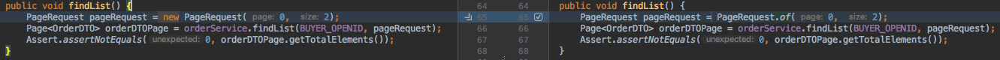
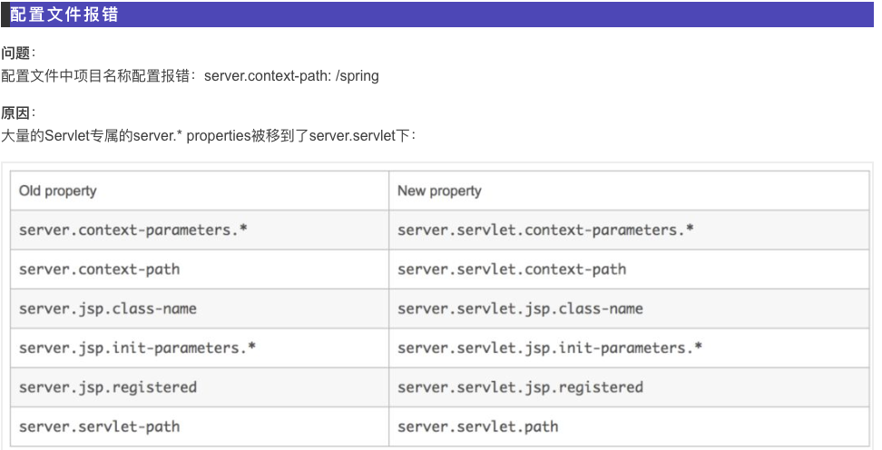
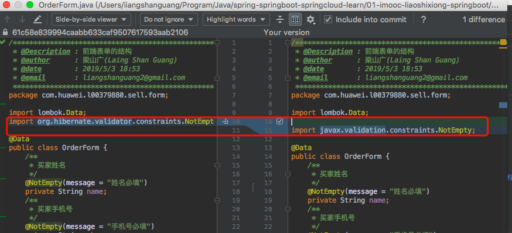

# 升级到SpringBoot2.1.x

> GA的意思General Availability

## 1.JPA的fndOne方法

> `xxxRepository.findOne(主键id)`改成`xxxRepository.findById(主键id).orElse(null)`



findOne(ID)-->findById(ID),需要先判断findById的返回值

```java
/**
 * If a value is present in this {@code Optional}, returns the value,
 * otherwise throws {@code NoSuchElementException}.
 *
 * @return the non-null value held by this {@code Optional}
 * @throws NoSuchElementException if there is no value present
 *
 * @see Optional#isPresent()
 */
public T get() {
    if (value == null) {
        throw new NoSuchElementException("No value present");
    }
    return value;
}

/**
 * 根据用户id查询用户信息
 *
 * @param id 用户ID
 * @return 查询结果
 */
@Override
public Result getUserInfo(Long id) {
    /*
     *
     * 版本更新说明:
     * Spring Data JPA 1.xx:
     * 根据ID查询使用的是:T findOne(ID var)
     * 需要对返回值进行null判断,以判断是否能根据ID查询到对应的对象
     * Spring Data JPA 2.xx:
     * 根据ID查询使用的方法是:Optional<T> findById(ID id)-->T t = Optional<T>.get();
     * Optional<T>是非null的,但是如果查不到的话,它的get方法会报错,no value present;
     * 所以在进行get之前,需要使用Optional.isPresent()方法进行判断
     *
     */
    Optional<User> userById = userDao.findById(id);
    if (userById.isPresent()) {
        return Result.ok().put("user", userById.get());
    } else {
        return Result.error(615, "无效的查询请求");
    }
}
```

### 2.PageRequest对象创建改成static方法了

```java
PageRequest request = new PageRequest(0, 2);
```

改成

```java
PageRequest request = PageRequest.of(0, 2);
```



## 3.`save`只能保存单个对象,如果要保存多个对象的,需要`saveAll`

## 4.`WebMvcConfigurerAdapter`过时,变成实现`WebMvcConfigurer`

```java
/**
 * An implementation of {@link WebMvcConfigurer} with empty methods allowing
 * subclasses to override only the methods they're interested in.
 *
 * @author Rossen Stoyanchev
 * @since 3.1
 * @deprecated as of 5.0 {@link WebMvcConfigurer} has default methods (made
 * possible by a Java 8 baseline) and can be implemented directly without the
 * need for this adapter
 */
@Deprecated
public abstract class WebMvcConfigurerAdapter implements WebMvcConfigurer {
}
```

从继承WebMvcConfigurerAdapter变成实现WebMvcConfigurer

## 5.MySQL在application.yml里面的配置边了

```yaml
spring:
  datasource:
    driver-class-name: com.mysql.jdbc.Driver
```

变成

```yaml
spring:
  datasource:
    driver-class-name: com.mysql.cj.jdbc.Driver
```

## 6.`server.context-path`配置失效

```yaml
server:
    context-path: /sell
```

改成

```yaml
server:
  servlet:
    context-path: /sell
```

解释，因为WebFlux的出现大量的Servlet专属的server.* properties被移到了server.servlet下，更多的见下表



## 7.表单校验的`@NotEmpty`注解挪到其他包了

```java
import org.hibernate.validator.constraints.NotEmpty;
```

改成

```java
import javax.validation.constraints.NotEmpty;
```

