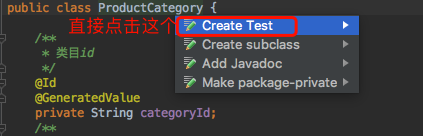
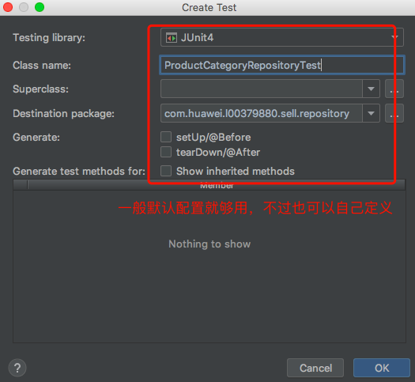

# 4-1~4-2_买家类目-dao

> 买家端的代码开发顺序

+ DAO层设计与开发
+ Service层设计与开发
+ Controller层设计与开发

## application.yml中的MySQL配置

```yml
spring:
  datasource:
    driver-class-name: com.mysql.jdbc.Driver
    username: root
    password: 123456
    url: jdbc:mysql://10.102.26.63:3306/sell?useUnicode=true&characterEncoding=UTF-8&useSSLfalse
  jpa:
    show-sql: true
```

## 使用IDEA自带地生成测试类的工具

+ 按`coomand+1`，会弹出快速菜单，选择`create Test`

  

+ 然后配置框，简单配置下点击OK即可(默认设置一般就够)

  

## 关于设置默认值的好处

`product_category`表除了category_name字段，其他所有字段都有默认值，尤其是create_time和update_time，通过

```sql
# 默认时间为当前时间
create_time   timestamp     not null default current_timestamp comment '创建时间',
# update_time：数据库其他字段更新时，这个字段自动更新为当前时间，在这里实现要比在SpringBoot里实现简单地多
update_time   timestamp     not null default current_timestamp on update current_timestamp comment '更新时间',
```

上面设置可以做到自动插入当前时间和当操作表时自动更新update_time，能够极大地节省在java中操作表实体类的工作量

## 关于update_time字段自动更新

### 当实体类中没有createTime和updateTime两个属性，但是表结构设计时里面有create_time和udpdate_time字段而且设置了自动更新

如下

```sql
# 默认时间为当前时间
create_time   timestamp     not null default current_timestamp comment '创建时间',
# update_time：数据库其他字段更新时，这个字段自动更新为当前时间，在这里实现要比在SpringBoot里实现简单地多
update_time   timestamp     not null default current_timestamp on update current_timestamp comment '更新时间',
```

那么当插入新记录时，这两个字段会自动插入最新事件，当记录数据有字段变化时，update_time也会自动更新

不过缺点是表和java代码中的实体类不统一，后面不好维护;而且后面接口数据返回时，这两个字段是很常用的(前端展示)，因此必须加上！！！

### 在实体类中添加了createTime和updateTime两个属性，表结构设计时里面也有create_time和udpdate_time字段

> 插入数据时，create_time和update_time能自动插入，但是当更新数据时，update_time并不会自动更新

怎么解决呢？`在实体类上添加@DynamicUpdate注解即可`

这样就实现了实体类和表结构的完全统一，并且update_time能自动更新

## @Transactional注解的用法

+ 在src代码中是当初异常时数据回滚
+ 在test代码中是执行完test就回滚，不管出没出异常，这样可以防止测试数据污染数据库

## Lombok的小bug

当在实体类中自定义了构造方法时，`@AllArgsConstructor`和`@NoArgsConstructor`就不能用了，所以建议后面不再用这两个构造器注解，后面实体类的构造方法一律自己显示写出来

## 设置了unique的数据库字段是不能有这个字段相同地多条记录地

比如product_category设置了category_type为unique

```sql
# category_type是唯一的，设置为约束索引，可以提高查询效率
  unique key uqe_category_type (category_type)
```

所以新插入的记录的category_type不能和已有的任何一条记录相同


