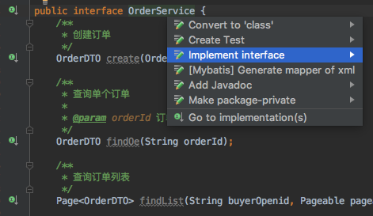
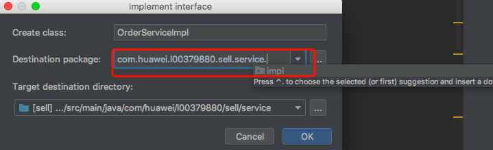
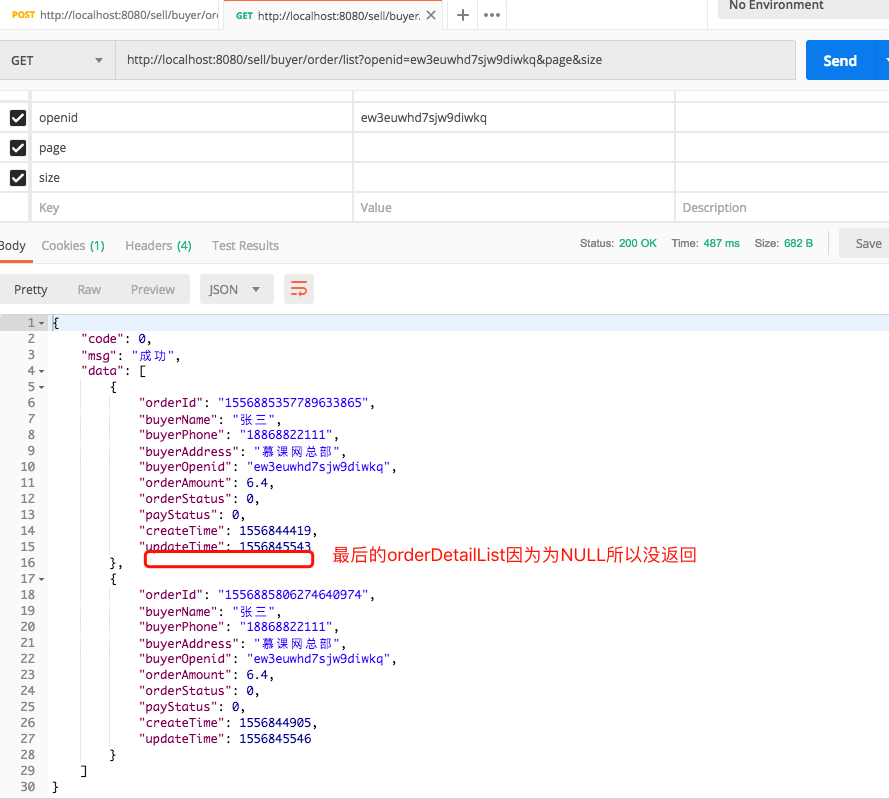

# 第6章 买家端订单

本章也是分3部分完成设计与开发

+ DAO层
+ Service层
+ Controller层

## 订单主表OrderMaster

```java
PageRequest pageRequest = new PageRequest(0, 2);
Page<OrderMaster> orderMasterPage = service.findByBuyerOpenid(OPENID, pageRequest);
System.out.println("本页有" + orderMasterPage.getTotalElements() + "条数据");
List<OrderMaster> orderMasterList = orderMasterPage.getContent();
for (OrderMaster orderMaster : orderMasterList) {
    System.out.println(orderMaster);
}
```

分页返回结果`Page<OrderMaster>`的内容

+ `getTotalElements()`获得总个数；
+ `getTotalPages()`获得总页数；
+ `getContent()`获得`List<OrderMaster>`集合。

## Service层

### 注意事项

+ **DTO**:Data Transfer Object数据传输对象，用于在service、controller、dao层传输用
+ 与之相比**VO**:View Object，适用于和前端进行适配的对象
+ `@transient`注解忽略数据库之间的映射
+ 单价不能由前端传过来，因为前段数据时可以改dom地，非常不安全，一定只能从数据库取单价

### IDEA中快速实现Service

+ `Command+1`弹出快速操作菜单，如下  
  
+ 把实现类xxxImpl改到.impl包中，如下
  

### IDEA中可用xxx.null快速实现if(xxx==null)的判断

### 当REST接口返回的实体类字段为NULL时，这个字段自动从json中去掉

> 可以在实体类上加上`@JsonInclude(JsonInclude.Include.NON_NULL)`来避免返回NULL的字段

例子如下，OrderDTO.java

```java
/***********************************************************
 * @Description : 订单主表DTO
 * @author      : 梁山广(Laing Shan Guang)
 * @date        : 2019/5/3 11:49
 * @email       : liangshanguang2@gmail.com
 ***********************************************************/
package com.huawei.l00379880.sell.dto;

import com.fasterxml.jackson.annotation.JsonInclude;
import com.fasterxml.jackson.databind.annotation.JsonSerialize;
import com.huawei.l00379880.sell.entity.OrderDetail;
import com.huawei.l00379880.sell.utils.serializer.Date2LongSerializer;
import lombok.Data;

import java.math.BigDecimal;
import java.util.Date;
import java.util.List;

@Data
@JsonInclude(JsonInclude.Include.NON_NULL)
public class OrderDTO {
    /**
     * 订单id
     */
    private String orderId;

    ......

    @JsonSerialize(using = Date2LongSerializer.class)
    private Date createTime;

    /**
     * 更新时间
     */
    @JsonSerialize(using = Date2LongSerializer.class)
    private Date updateTime;

    /**
     * 订单主表下的商品表
     */
    private List<OrderDetail> orderDetailList;

    public OrderDTO() {
    }
}

```

最后的orderDetailList可能为NULL，经过上面的配置后，返回的json中就不会有这个字段了

通过在**application.yml**添加

```yaml
spring:
  jackson:
    default-property-inclusion: non_null
```

也可以达到同样的效果,如下



如果想把某个字段设置为必须值，一定不为NULL，可以在实体类中初始化，比如orderDetailList如下初始化，

```java
/**
 * 订单主表下的商品表
 */
private List<OrderDetail> orderDetailList = new ArrayList<>();
```

则json返回

```json
{
    "code": 0,
    "msg": "成功",
    "data": [
        {
            "orderId": "1556885357789633865",
            "buyerName": "张三",
            "buyerPhone": "18868822111",
            "buyerAddress": "慕课网总部",
            "buyerOpenid": "ew3euwhd7sjw9diwkq",
            "orderAmount": 6.4,
            "orderStatus": 0,
            "payStatus": 0,
            "createTime": 1556844419,
            "updateTime": 1556845543,
            "orderDetailList": []
        },
        {
            "orderId": "1556885806274640974",
            "buyerName": "张三",
            "buyerPhone": "18868822111",
            "buyerAddress": "慕课网总部",
            "buyerOpenid": "ew3euwhd7sjw9diwkq",
            "orderAmount": 6.4,
            "orderStatus": 0,
            "payStatus": 0,
            "createTime": 1556844905,
            "updateTime": 1556845546,
            "orderDetailList": []
        }
    ]
}
```

可以看到`"orderDetailList": []`字段orderDetailLis会一直存在的
