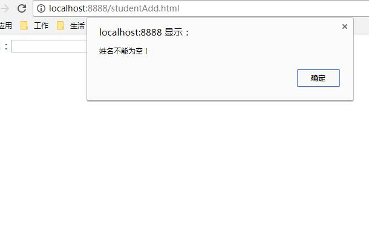
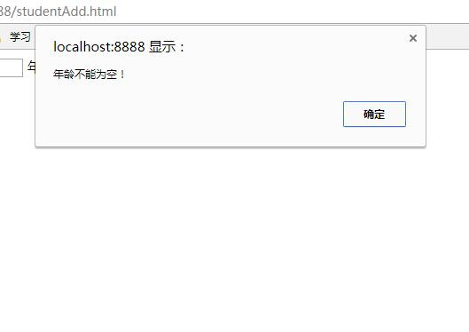
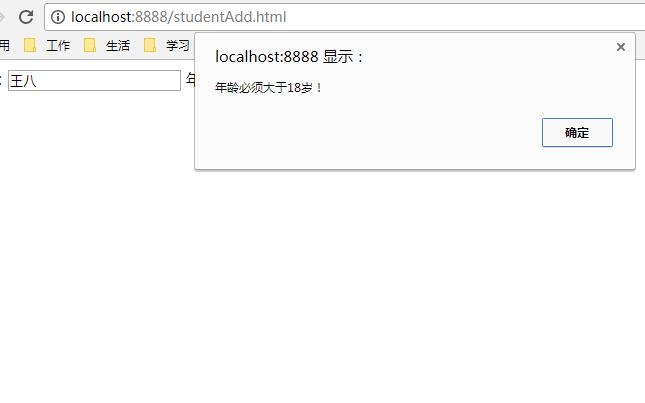
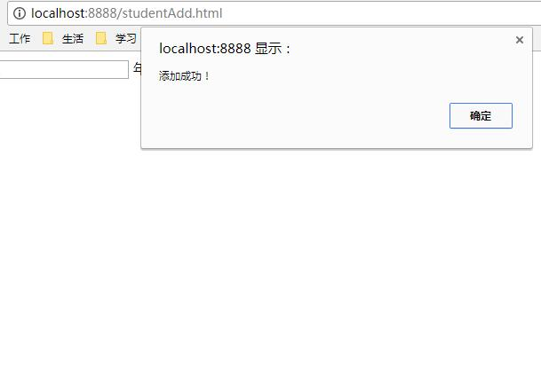

# SpringBoot之表单验证`@Valid`

> 参考文章： https://www.cnblogs.com/chenlove/p/8708627.html

## 创建实体类

SpringBoot提供了强大的表单验证功能实现，给我们省去了写验证的麻烦；

这里我们给下实例，提交一个有姓名和年龄的表单添加功能，

要求姓名不能为空，年龄必须是不小于18 ；

我们先新建一个Student实体,用Valid内的注解对Student属性进行修饰：

```java
import javax.persistence.Column;

import javax.persistence.Entity;
import javax.persistence.GeneratedValue;
import javax.persistence.Id;
import javax.persistence.Table;
import javax.validation.constraints.Min;
import javax.validation.constraints.NotNull;
import lombok.Data;

@Entity
@Table(name="t_student")
@Data
public class Student {

    @Id
    @GeneratedValue
    private Integer id;

    @NotEmpty(message="姓名不能为空！")
    @Column(length=50)
    private String name;

    @NotNull(message="年龄不能为空！")
    @Min(value=18,message="年龄必须大于18岁！")
    @Column(length=50)
    private Integer age;
}
```

这里只用了`@NotEmpty`和`@NotNull`两个注解，下面列下清单，平时可以参考用:

| 限制                      | 说明                                                         |
| ------------------------- | ------------------------------------------------------------ |
| @Null                     | 限制只能为null                                               |
| @NotNull                  | 限制必须不为null                                             |
| @AssertFalse              | 限制必须为false                                              |
| @AssertTrue               | 限制必须为true                                               |
| @DecimalMax(value)        | 限制必须为一个不大于指定值的数字                             |
| @DecimalMin(value)        | 限制必须为一个不小于指定值的数字                             |
| @Digits(integer,fraction) | 限制必须为一个小数，且整数部分的位数不能超过integer，小数部分的位数不能超过fraction |
| @Future                   | 限制必须是一个将来的日期                                     |
| @Max(value)               | 限制必须为一个不大于指定值的数字                             |
| @Min(value)               | 限制必须为一个不小于指定值的数字                             |
| @Past                     | 限制必须是一个过去的日期                                     |
| @Pattern(value)           | 限制必须符合指定的正则表达式                                 |
| @Size(max,min)            | 限制字符长度必须在min到max之间                               |
| @Past                     | 验证注解的元素值（日期类型）比当前时间早                     |
| @NotEmpty                 | 验证注解的元素值不为null且不为空（字符串长度不为0、集合大小不为0） |
| @NotBlank                 | 验证注解的元素值不为空（不为null、去除首位空格后长度为0），不同于@NotEmpty，@NotBlank只应用于字符串且在比较时会去除字符串的空格 |
| @Email                    | 验证注解的元素值是Email，也可以通过正则表达式和flag指定自定义的email格式 |

## Dao

```java
import org.springframework.data.jpa.repository.JpaRepository;

 
import com.java1234.entity.Student;
 
/**
 * 学生Dao接口
 * @author user
 *
 */
public interface StudentDao extends JpaRepository<Student, Integer>{
 
}
```

## service

### StudentService.java

```java
import com.java1234.entity.Student;
 
/**
 * 学生Service接口
 * @author user
 *
 */
public interface StudentService {
    /**
     * 添加学生
     */
    public void add(Student student);
}
```

### StudentServiceImpl.java

```java
import javax.annotation.Resource;
import org.springframework.stereotype.Service;
import com.java1234.dao.StudentDao;
import com.java1234.entity.Student;
import com.java1234.service.StudentService;

/**
 * 学生Service实现类
 * @author user
 *
 */
@Service
public class StudentServiceImpl implements StudentService{

    @Resource
    private StudentDao studentDao;

    @Override
    public void add(Student student) {
        studentDao.save(student);
    }
}
```

## controller

```java
import javax.annotation.Resource;
import javax.validation.Valid;

import org.springframework.stereotype.Controller;
import org.springframework.validation.BindingResult;
import org.springframework.web.bind.annotation.PostMapping;
import org.springframework.web.bind.annotation.RequestMapping;
import org.springframework.web.bind.annotation.ResponseBody;
import org.springframework.web.bind.annotation.RestController;
import org.springframework.web.servlet.ModelAndView;
import com.java1234.entity.Student;
import com.java1234.service.StudentService;

/**
 * 学生控制类
 * @author user
 *
 */
@RestController
@RequestMapping("/student")
public class StudentController {

    @Resource
    private StudentService studentService;

    /**
     * 添加图书
     * @param book
     * @return
     */
    @ResponseBody
    @PostMapping(value="/add")
    public String add(@Valid Student student,BindingResult bindingResult){
        if(bindingResult.hasErrors()){
            // 返回报错信息
            return bindingResult.getFieldError().getDefaultMessage();
        }else{
            studentService.add(student);
            return "添加成功！";
        }
    }
}
```

## 前端测试

+ 创建 html文件：studentAdd.html

  ```html
  <!DOCTYPE html>

  <html>
  <head>
  <meta charset="UTF-8">
  <title>学生信息添加页面</title>
  <script src="jQuery.js"></script>
  <script type="text/javascript">
      function submitData(){
          $.post("/student/add",{name:$("#name").val(),age:$("#age").val()},
                  function(result){
                      alert(result);
                  }
          );
      }
  </script>
  </head>
  <body>
  姓名：<input type="text" id="name" name="name"/>
  年龄：<input type="text" id="age" name="age"/>
  <input type="button" value="提交" onclick="submitData()"/>
  </body>
  </html>
  ```

+ 浏览器请求：http://localhost:8888/studentAdd.html

+ 直接点击提交  
    

+ 输入姓名后，提交  
    

+ 输入年龄5，提交   
    

+ 我们改成20，提交  
    
  提交通过
