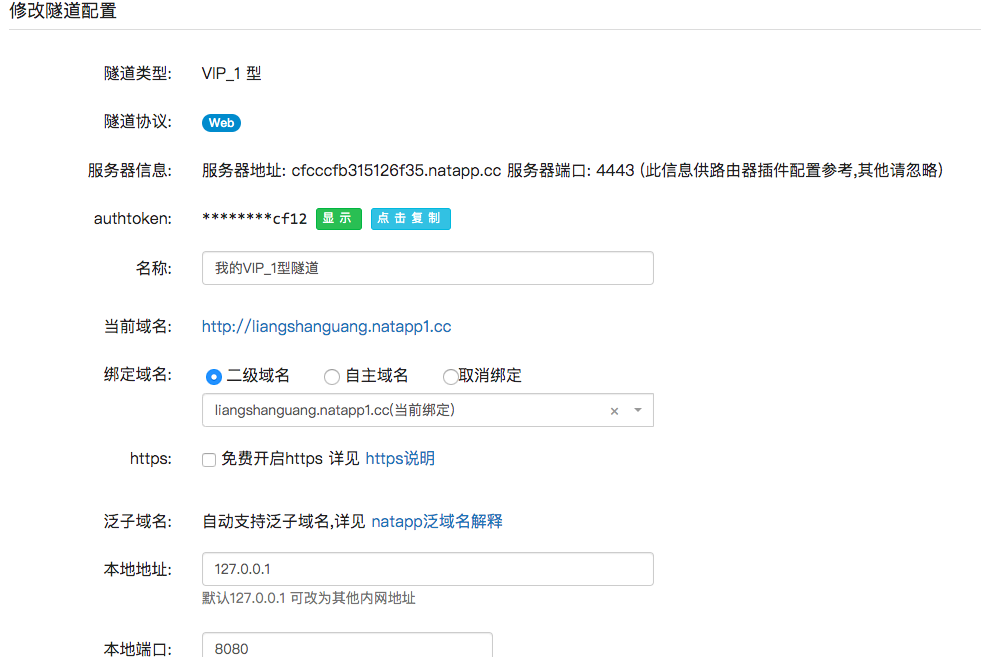
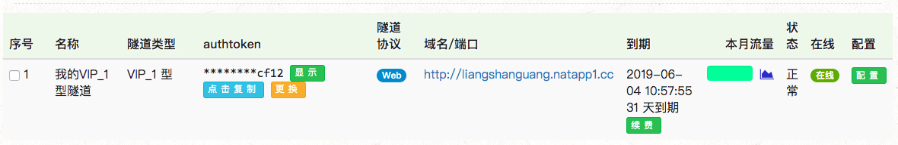

# 第7章 微信授权

## 参考文章

+ [微信授权](https://www.imooc.com/article/70497)
+ [微信支付(账号借用)](https://www.imooc.com/article/31607)

## 第一个关键点：获取OpenID

两种方式，推荐第二种

+ 手工方式
+ 利用第三方sdk

## 微信网页授权

+ [官方文档](https://mp.weixin.qq.com/wiki)
+ [调试工具，用于把微信回调地址定位到本机](https://natapp.cn)，**这个工具还有更多的想象空间！！**
  + 也可以用于把本地服务搞成全网可用地！！！
  + 可以每个月花12块钱把本机当成服务器，对外提供自己的网站！！！
+ [第三方SDK](https://github.com/Wechat-Group/WxJava)

## 微信支付文档

+ [微信支付文档](https://pay.weixin.qq.com/wiki/doc/api/index.html)
+ [JSAPI支付,可在公众号里完成支付](https://pay.weixin.qq.com/wiki/doc/api/jsapi.php?chapter=7_1)

## netapp使用教程

+ 1.从[客户端地址](https://natapp.cn/#download)下载本地操作系统的npp可执行文件
+ 2.解压下载的压缩包，cd到解压路径，`chmod 777 natapp`给可执行文件赋予执行权限
+ 3.注册用户名并在[购买地址](https://natapp.cn/tunnel/buy)购买[VIP-1型隧道](https://natapp.cn/tunnel/buy/vip/vip1)并配置映射信息
  
+ 4.从[我的隧道](https://natapp.cn/tunnel/lists)查看刚购买的隧道
  
+ 5.从已购买的隧道订单中复制authtoken,到本地natapp可执行文件处执行`./natapp -authtoken=复制的authtoken`即可顺利创建隧道
+ 6.原来本地接口 http://localhost:8080/sell/buyer/product/list 能获得如下数据，但是只能本地访问，无法对外公开，经过上面的隧道映射后，可以在任何地方访问 http://liangshanguang.natapp1.cc//sell/buyer/product/list 获得接口数据了，**对于网站演示非常有用！！！！！**

  ```json
  {
    "code": 0,
    "msg": "成功",
    "data": [
        {
            "name": "热销榜",
            "type": 2,
            "foods": [
                {
                    "id": "123456",
                    "name": "瘦肉粥",
                    "price": 3.2,
                    "description": "很好喝的粥",
                    "icon": "http://xxx.jpg"
                },
                {
                    "id": "abcdef",
                    "name": "烧饼",
                    "price": 1.5,
                    "description": "烧饼难吃",
                    "icon": "http://xxx.png"
                }
            ]
        },
        {
            "name": "女生最爱",
            "type": 1,
            "foods": [
                {
                    "id": "654321",
                    "name": "芒果冰",
                    "price": 3.4,
                    "description": "很甜",
                    "icon": "http://yyy.jpg"
                }
            ]
        }
    ]
  }
  ```

+ 6.更多教程见[NatAPP使用教程](https://natapp.cn/article)