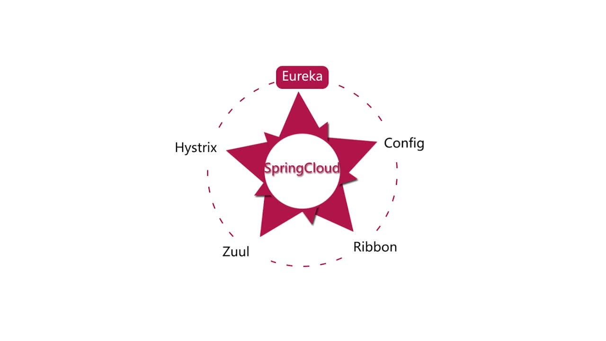

# 课程介绍

> 课程的老师代码仓库[SpringCloud微服务实战教师代码](https://git.imooc.com/coding-187)

## 本课程重点介绍的内容

+ Eureka
  + Eureka Server
  + Eureka Client
  + Eureka 高可用
  + 服务发现机制
+ Config
  + Config Server
  + Config Client
  + Spring Cloud Bus(结合RabbitMQ)自动刷新
+ Ribbon
  + RestTemplate
  + Feign
  + Ribbon源码分析，了解底层
+ Zuul
  + 动态路由
  + 校验
+ Hystrix
  + Hystrix Dashboard
  + 熔断机制
+ 容器编排和服务追踪
  + 容器编排: Docker + Rancher
  + 服务追踪：Spring Cloud Sleuth + Zipkin

## 课程用到的软件版本

> SpringBoot和SpringCloud都进行了两次升级(13章和14章)

| 软件 |               SpringBoot               |                Spring Cloud                 | Rancher |   Docker   |
| :--: | :------------------------------------: | :-----------------------------------------: | :-----: | :--------: |
| 版本 | 2.0.0.M3—>—>2.0.2.RELEASE-->2.0.6.RELEASE | Finchley.M2—>Finchley.RELEASE—>Finchley.SR2 |   1.6   | 17.12.0-ce |

