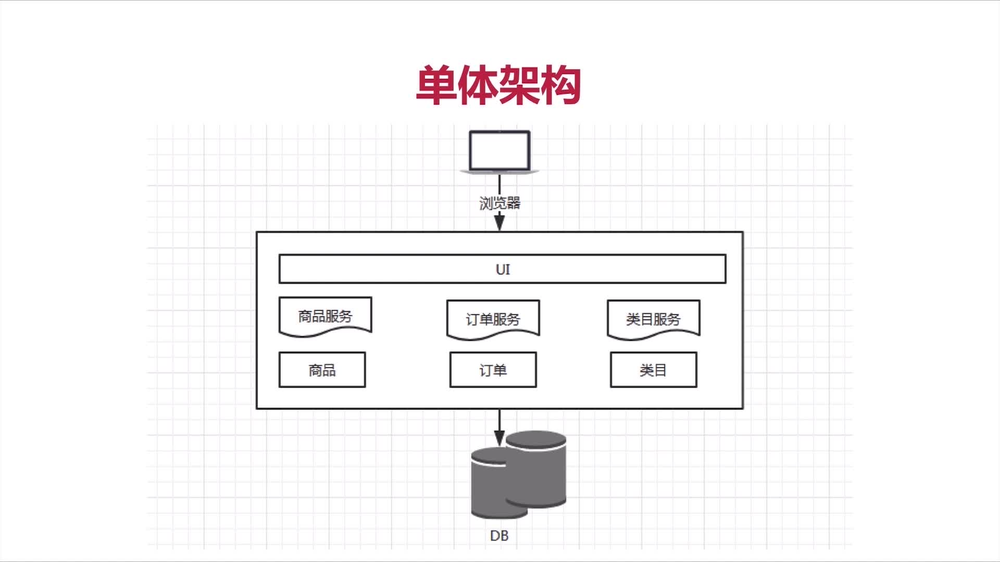
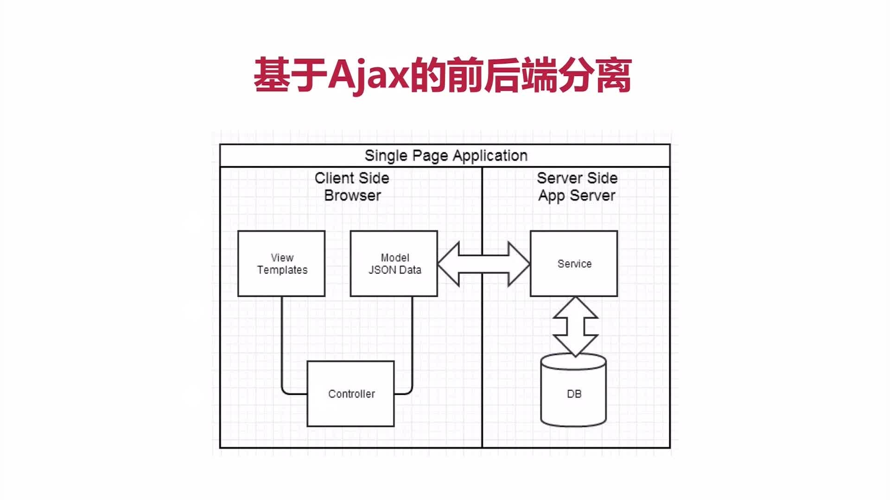
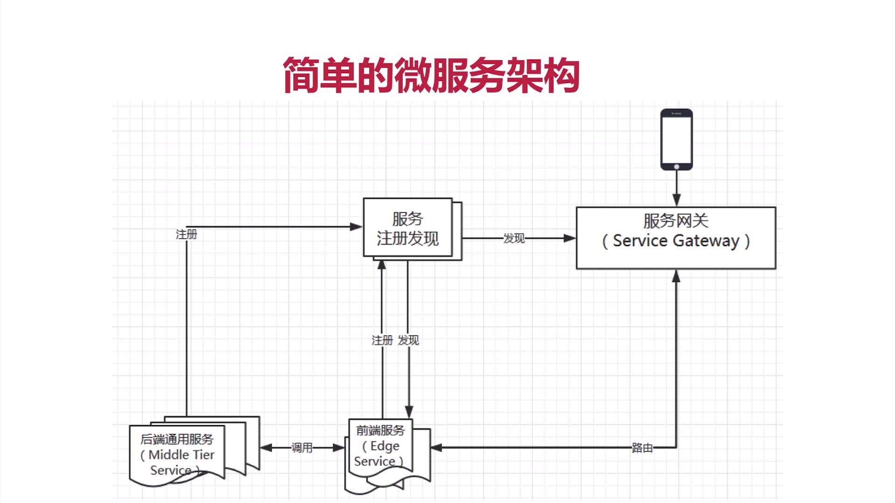

# 微服务介绍

## 一、什么是微服务

> 微服务是一种架构风格，不是组件不是框架。

+ 1.一系列微小的服务共同组成
+ 2.跑在自己的进程
+ 3.每个服务为独立的业务开发
+ 4.独立部署
+ 5.分布式的管理

## 二、微服务架构的演进

### 1.单体架构

#### 1.1优点

+ 容易测试（本地启动完整的测试，不需要外部依赖）
+ 容易部署（直接打成war包，放在tomcat下面就可以了）

#### 1.2缺点

+ 开发效率低（容易提交代码的时候造成冲突）
+ 代码维护难（尤其是新人来的时候业务代码写在一块，不知从何下手）
+ 部署不够灵活（任何小修改都要重新构建，构建时间特别长）
+ 稳定性不够 （任何一个小问题容易让整个系统挂掉）
+ 扩展性不够（无法满足高并发下的业务需求） 

### 2.基于ajax的前后端分离

### 3.分布式

#### 3.1定义

旨在支持应用程序和服务的开发，可以利用物理架构由**多个自治的处理元素，不共享内存**，但**通过网络发送消息合作**————Leslie Lamport

#### 3.2概括

多个服务，通过消息关联

#### 3.3与微服务的区别和联系

微服务一定是分布式的，但分布式的不一定是微服务。单体应用也可以分布式部署

## 三、微服务架构分析

### 微服务架构的基础框架或组件

+ 1.服务注册发现
+ 2.服务网关Gateway: 路由、监控、容错、日志、授权、反爬虫
+ 3.后端通用服务, 也称中间层服务Middle Tier Service (启动时会请求将地址信息放在服务注册表比如Eureka中)
+ 4.前端服务，也称前端服务Edge Service (通过查询注册表发现并调用后端服务，主要是聚合后端服务和暴露外部接口)

### 单体架构到微服务架构演进的例子

## 四、Spring Cloud 是什么？

Spring Cloud 是一个开发工具集，包含多个子项目，**主要是基于对Netflix开源组件的进一步封装**，继承了了Spring Boot 的开发便利，简化了分布式开发。不仅需要掌握如何使用，更要理解分布式架构的特点。