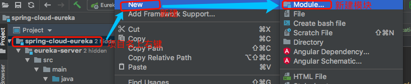

# 第03章-服务注册于发现之Eureka

> Eureka基于Netflix Eureka做了二次封装

## 一、组成

+ Eureka Server 注册中心
+ Eureka Client 服务注册

## 二、IDEA创建SpringCloud聚合工程的步骤

### 1.创建普通的Maven项目，删除掉src目录，添加`.gitignore`文件，内容如下
  
**.gitignore**文件

```txt
HELP.md
/target/
!.mvn/wrapper/maven-wrapper.jar

### STS ###
.apt_generated
.classpath
.factorypath
.project
.settings
.springBeans
.sts4-cache

### IntelliJ IDEA ###
.idea
*.iws
*.iml
*.ipr

### NetBeans ###
/nbproject/private/
/nbbuild/
/dist/
/nbdist/
/.nb-gradle/
/build/

### VS Code ###
.vscode/
```

### 2.修改pom.xml

> 把创建的Maven项目的pom.xml内容替换为下面的内容，其中的`<name>`、`<parent>-><version>`和`<spring-cloud.version>`改成自己的

**pom.xml**文件

```xml
<?xml version="1.0" encoding="UTF-8"?>
<project xmlns="http://maven.apache.org/POM/4.0.0"
         xmlns:xsi="http://www.w3.org/2001/XMLSchema-instance"
         xsi:schemaLocation="http://maven.apache.org/POM/4.0.0 http://maven.apache.org/xsd/maven-4.0.0.xsd">
    <modelVersion>4.0.0</modelVersion>

    <!-- 注意1：下面6行酌情替换成自己的，一般name和artifactId必须换成刺激的 -->
    <groupId>com.huawei.l00379880</groupId>
    <artifactId>spring-cloud-eureka</artifactId>  
    <version>1.0-SNAPSHOT</version>
    <packaging>pom</packaging>
    <name>spring-cloud-eureka</name>
    <description>study eureka server and client</description>

    <parent>
        <groupId>org.springframework.boot</groupId>
        <artifactId>spring-boot-starter-parent</artifactId>
        <!-- 注意2：需要替换成自己想用的SpringBoot版本 -->
        <version>2.0.0.M3</version>
        <relativePath/> <!-- lookup parent from repository -->
    </parent>

    <modules>
        <!--注意3： 这里的module需要根据自己的业务进行添加 -->
        <module>eureka-server</module>
    </modules>

    <properties>
        <project.build.sourceEncoding>UTF-8</project.build.sourceEncoding>
        <project.reporting.outputEncoding>UTF-8</project.reporting.outputEncoding>
        <java.version>1.8</java.version>
        <!-- 注意4：这里需要替换为自己的SpringCloud版本 -->
        <spring-cloud.version>Finchley.M2</spring-cloud.version>
    </properties>

    <!-- 下面的部分是比不可少的，但是基本不用改 -->
    <dependencyManagement>
        <dependencies>
            <dependency>
                <groupId>org.springframework.cloud</groupId>
                <artifactId>spring-cloud-dependencies</artifactId>
                <version>${spring-cloud.version}</version>
                <type>pom</type>
                <scope>import</scope>
            </dependency>
        </dependencies>
    </dependencyManagement>
    <!--this segment is necessary for a spring-cloud pom project!!!-->
    <repositories>
        <repository>
            <id>spring-milestones</id>
            <name>Spring Milestones</name>
            <url>https://repo.spring.io/milestone</url>
            <snapshots>
                <enabled>false</enabled>
            </snapshots>
        </repository>
    </repositories>
</project>
```

### 3.创建子module并配置进聚合工程

#### 3.1创建子module

> 在聚合工程项目名上右键-->NEW-->Module-->Spring Initializer,然后按照正常顺序创建一个SpringBoot项目到当前的聚合工程即可



#### 3.2删除mvn目录和mvnw以及mvnw.cmd等不需要的mvn文件

#### 3.3重写module的pom.xml，改为聚合工程的module

> pom.xml的内容替换为如下的内容，其中注意的地方改为自己的内容。一般只改注意1和注意2就行

**pom.xml**文件

```xml
<?xml version="1.0" encoding="UTF-8"?>
<project xmlns="http://maven.apache.org/POM/4.0.0" xmlns:xsi="http://www.w3.org/2001/XMLSchema-instance"
         xsi:schemaLocation="http://maven.apache.org/POM/4.0.0 http://maven.apache.org/xsd/maven-4.0.0.xsd">
    <modelVersion>4.0.0</modelVersion>
    <!-- 注意1：artifactId改为自己的module名 -->
    <artifactId>eureka-server</artifactId>
    <version>0.0.1-SNAPSHOT</version>
    <packaging>jar</packaging>

    <!-- 注意2：name改为自己的module名 -->
    <name>eureka-server</name>
    <description>Demo project for Spring Boot</description>

    <parent>
        <!-- 注意3：下面3行改为父pom聚合工程里pom.ml对应的内容 -->
        <groupId>com.huawei.l00379880</groupId>
        <artifactId>parent-name</artifactId>
        <version>0.0.1-SNAPSHOT</version>
        <relativePath/> <!-- lookup parent from repository -->
    </parent>

    <!-- 注意4：这里的依赖视自己的需要添加 -->
    <dependencies>
        <dependency>
            <groupId>org.springframework.boot</groupId>
            <artifactId>spring-boot-starter-test</artifactId>
            <scope>test</scope>
        </dependency>
    </dependencies>

    <build>
        <plugins>
            <plugin>
                <groupId>org.springframework.boot</groupId>
                <artifactId>spring-boot-maven-plugin</artifactId>
            </plugin>
        </plugins>
    </build>
</project>
```

### 4.在聚合工程的pom.xml添加上面新建的子module

> 在父工程里面的`<modules></modules>`里把当前的springboot的module name添加为`<module>springboot的module名<module/>`,类似下面

```xml
<!-- 父工程的pom.xml -->
<modules>
    <!-- 在这里添加 -->
    <module>eureka-server</module>
    <module>product-service</module>
</modules>
```

### 5.当用地Maven版本是非正式版时，可能会遇到部分组件下载不下来的问题

> 在聚合工程的pom.xml里加上spring官方的maven仓库即可，覆盖掉本地自己配置的比如阿里云的Maven仓，添加的内容如下

```xml
<!--  自己配置的本地Maven仓库可能下载不了部分组件，配置这个地址保证一定能下载全  -->
<repositories>
    <repository>
        <id>spring-snapshots</id>
        <name>Spring Snapshots</name>
        <url>https://repo.spring.io/snapshot</url>
        <snapshots>
            <enabled>true</enabled>
        </snapshots>
    </repository>
    <repository>
        <id>spring-milestones</id>
        <name>Spring Milestones</name>
        <url>https://repo.spring.io/milestone</url>
        <snapshots>
            <enabled>false</enabled>
        </snapshots>
    </repository>
</repositories>
<pluginRepositories>
    <pluginRepository>
        <id>spring-snapshots</id>
        <name>Spring Snapshots</name>
        <url>https://repo.spring.io/snapshot</url>
        <snapshots>
            <enabled>true</enabled>
        </snapshots>
    </pluginRepository>
    <pluginRepository>
        <id>spring-milestones</id>
        <name>Spring Milestones</name>
        <url>https://repo.spring.io/milestone</url>
        <snapshots>
            <enabled>false</enabled>
        </snapshots>
    </pluginRepository>
</pluginRepositories>
```

添加后完整的聚合工程的pom.xml内容如下：

```xml
<?xml version="1.0" encoding="UTF-8"?>
<project xmlns="http://maven.apache.org/POM/4.0.0"
         xmlns:xsi="http://www.w3.org/2001/XMLSchema-instance"
         xsi:schemaLocation="http://maven.apache.org/POM/4.0.0 http://maven.apache.org/xsd/maven-4.0.0.xsd">
    <modelVersion>4.0.0</modelVersion>

    <!-- 注意1：下面6行酌情替换成自己的，一般name和artifactId必须换成刺激的 -->
    <groupId>com.huawei.l00379880</groupId>
    <artifactId>spring-cloud-eureka</artifactId>
    <version>1.0-SNAPSHOT</version>
    <packaging>pom</packaging>
    <name>spring-cloud-eureka</name>
    <description>study eureka server and client</description>

    <parent>
        <groupId>org.springframework.boot</groupId>
        <artifactId>spring-boot-starter-parent</artifactId>
        <!-- 注意2：需要替换成自己想用的SpringBoot版本 -->
        <version>2.0.0.M3</version>
        <relativePath/> <!-- lookup parent from repository -->
    </parent>

    <modules>
        <!--注意3： 这里的module需要根据自己的业务进行添加 -->
        <module>eureka-server</module>
        <module>eureka-client</module>
    </modules>

    <properties>
        <project.build.sourceEncoding>UTF-8</project.build.sourceEncoding>
        <project.reporting.outputEncoding>UTF-8</project.reporting.outputEncoding>
        <java.version>1.8</java.version>
        <!-- 注意4：这里需要替换为自己的SpringCloud版本 -->
        <spring-cloud.version>Finchley.M2</spring-cloud.version>
    </properties>

    <!-- 下面的部分是比不可少的，但是基本不用改 -->
    <dependencyManagement>
        <dependencies>
            <dependency>
                <groupId>org.springframework.cloud</groupId>
                <artifactId>spring-cloud-dependencies</artifactId>
                <version>${spring-cloud.version}</version>
                <type>pom</type>
                <scope>import</scope>
            </dependency>
        </dependencies>
    </dependencyManagement>

    <!--  注意5：自己配置的本地Maven仓库可能下载不了部分组件，配置这个地址保证一定能下载全  -->
    <repositories>
        <repository>
            <id>spring-snapshots</id>
            <name>Spring Snapshots</name>
            <url>https://repo.spring.io/snapshot</url>
            <snapshots>
                <enabled>true</enabled>
            </snapshots>
        </repository>
        <repository>
            <id>spring-milestones</id>
            <name>Spring Milestones</name>
            <url>https://repo.spring.io/milestone</url>
            <snapshots>
                <enabled>false</enabled>
            </snapshots>
        </repository>
    </repositories>
    <pluginRepositories>
        <pluginRepository>
            <id>spring-snapshots</id>
            <name>Spring Snapshots</name>
            <url>https://repo.spring.io/snapshot</url>
            <snapshots>
                <enabled>true</enabled>
            </snapshots>
        </pluginRepository>
        <pluginRepository>
            <id>spring-milestones</id>
            <name>Spring Milestones</name>
            <url>https://repo.spring.io/milestone</url>
            <snapshots>
                <enabled>false</enabled>
            </snapshots>
        </pluginRepository>
    </pluginRepositories>

    <!--this segment is necessary for a spring-cloud pom project!!! -->
    <!--  当用SpringCloud的Release版本时这部分可以放开，把注意5的内容去掉  -->
    <!--
    <repositories>
        <repository>
            <id>spring-milestones</id>
            <name>Spring Milestones</name>
            <url>https://repo.spring.io/milestone</url>
            <snapshots>
                <enabled>false</enabled>
            </snapshots>
        </repository>
    </repositories>
    -->
</project>
```

## 三、SpringCloud版本信息大全

> https://spring.io/projects/spring-cloud

## 四、Eureka总结

+ `@EnableEurekaServer` 用来启动注册中心server，各个服务启动时，都会在注册中心注册，包括其他的注册中心
+ `@EnableEurekaClient` 用来启动注册中心client
+ 有心跳检测，健康检查，负载均衡等功能
+ Eureka的高可用，生产上建议两台以上，各自分别注册
+ 异构：即支持不同语言和不同类型的数据库