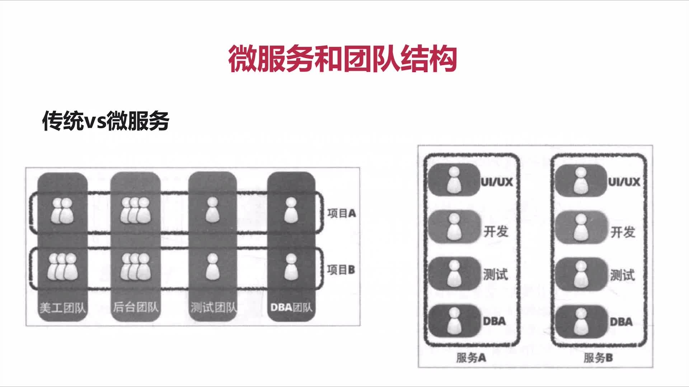
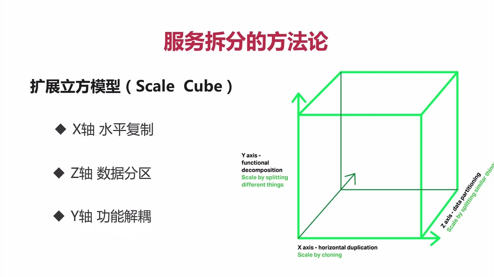

# 第04章 服务拆分

## 一、微服务如何拆分

+ 1、先明白起点和终点
  + 起点：既有的架构形态(老项目、新项目)
  + 终点：好的架构不是设计出来的，而是进化而来的。进化一直在演进
+ 2、需要考虑的因素与坚持的原则

## 二、业务形态不适合微服务的

+ 1、系统中包含很多很多强事务场景的
+ 2、业务相对稳定，迭代周期长
+ 3、访问压力不大，可用性要求不高

## 三、微服务特点

> 微服务的基础理论之康威定律：任何组织在设计一套系统时，所交付的设计方案在结构上都与该组织的沟通结构保持一致。

+ 1.一系列微小的服务共同组成
+ 2.单独部署，跑在自己的进程里
+ 3.每个服务为独立的业务开发
+ 4.分页式的管理

## 四、传统和微服务的团队结构

## 五、服务拆分的方法论：功能和数据
  
### 1.服务拆分的方法论：<可扩展的艺术>
  
> 扩展立方模型

+ x轴：水平复制，通过副本扩展，将应用程序水平复制，通过负载均衡运行程序的多个完全一样的副本方式，来实现应用程序的伸缩性，提  程序的容量和可用度。
+ Z轴：数据分区，每个服务器负责一个数据子集。每个服务器运行的代码是一样的。
+ Y轴：功能解耦，将不同职责的模块，分成不同的服务

### 2.如何拆分功能？

+ 单一职责，松耦合、高内聚  
  （每个服务只负责业务功能的一个单独部分。服务之间耦合度低，修改一个服务不用导致另外一个服务跟着修改，高内聚指的是服务内关的行为聚集在一个服务内，而不是分散在不同的服务中，需要修改一个行为时，只需要修改一个服务就行）
+ 关注点分离
  + 按职责（给我们的服务进行分类，明显按照业务领域可以划分出来的服务，职责比较单一
  + 按通用性（一些基础组件，与具体的业务无关的可以划分成单独的服务 消息 用户
  + 按粒度级别

### 3.服务和数据的关系

+ 先考虑拆分业务功能，再考虑拆分业务功能对应的数据。
+ 无状态服务（一个数据需要被多个服务共享才能完成一个请求，这个数据就是有状态）

### 4.点餐业务的拆分

> 因为本章的代码和SpringBoot点餐的代码重复了，这里不再记录过多笔记，可以多学习下[SrpingBoot微信点餐代码](../../01-imooc-liaoshixiong-springboot).这里直接把老师的代码拿过来了

+ [商品服务service-product](sell/service-product)
+ [订单服务order-service](sell/order-service)

### 5.如何拆分数据

> 依据边界设计API；依据边界权衡数据冗余

+ 1、每个微服务都有单独的数据存储，达到松耦合，其它服务避免访问别的服务的数据库。一个服务的数据，只能通过这个服务提供的api访问，服务之间都是有隔离的。
+ 2、依据服务特点选择不同结构的数据库类型。依据功能特点选择合适的数据库。mongodb（前端服务，对事物要求低）、Elasticsearc(ES搜索)、mysql
+ 3、难点在确定边界