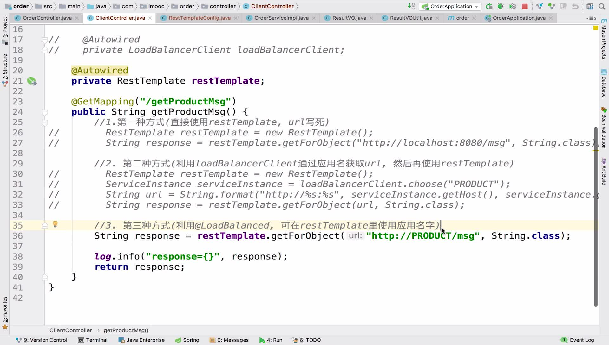
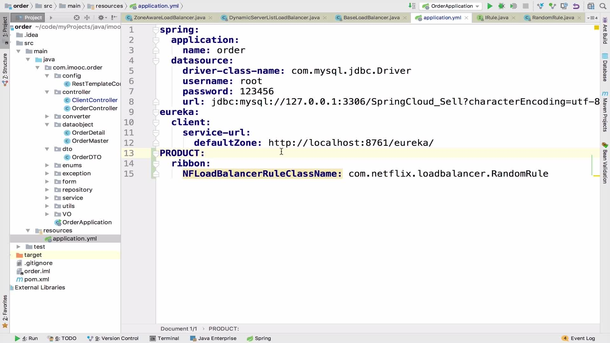

# 第5章 应用通信

## 一、HTTP和RPC的代表Dubbo和SpringCloud的对比

+ Dubbo是一个**RPC框架**，服务治理集成非常完善，不仅提供了服务注册发现，负载均衡，路由等面向分布式集群，面向开发测试，服务治理和监控的可视化平台。

+ Spring Cloud是微服务架构下的一站式解决方案，微服务之间使用Http Restful调用方式：RestTemplate  Feign。HttpRestful:本身轻量易用，适用性强，可以很容易跨语言跨平台，或者与已有的系统交互。

## 二、RestTemplate的三种使用方式

> 访问 http://localhost:8080/msg ,服务名是SERVICE-PRODUCT,返回是"this is product's msg"

+ 1.url写死，用new RestTemplate()访问url来获取消息 [代码](sell/service-order/src/main/java/com/huawei/l00379880/serviceorder/controller/RestTemplateTestController.java#L27)

  ```java
  @GetMapping("/getProductMsg1")
  public String getProductMsg() {
      // 1.第一种方式(直接使用restTemplate, url写死)
      RestTemplate restTemplate = new RestTemplate();
      String response = restTemplate.getForObject("http://localhost:8080/msg", String.class);
      log.info("response={}", response);
      return response;
  }
  ```

+ 2.使用loadBlancerClient获取到url，然后使用new RestTemplate()访问url来获取消息 [代码](service-order/src/main/java/com/huawei/l00379880/serviceorder/controller/RestTemplateTestController.java#L38)

  ```java
  @Autowired
  private LoadBalancerClient loadBalancerClient;
  @GetMapping("/getProductMsg2")
  public String getProductMsg2() {
      // 2. 第二种方式(利用loadBalancerClient通过应用名获取url, 然后再使用restTemplate)
      RestTemplate restTemplate = new RestTemplate();
      ServiceInstance serviceInstance = loadBalancerClient.choose("SERVICE-PRODUCT");
      String url = String.format("http://%s:%s", serviceInstance.getHost(), serviceInstance.getPort()) + "/msg";
      String response = restTemplate.getForObject(url, String.class);
      log.info("response={}", response);
      return response;
  }
  ```

+ 3.使用应用名访问
  + 利用@LoadBlanced 注解restTemplate [代码](sell/service-order/src/main/java/com/huawei/l00379880/serviceorder/config/RestTemplateConfig.java)

    ```java
    @Component
    public class RestTemplateConfig {

        @Bean
        @LoadBalanced
        public RestTemplate restTemplate() {
            return new RestTemplate();
        }
    }
    ```

  + 然后restTemplate 就可以使用应用名称来访问（通过ribbon依据某种规则，如简单轮循、随机连接去连接目标服务来实现负载均衡）[代码](sell/service-order/src/main/java/com/huawei/l00379880/serviceorder/controller/RestTemplateTestController.java#L52)

    ```java
    @GetMapping("/getProductMsg3")
    public String getProductMsg3() {

        //3. 第三种方式(利用@LoadBalanced注解的RestTemplateConfig类里的restTemplate的Bean, 可在restTemplate里使用应用名字)
        String response = restTemplate.getForObject("http://SERVICE-PRODUCT/msg", String.class);

        log.info("response={}", response);
        return response;
    }
    ```



## 三、负载均衡器之Ribbon

### 1.特点

+ 服务发现：依据服务的名字，把该服务下所有的实例都找出来
+ 服务选择规则：依据规则策略，如果从多个实例中，选出有效的服务
+ 服务监听：检测失效的服务，做到高效剔除

### 2.Ribbon三大组件：

+ **ServerList** 服务发现：发现所有的服务列表
+ **IRule** 服务选择规则：根据规则获取某个服务
+ **ServerListFilter** 服务监听：剔除无效服务，根据规则过滤掉其他的服务

### 3.知识扩展

+ 利用@LoadBlanced 注解restTemplate，然后restTemplate 就可以使用应用名称来访问（通过ribbon依据某种规则，如简单轮循、随机连接去连接目标服务来实现负载均衡）
+ 其实RestTemplate、Feign和Zuul底层都是借Ribbon实现地

### 4.Ribbon的负载均衡策略

#### 4.1 原理和配置可以参考如下两篇文章

+ [Ribbon的负载均衡策略及原理](https://blog.csdn.net/wudiyong22/article/details/80829808)
+ [Ribbon负载均衡策略规则定制](https://www.cnblogs.com/cxxjohnson/p/9027919.html)
+ [Ribbon负载均衡策略源码解读](https://www.jianshu.com/p/186b4ceea6fc)

#### 4.2 Ribbon内置的负载均衡策略如下：

| **内置负载均衡规则类**    | **规则描述**                                                 |
| ------------------------- | ------------------------------------------------------------ |
| RoundRobinRule            | 简单轮询服务列表来选择服务器。它是Ribbon默认的负载均衡规则。 |
| AvailabilityFilteringRule | 对以下两种服务器进行忽略：（1）在默认情况下，这台服务器如果3次连接失败，这台服务器就会被设置为“短路”状态。短路状态将持续30秒，如果再次连接失败，短路的持续时间就会几何级地增加。注意：可以通过修改配置loadbalancer.<clientName>.connectionFailureCountThreshold来修改连接失败多少次之后被设置为短路状态。默认是3次。（2）并发数过高的服务器。如果一个服务器的并发连接数过高，配置了AvailabilityFilteringRule规则的客户端也会将其忽略。并发连接数的上线，可以由客户端的<clientName>.<clientConfigNameSpace>.ActiveConnectionsLimit属性进行配置。 |
| WeightedResponseTimeRule  | 为每一个服务器赋予一个权重值。服务器响应时间越长，这个服务器的权重就越小。这个规则会随机选择服务器，这个权重值会影响服务器的选择。 |
| ZoneAvoidanceRule         | 以区域可用的服务器为基础进行服务器的选择。使用Zone对服务器进行分类，这个Zone可以理解为一个机房、一个机架等。 |
| BestAvailableRule         | 忽略哪些短路的服务器，并选择并发数较低的服务器。             |
| RandomRule                | 随机选择一个可用的服务器。                                   |
| Retry                     | 重试机制的选择逻辑                                           |

#### 4.3 可以通过如下配置修改均衡策略：

```yaml
要调用的微服务名:
  ribbon:
    NFLoadBalancerClassName: com.netflix.loadbalancer.上面表里的策略名
```

例子如下图：



#### 4.4 自定义负载均衡策略

+ 实现IRule接口创建自己的规则类
  > 示例：构建一个60%的概率选择8091,40%概率选择8092的规则

  ```java
  import java.util.List;
  import java.util.Random;
  
  import com.netflix.loadbalancer.BaseLoadBalancer;
  import com.netflix.loadbalancer.ILoadBalancer;
  import com.netflix.loadbalancer.IRule;
  import com.netflix.loadbalancer.Server;
  
  public class MyProbabilityRandomRule implements IRule {
  
  	ILoadBalancer balancer = new BaseLoadBalancer();
  
  	@Override
  	public Server choose(Object key) {
  		List<Server> allServers = balancer.getAllServers();
  		Random random = new Random();
  		final int number = random.nextInt(10);
  		if (number < 7) {
  			return findServer(allServers,8091);
  		}
  		return findServer(allServers,8092);
  	}
  
  	private Server findServer(List<Server> allServers, int port) {
  		for (Server server : allServers) {
  			if (server.getPort() == port) {
  				return server;
  			}
  		}
  		System.out.println("NULL port="+port);
  		return null;
  	}
  
  	@Override
  	public void setLoadBalancer(ILoadBalancer lb) {
  		this.balancer = lb;
  	}
  
  	@Override
  	public ILoadBalancer getLoadBalancer() {
  		return this.balancer;
  	}
  }
  ```

+ 然后在当前要调用其他微服务的程序的application.yaml中配置上自己上面定义的负载均衡策略

  ```yaml
  要调用的微服务名:
    ribbon:
      NFLoadBalancerClassName: com.netflix.loadbalancer.自定义的策略类的名字
  ```

  比如要调用的其他微服务名是SERVICE-PRODUCT, 自定义策略类是MyProbabilityRandomRule，则配置如下

  ```yaml
  SERVICE-PRODUCT:
    ribbon:
      NFLoadBalancerClassName: com.netflix.loadbalancer.MyProbabilityRandomRule
  ```

## 四、声明式调用其他微服务之Feign

### 1.Feign的特点

+ 声明式REST客户端(伪RPC)
+ 采用了基于接口的注解

### 2.feign用来进行应用之间的通信

> 目标：在order项目中调用商品服务，应用feign

+ 1.用的时候需要在pom.xml[添加feign依赖](sell/service-order/pom.xml#L31)
+ 2.在启动主类(OrderApplication)上[加注解@EnableFeignClients](sell/service-order/src/main/java/com/huawei/l00379880/serviceorder/ServiceOrderApplication.java#L10)
+ 3.[在客户端定义好要调用的服务和接口(ProductClient)](sell/service-order/src/main/java/com/huawei/l00379880/serviceorder/client/ProductClientForFeign.java#L12),这里是要调用商品服务的商品详情接口productMsg()，主要是通过@FeignClient匹配服务@GetMapping匹配方法的
+ 4.[在客户端添加ClientController](sell/service-order/src/main/java/com/huawei/l00379880/serviceorder/controller/FeignTestController.java#L17)，依赖注入ProductClient，调用ProductClient的getProductMsg()
