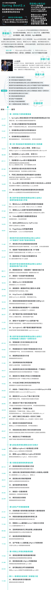
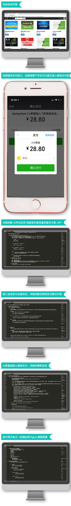

# [51CTO小D课堂SpringBoot2.x整合微信支付在线教育网站](https://edu.51cto.com/course/14182.html)

> 课程资料下载 https://edu.51cto.com/center/file/download/index?fid=VF0JXVM6RBtsBQYAWws

课程目录如下：

+ 第1章项目介绍和前期准备1小时8分钟4节
  + 1-1SpringBoot整合微信支付开发在线教育视频站点[免费试看]21:17
  + 1-2中大型公司里面项目开发流程讲解[免费试看]12:25
  + 1-3在线教育站点需求分析和架构设计13:41
  + 1-4在线教育后台数据库设计21:10

+ 第2章项目基础环境搭建和逆向工程构建1小时11分钟7节
  + 2-1快速搭建SpringBoot项目，采用Eclipse14:13
  + 2-2快速搭建SpringBoot项目，采用IDEA06:40
  + 2-3热部署在Eclipse和IDE里面的使用07:11
  + 2-4后端项目分层分包及资源文件处理07:42
  + 2-5开源工具的优缺点选择和抽象方法的建议11:33
  + 2-6Mysql逆向工程效率神器之使用IDE自动生成Java实体类14:29
  + 2-7接口配置文件自动映射到属性和实体类配置10:05

+ 第3章开发在线教育视频站点核心业务之视频列表相关接口开发1小时35分钟5节
  + 3-1整合Mybatis访问数据库和阿里巴巴数据源11:57
  + 3-2使用Mybatis注解开发视频列表增删改查37:42
  + 3-3Vidoe相关接口完善和规范协议12:56
  + 3-4动态Sql语句Mybaties SqlProvider14:25
  + 3-5PageHelper分页插件使用18:01

+ 第4章开发在线教育视频站点核心业务之JWT微服务下的用户登录权限校48分钟3节
  + 4-1单机和分布式应用的登录检验讲解11:42
  + 4-2微服务下登录检验解决方案 JWT讲解15:14
  + 4-3登录检验JWT实战之封装通用方法21:57

+ 第5章开发在线教育视频站点核心业务之微信授权用户接口开发3小时10分钟10节
  + 5-1数据信息安全--微信授权一键登录功能介绍08:11
  + 5-2微信扫一扫功能开发前期准备08:30
  + 5-3微信Oauth2.0交互流程讲解18:18
  + 5-4微信授权一键登录开发之授权URL获取29:46
  + 5-5HttpClient4.x工具获取使用25:59
  + 5-6微信扫码登录回调本地域名映射工具Ngrock10:18
  + 5-7授权登录获取微信用户个人信息实战28:35
  + 5-8用户模块开发之保存微信用户信息26:37
  + 5-9使用JWT生成用户Token回写客户端11:23
  + 5-10Springboot2.x用户登录拦截器开发实战22:50

+ 第6章开发在线教育视频站点核心业务之从零基础接入 微信扫一扫网页支4小时50分钟15节
  + 6-1常用的第三方支付和聚合支付介绍07:19
  + 6-2申请微信支付介绍和不同场景的支付方式10:42
  + 6-3微信网站扫码支付介绍18:26
  + 6-4互联网架构知识时序图讲解11:32
  + 6-5微信网页扫码支付时序图讲解和统一下单接口19:17
  + 6-6微信支付订单接口开发之订单增删改查16:37
  + 6-7IDE生成订单接口单元测试和断言开发15:52
  + 6-8微信统一下单接口开发之CommonUtils和WXpayUt34:25
  + 6-9微信支付Controller下单API接口开发17:08
  + 6-10微信支付下单API接口和签名开发26:05
  + 6-11调用微信统一下单接口实战22:53
  + 6-12谷歌二维码工具生成扫一扫支付二维码21:37
  + 6-13微信支付扫码回调开发实战24:12
  + 6-14微信回调处理之更新订单状态和幂等性讲解29:27
  + 6-15微信支付之下单事务处理15:05

+ 第7章全局异常处理和日志打点统计31分钟2节
  + 7-1配置SpringBoot2.0全局自定义异常14:40
  + 7-2使用Logback整合SpringBoot打点日志16:55

+ 第8章前后端联调和跨域处理2小时2分钟6节
  + 8-1联调效果演示和还原接口代码07:13
  + 8-2动静分离之前端项目静态页面引入和相关js包使用13:59
  + 8-3前后端分离 跨域问题讲解26:31
  + 8-4首页视频列表页联调15:57
  + 8-5微信扫一扫登录联调35:42
  + 8-6网页扫码支付联调22:59

+ 第9章生产环境搭建部署1小时16分钟6节
  + 9-1云服务器介绍和阿里云服务器ECS服务器选购21:51
  + 9-2阿里云服务器远程登录和常用工具07:02
  + 9-3阿里云Linux服务器Centos7 安装JDK8环境11:34
  + 9-4互联网架构知识之网站部署上线基础准备09:46
  + 9-5域名购买和配置解析实战13:55
  + 9-6生产环境Linux服务器上Nginx介绍和安装11:52

+ 第10章线上环境应用集群部署1小时11分钟3节
  + 10-1视频应用阿里云服务器部署安装17:03
  + 10-2前后端启动接入Nginx代理服务器31:08
  + 10-3高可用处理之多节点集群部署开

