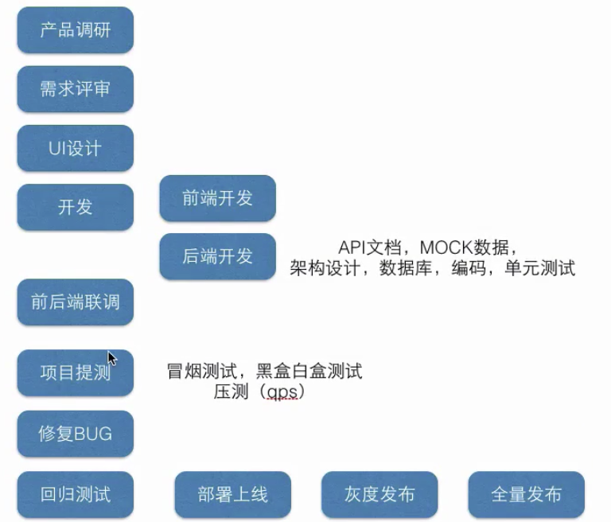
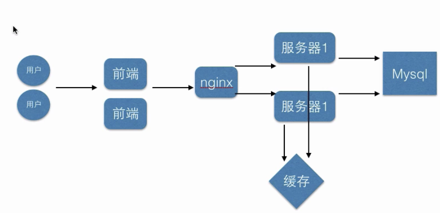
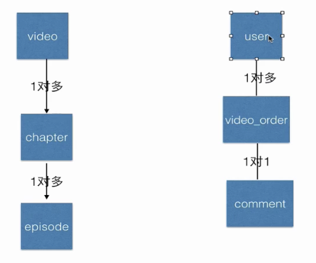

# 第一章项目介绍和前期准备 

## 1、SpringBoot整合微信支付开发在线教育视频站点介绍

> 简介: 课程介绍，和小D课堂在线教育项目搭建开发

+ 1、课程大纲介绍
+ 2、微信支付项目效果演示
+ 3、课程所需基础：springboot2基础+javaweb+mysql+maven
+ 4、开发环境 jdk8+eclipse和Idea

## 2、中大型公司里面项目开发流程讲解

> 简介：讲解一个项目如何从零到上线，经历过怎样的步骤和流程

+ 2.1、一个中大型项目的开发流程，从需求调研到项目上线

+ 2.2、需求评审（产品/设计/前端/后端/测试/运营）--> UI设计 --> 开发(前端架构->开发/ 后端架构->开发) --> 前端后端联调 --> 项目提测 --> BugFix --> 回归测试 --> 运维和开发部署上线 --> 灰度发布 --> 全量发布 --> 维护和运营
  

## 3、在线教育站点需求分析和架构设计

> 简介：分析要开发的功能点和系统架构应该怎样架构

### 3.1 开发的功能

+ 首页视频列表
+ 视频详情  （自己开发）
+ 微信扫码登录
+ 下单微信支付
+ 我的订单列表 （自己开发）

### 3.2 架构设计

+ 前端后端分离 -> 方案：node渲染
+ 动静分离  -> 方案：静态资源如html，js放在cdn或者nginx服务器上
+ 技术选择：
  + 后端技术选择：Eclipse + Springboot2.0 + redis4.0+ HttpClient + mysql + ActiveMQ消息队列
  + 前端技术选择：HTML5 + bootstrapt + jquery
+ 测试要求：
  + 首页和视频详情页qps单机qps要求 2000+

## 4、在线教育后台数据库设计

> 简介：讲解后端数据库设计，字段冗余的好处，及常见注意事项

### 4.1、数据库设计

+ er图：
  + 实体对象：矩形
  + 属性：椭圆
  + 关系：菱形

+ 表
  + video表
  + video_order表
  + user表
  + comment表
  + chapter张
  + episode节

## 4.2 字段冗余：

+ 什么是字段冗余
+ 什么时候选择字段冗余
+ 优缺点

### 4.3 Mysql测试数据导入

### 4.4 mysql客户端软件

+ 苹果系统：sequel pro
+ windows：navicat

### 4.5、没有一成不变的架构，没有通用的设计方案

一定跟业务结合
